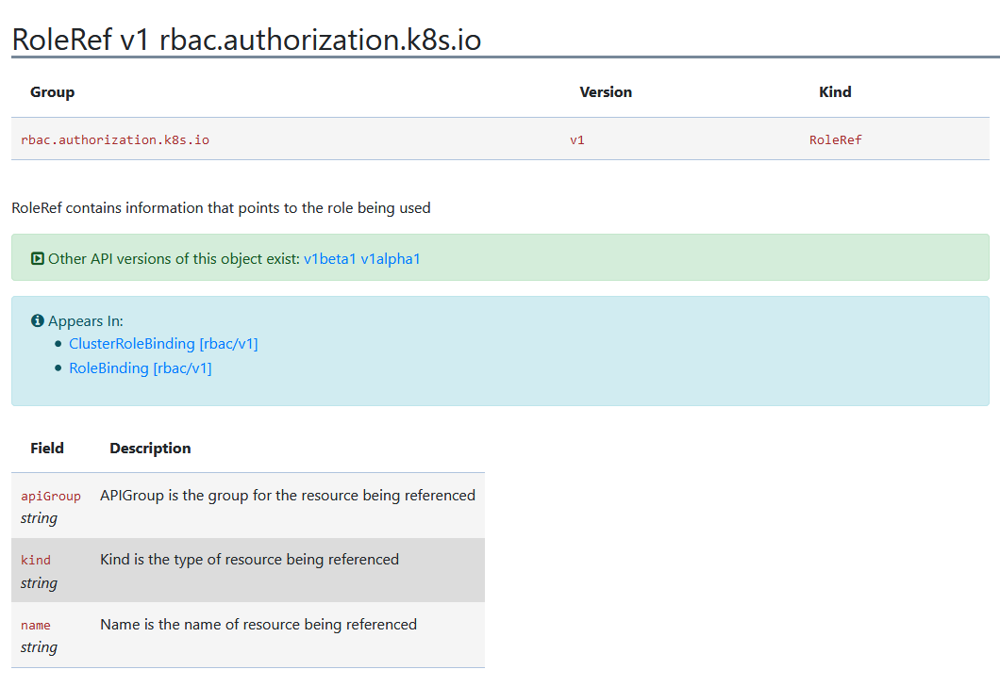

At some point, as your Kubernetes cluster grows in complexity, the question of role-based security will become important. Typically, this means breaking the cluster up into namespaces and limiting access to namespaced resources to specific accounts.

To support this, Kubernetes includes a number of resources, including roles, cluster roles, role bindings, and cluster role bindings. At a high level, roles and role bindings are placed inside of and grant access to a specific namespace, while cluster roles and cluster role bindings do not belong to a namespace and grant access across the entire cluster.

However, it is possible to mix these two types of resources. For example, what happens when a role binding links an account to a cluster role? This post looks at some of these scenarios to gain a better insight into how Kubernetes implements role-based security.

Automate your Kubernetes deployments with a [free Octopus trial.](https://oc.to/k8s-rbac-roles-and-bindings-trial)

## Preparing the cluster

To start, we’ll create a number of namespaces that we’ll grant access to via the Kubernetes Role-Based Access Control (RBAC) resources:

```
$ kubectl create namespace test
$ kubectl create namespace test2
$ kubectl create namespace test3
$ kubectl create namespace test4
```

We’ll then create a service account in the `test` namespace:

```YAML
apiVersion: v1
kind: ServiceAccount
metadata:
  name: myaccount
  namespace: test
```

## Scenario 1: Role and RoleBinding

We’ll start with a simple example that creates a role and a role binding to grant the service account access to the `test` namespace:

```YAML
kind: Role
apiVersion: rbac.authorization.k8s.io/v1
metadata:
  namespace: test
  name: testadmin
rules:
- apiGroups: ["*"]
  resources: ["*"]
  verbs: ["*"]
```

```YAML
kind: RoleBinding
apiVersion: rbac.authorization.k8s.io/v1
metadata:
  name: testadminbinding
  namespace: test
subjects:
- kind: ServiceAccount
  name: myaccount
  apiGroup: ""
roleRef:
  kind: Role
  name: testadmin
  apiGroup: ""
```

This example is easy to understand. All of our resources (the service account, role, and role binding) are in the `test` namespace. The role grants access to all resources and the role binding links the service account and the role together. As you would expect, requests made by the service account against resources in the `test` namespace work:

```
$ kubectl get roles -n test
NAME        CREATED AT
testadmin   2020-08-24T23:24:59Z
```

## Scenario 2: Role and RoleBinding in another namespace

Let’s now create a new role and role binding in the namespace `test2`. Notice here that the role binding is linking the role from `test2` and the service account from `test`:

```YAML
kind: Role
apiVersion: rbac.authorization.k8s.io/v1
metadata:
  namespace: test2
  name: testadmin
rules:
- apiGroups: ["*"]
  resources: ["*"]
  verbs: ["*"]
```

```YAML
kind: RoleBinding
apiVersion: rbac.authorization.k8s.io/v1
metadata:
  name: testadminbinding
  namespace: test2
subjects:
- kind: ServiceAccount
  name: myaccount
  namespace: test
  apiGroup: ""
roleRef:
  kind: Role
  name: testadmin
  apiGroup: ""
```

This works, granting the service account access to resources outside of the namespace the service account was created in:

```
$ kubectl get roles -n test2
NAME        CREATED AT
testadmin   2020-08-24T23:35:16Z
```

Note that the `roleRef` property does not have a `namespace` field. This is the `RoleRef` [API documentation](https://kubernetes.io/docs/reference/generated/kubernetes-api/v1.18/#roleref-v1-rbac-authorization-k8s-io):



The implication here is that a role binding can only reference a role in the same namespace.

## Scenario 3: ClusterRole and RoleBinding

As noted earlier, cluster roles do not belong to a namespace. This means the cluster role does not scope permission to a single namespace.

However, when a cluster role is linked to a service account via a role binding, the cluster role permissions only apply to the namespace in which the role binding has been created.

Here we create a role binding in namespace `test3`, linking our service account to the cluster role `clusteradmin`:

```YAML
kind: RoleBinding
apiVersion: rbac.authorization.k8s.io/v1
metadata:
  name: testadminbinding
  namespace: test3
subjects:
- kind: ServiceAccount
  name: myaccount
  namespace: test
  apiGroup: ""
roleRef:
  kind: ClusterRole
  name: cluster-admin
  apiGroup: ""
```

Our service account now has access to the resources in the `test3` namespace:

```
$ kubectl get rolebindings -n test3
NAME               ROLE                        AGE
testadminbinding   ClusterRole/cluster-admin   21m
```

But it does not have access to other namespaces:

```
$ kubectl get roles -n test4
Error from server (Forbidden): roles.rbac.authorization.k8s.io is forbidden: User "system:serviceaccount:test:myaccount" cannot list resource "roles" in API group "rbac.authorization.k8s.io" in the namespace "test4"
```

## Scenario 4: ClusterRole and ClusterRoleBinding

In our final scenario, we’ll create a cluster role binding to link the cluster role to our service account:

```YAML
apiVersion: rbac.authorization.k8s.io/v1
kind: ClusterRoleBinding
metadata:
  name: testadminclusterbinding
subjects:
- kind: ServiceAccount
  name: myaccount
  apiGroup: ""
  namespace: test
roleRef:
  kind: ClusterRole
  name: cluster-admin
  apiGroup: ""
```

Note again the lack of a `namespace` field on the `roleRef`. This implies that a cluster role binding cannot identify a role to link to, because roles belong in namespaces, and cluster role bindings (along with the cluster roles they reference) are not namespaced.

Despite the fact that neither the cluster role nor the cluster role binding defined any namespaces, our service account now has access to everything:

```
$ kubectl get namespace test4
NAME    STATUS   AGE
test4   Active   26m
```

## Conclusion

From these examples, we can observe some behaviors and limitations with RBAC resources:

- Roles and role bindings must exist in the same namespace.
- Role bindings can exist in separate namespaces to service accounts.
- Role bindings can link cluster roles, but they only grant access to the namespace of the role binding.
- Cluster role bindings link accounts to cluster roles and grant access across all resources.
- Cluster role bindings can not reference roles.

Perhaps the most interesting implication here is that a cluster role can define common permissions that are expressed in a single namespace when referenced by a role binding. This removes the need to have duplicated roles in many namespaces.

Happy deployments!