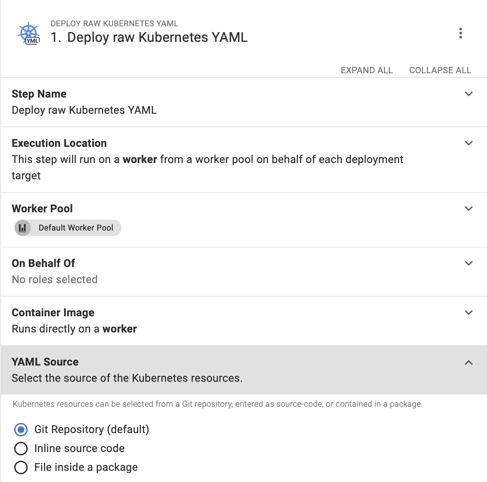
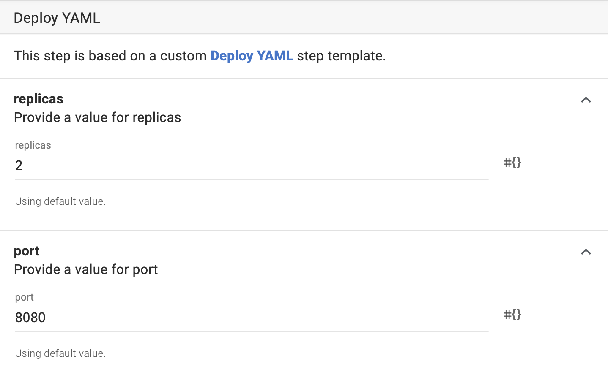
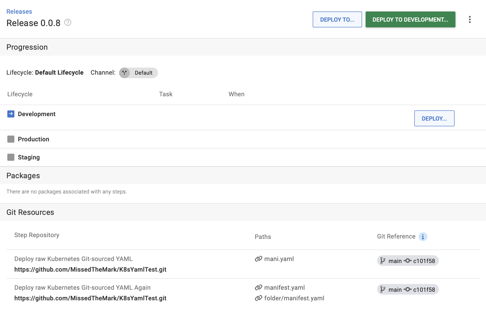

There are several ways to configure Kubernetes, but a default option is a declarative configuration with YAML manifests. Another standard is storing your configuration in Git. It's a natural choice if you evolve and audit all your other code this way.

Until now, you couldn't source configuration files directly from Git. You needed an interim step involving packaging files and sending them to Octopus. This approach has advantages, like no dependency on Git at the moment of deployment and easy release management. However, it doesn't feel like the simplest way to deploy to Kubernetes.

That's why we introduced an improvement so you can source files directly from Git. We preserved the benefits of the package approach, so you won't have to give up on your release immutability.

The new way to source YAML manifests isn't just an alternative to packages. It enables more advanced scenarios. 

In this post, I illustrate one of those advanced scenarios — configuration templating. You can reference the same set of YAML files in multiple projects and modify them with Octopus variables on the project level. It's helpful if you manage many similar services, saving you time and introducing standards for configuring them.

## Templating Kubernetes configuration when sourcing YAML files from Git

Referencing files from a Git repo is the latest addition and the new default option for the **Deploy raw Kubernetes YAML** step.

### What the new feature does

Sourcing files without the need to package them is one clear benefit of this new feature. However, there are more improvements this introduces:

- You can reference many files in one step. There's no need to run multiple steps or combine everything in one YAML file.
- You can use glob patterns to define multiple files (in this case, they're applied all at once in alphabetical order).
- You can provide multiple paths if you need to define a specific order.

The benefits listed above unlock scenarios like deploying many apps in one step. For example, you might want to:

- Deploy all secrets and ConfigMaps first: `/configuration/*-secret*.yaml` and `/configuration/*-configmap.yaml` or `/configuration/secrets-and-configs/*`
- Deploy your first app after that: `/configuration/db-*.yaml`
- Add the second app at the end: `/configuration/web-*.yaml`

You might notice that a file like `/configuration-db-configmap.yaml` gets referenced twice. It's not neat, but the deployment works anyway (unless it includes jobs, the second deployment typically won't have any effect).

There is also nothing wrong with using the same files multiple times in different steps. You can consider the files as templates and change them with [Octopus variables](https://octopus.com/docs/projects/variables) embedded in YAML.

You can also use [structured configuration variables](https://octopus.com/blog/structured-variables-raw-kubernetes-yaml) if you don't want to change your YAML files, so you can still use them for deployments outside of Octopus.

Finally, you can use Octopus variables in the paths or repository links, creating powerful step templates.

### How to create a template

Imagine you're on a platform team that owns Kubernetes clusters and deployment pipelines. Your company develops a complex app with 100 microservices. You combine these microservices in 3 similar groups to define YAML templates for each group. You still need to change some parameters for each app, like the image name.

You can create 3 new repos with configuration files, one for each group of microservices. Storing all the configuration files in one repo also works, but for this example, let's imagine you have 3.

There are 2 ways of modifying configuration files with Octopus. The most straightforward option is using Octopus variables. You need to replace values you want to change in your configuration files with variables like `#{containerImage}` or `#{appLabel}`. You can combine variables. For example, the value for `spec.template.spec.containers[0].image` can look like `#{containerImage}:#{containerTag}`. You can even use [extended syntax](https://octopus.com/docs/projects/variables/variable-substitutions#VariableSubstitutionSyntax-ExtendedSyntax) for advanced scenarios.

Files with Octopus variables are easy to inspect, and you have tremendous flexibility with variables. However, sometimes you need valid YAML in your repository. For example, if you need to test the configuration locally. In this case, you can take another step and use [structured variable replacement](https://octopus.com/blog/structured-variables-raw-kubernetes-yaml).

Despite the option you choose, you can configure some variables for all projects using [library sets](https://octopus.com/docs/projects/variables/library-variable-sets). It's helpful if all your apps, for example, have a certain number of replicas in a given environment. You can configure project-specific variables at the project level.

### Hiding complexity

You might want to hide Kubernetes complexity from your software teams by exposing a limited number of properties a team should change to make the template work. You can achieve this by creating a step template. 

With step templates, there's no need for software teams to learn YAML, know where to store templates, or fill in the variables when creating a project.

So software teams won't have to fill in these values, you can create a new step template from the **Deploy raw Kubernetes YAML** step, and use variables. For example:

- `Octopus.Project.Name`
- `Octopus.Release.Number`
- Or other [system variables](https://octopus.com/docs/projects/variables/system-variables) 

Your `spec.template.spec.containers[0].image` can actually look like `#{Octopus.Project.Name}:#{Octopus.Release.Number}`. 

Finally, you can expose variables like the number of replica sets or container ports, so team members can modify them when using the step template.

In this scenario, a new app deployment configuration is as simple as creating a new project, adding a step template, and specifying a few variables.

### How to configure the deployment step

Now you just need to configure the deployment step.

1. Open the process editor and find the **Deploy raw Kubernetes YAML** step you want to modify, or add a new one.
1. Choose the option to source YAML manifests from Git - the default option for newly added steps.
1. Choose Git credentials, or add new ones to the library following the link.
1. Specify a Git repo URI. You can use a variable in this row (for example, `Octopus.ProjectGroup.Name`). You cannot scope this variable per environment; you must use one value per project.
1. Specify the files you want to use for the deployment by providing the path.
1. Save the process configuration.

Now you can create a release and deploy it. Octopus will clone your Git repo, find the files you specified, and deploy them.

Variable replacement, including structured configuration variables, will work as usual. Therefore, you can use Octopus variables in your YAML files if needed.

#### How to configure file paths

You can configure multiple paths. Paths should be separated by `;`.

Each path can point to one or many files.

- If you want to point to one file, type the path to it, including folder structure. For example, `configs/yaml/deployment.yaml`.
- If you want to fetch a several files with one path, you can use glob patterns. For example, `configs/yaml/appname-*.yaml`. 
   - In this case, if there are multiple files like `appname-service.yaml` and `appname-deployment.yaml` in this folder, Octopus will apply them but will ignore files like `someoneselseapp-deployment.yaml`.

You can use glob to specify a folder, for example, `configs/yaml/*`.

#### How Octopus applies files from the paths

Octopus applies all files from one path at the same time using `kubectl apply`. Kubectl applies the files in alphabetical order. Therefore, if you want to enforce a specific application order in one path, you must name the files accordingly.

Octopus applies files from different paths in sequence using multiple `kubectl apply` commands. Octopus doesn't wait for the cluster to implement an applied configuration before executing the following `kubectl apply` command. However, it waits for the `kubectl` command to complete.

:::hint
You can use paths to enforce a particular order of file application.
:::

You can also use variables in the path row and specify multiple files in a variable.

#### When Octopus fetches files from Git

Octopus records the commit hash specified during release creation (this may be the tip of a branch or label). It then fetches files from the provided repo during deployment. If you add new files to Git before creating a release, but after configuring the step, Octopus still uses those files for deployments (if they meet the path configuration). But, if you add or update files to the same branch after you create a release, Octopus won't deploy the files with that release.

### What you see on the release page

When you create a release, Octopus shows you the list of saved release files and Git references.

## Conclusion

Sourcing files from Git enables Kubernetes configuration templating. You can make Kubernetes deployments easy for people in your company and maintain standardization at the same time.

There are many other ways to use this feature. We're looking forward to hearing your thoughts so we can improve it further. Feel free to leave your feedback via the form you find in Octopus when you configure the **Deploy raw Kubernetes YAML** step.

## Learn more

- [A LINK TO DOCS SHOULD BE HERE](https://www.example.com/resource)

Happy deployments!