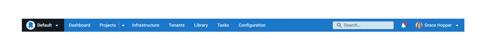
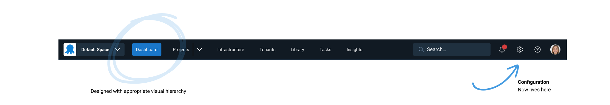

# Octopus UI Navigation Improvements

At Octopus, we pay close attention to our customer feedback. Lately we have focused on a certain feedback category of our user experience: navigation. This feedback indicated that functions are hard to find, hard to remember where items live or people have trouble understanding where they are located within our application. 

This is a design issue. It's a tricky design issue due to the combination of the following
- where things are located
- complex information structures
- complex interactions around how to do X or Y in octopus
- visual design & page layouts not helping a user understand where they are
- when to use search vs when to use navigation

We spent time reimagining our UI to help understand how all these elements could work together harmoniously. We then took our concept to customers and Devops professionals to see if this was in fact true. The feedback we received was highly positive and the learnings valuable. However, it would be a big change and the path to achieve this isn’t so simple.  

Baby steps. Our first step focuses on visually improving our navigation while introducing some good design patterns.

See the below for a before and after.

### Before

### After :D

- **Spaces:** Square instead of round. We will be moving away from the use of circles in spaces and projects. This helps with easier visual identification of elements across the app.
- **Stronger Visual Hierarchy:** You can easily identify which section of the app you are located in by using strong contrasting color choices applied appropriately.
- **Configuration / Administration:** Moved to a cog icon on the far right following standard navigation ux patterns.

## Under the Covers
**On the outside this may look like a small change but underneath we have taken a more considered approach to how we build our UI components. This is where a design system comes into play.**

We started by tackling our simplest design decisions first. This is primarily our colors and typography. In a design system these are represented as design tokens. Using this modern approach to building interfaces helps us build better quality and a better experience for our customer. 

Some of you may have already noticed but we darken our dark mode. This was one of the positive outcomes of taming and consolidating the many colors that had grown overtime. This is what UX debt can look like and requires design and engineering effort to manage.

Now that we have design tokens we can keep our colors in line with accessibility guidelines. In addition, in future surface more theming options to our customers. 

## Upcoming changes

To continue bringing a modern UI across Octopus Deploy next we are tackling the Page header section. This is creating a simpler layout to support easier navigation between areas of the app. With each change applied to the navigation it will bring more visual consistency and correction of the information architecture.

Octopus is dedicated to improving its user experience. This is the first of many milestones ahead of us to achieve our North Star navigation experience. 

