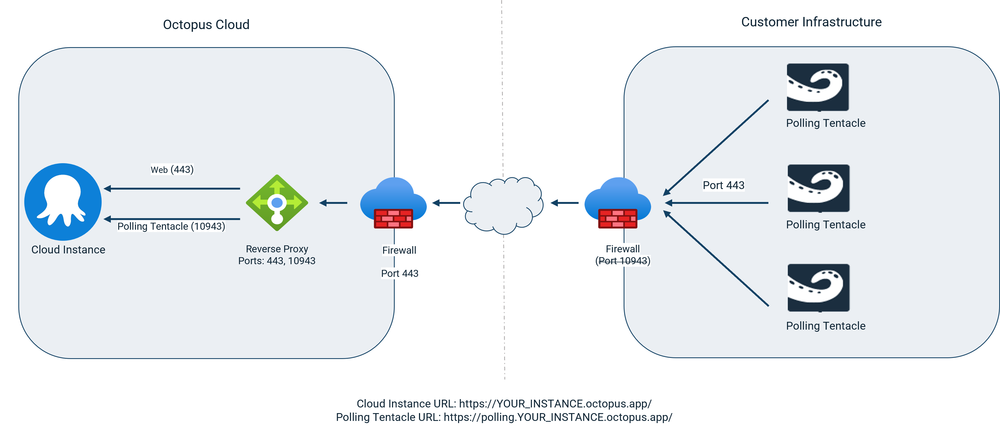

In Octopus Deploy, deployment targets communicate with Octopus Cloud using Tentacles. We made an update so that Polling Tentacles can use port 443, instead of port 10943. 

Port 10943 is an unassigned port in the [IANA port listing](https://www.iana.org/assignments/service-names-port-numbers/service-names-port-numbers.xhtml?&page=120), and therefore looks suspicious to some. 

Port 443 often meets an organization’s firewall rules for outgoing encrypted traffic. This avoids lengthy approval processes to get authorization for firewall rule exceptions for port 10944. 

In this post, I explain how to use port 443 for Polling Tentacles.

## How to use port 443 for Polling Tentacles

The Octopus server needs Polling Tentacles and web app traffic on separate ports. So that Polling Tentacles can also use port 443, we configured a second URL. A reverse proxy re-routes Polling Tentacle traffic to the expected server port. This means your firewall rules only need port 443 open for outgoing traffic. This avoids applying to security for an exception and open port 10943.

This second URL is your Octopus Cloud URL prefixed with `polling`. For example, `https://polling.YOUR_INSTANCE.octopus.app`. Simply use this new domain and port 443 when configuring the Polling Tentacles.

In Octopus Cloud, a reverse proxy redirects polling traffic to port 10943 on the Octopus Server. Web app traffic passes through on port 443, which is what the Octopus server expects. This is backward compatible with Polling Tentacles still communicating over 10943.

### Some things to note

- This capability is available from Polling Tentacle version 6.3.417 or later. 
- You need to upgrade existing Polling Tentacles to use port 443. 
- It's possible to run a mix of Polling Tentacles, some configured to run over port 443 and others over 10943. 

Running a mix of Polling Tentacles may be useful if you're updating Polling Tentacles to use port 443 and existing 10943 Tentacles still need to work.

### What about Octopus Server (self-hosted Octopus instances)?

This change is for Octopus Cloud customers. If you use Octopus Server, Polling Tentacles can use port 443 for:

- A single Octopus Server
- A single Octopus execution server node and one or more UI nodes 

In these cases, you must add the second URL and a reverse proxy redirect for Polling Tentacle traffic.

The solution for multiple execution servers needs a more complex configuration. Please [reach out to our team](mailto:customersuccess@octopus.com) if you need help with this.

## Conclusion

Octopus Cloud can use port 443 for Polling Tentacle communication, removing the need for a non-standard port in your firewall. This saves the effort and delays getting approval for firewall exemptions and custom rules.

A similar approach works for self-hosted Octopus Deploy customers with a single execution server. For multiple execution servers, while it is possible, the configuration is more complex.

## Learn more

- [Polling Tentacles over port 443 documentation](https://octopus.com/docs/infrastructure/deployment-targets/tentacle/polling-tentacles-over-port-443)

## Watch our video about the change

<iframe width="560" height="315" src="https://www.youtube.com/embed/a4yeAwWwXi8" title="YouTube video player" frameborder="0" allow="accelerometer; autoplay; clipboard-write; encrypted-media; gyroscope; picture-in-picture" allowfullscreen></iframe>

Happy deployments!