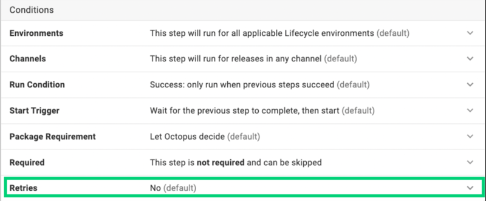

Octopus 2023.2 introduces step retries, a new feature that lets you add automatic retries and timeouts to deployments. This feature helps when you're dealing with steps that frequently fail due to temporary or transient errors during deployment.

Watch the video below to see this new feature in action:

<iframe width="560" height="315" src="https://www.youtube.com/embed/2KzwjpdZz70" title="YouTube video player" frameborder="0" allow="accelerometer; clipboard-write; encrypted-media; gyroscope; picture-in-picture; web-share" allowfullscreen></iframe>

## How do step retries work?

You can enable retries on individual steps found in the **Conditions** section of each step, as shown below:

When you enable retries for a step and an action in that step fails, Octopus will retry from the failed action. Please note, however, that the entire step does not retry from the beginning. 

If there's a subsequent failure, there's a 15-second delay before the action retries. 

A third and final retry with a 15-second delay will also take place. 

If any of these retries are successful, the deployment will proceed. However, if all 3 retries are unsuccessful, the step will fail, or guided failure mode will activate if enabled.

### Are there any steps I can't use step retries for?

You can use step retries on all steps except for:

- **Send an Email** step
- **Manual Intervention** step 
- **Health Check** step 
- **Deploy a Release** step

### Can I customize the number of retries?

Not at this stage, but please feel free to [provide feedback](https://octopusdeploy.typeform.com/to/UOObqaxV) if you'd like this functionality.

### Can I set retries to default to ‘on’ for all my steps?

No. You must configure retries on each step you want to retry in each deployment process.

### How do retries work with guided failure mode?

If enabled, guided failure mode will begin if all 3 retries are unsuccessful.

## Conclusion

To help improve the success rate and automation of deployments, you can now add automatic retries and timeouts to deployments. This lets you enable retries automatically from a failed action. The result is fewer manual interventions when transient connectivity issues interrupt your deployments.

## Feedback

We'd love to hear [any feedback](https://octopusdeploy.typeform.com/to/UOObqaxV) to help us improve this feature.

Happy deployments!