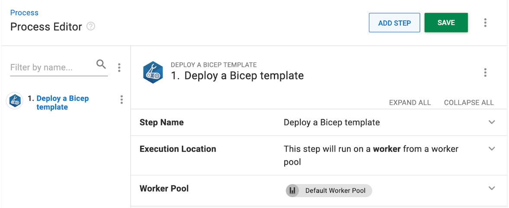
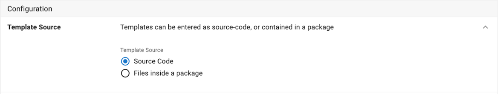
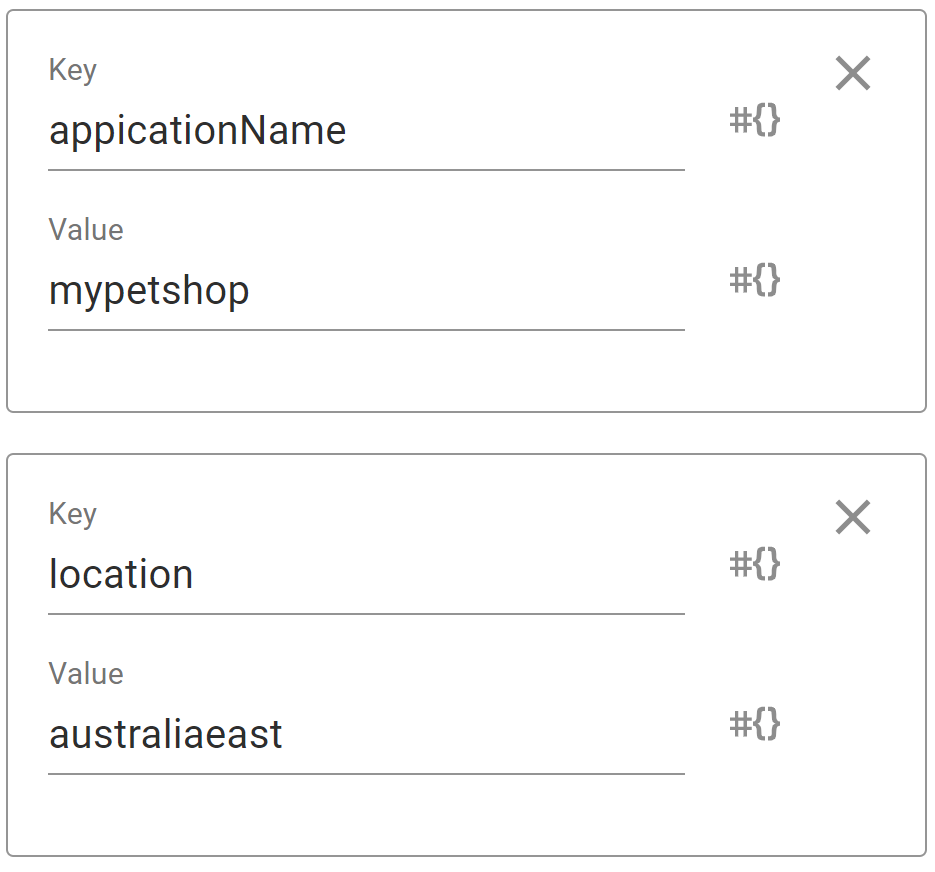
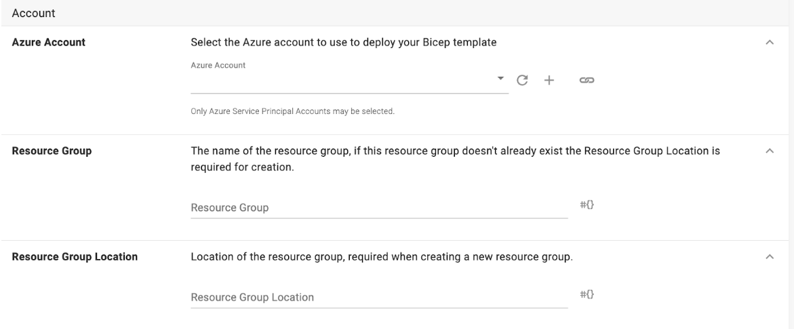

Bicep is a human-readable language for deploying resources using ARM templates. Our latest step makes deploying Azure Resources using Bicep more intuitive and user-friendly. 

In this post, I walk you through configuring our new **Deploy a Bicep Template** step.

## Getting started

To start, add the **Deploy a Bicep Template** step to your deployment process. This step depends on the [Bicep module](https://learn.microsoft.com/en-us/azure/azure-resource-manager/bicep/install) of the Azure CLI in the execution environment. Assuming the Azure CLI is already installed and on path, install the Bicep module using:

```
az bicep install
```



## Configuring the Deploy a Bicep Template step

You can store the templates using the source code editor or packages when configuring the **Deploy a Bicep Template** step.
 
The first and easier option is the Source Code editor. Here you can directly edit your Bicep template. 

Alternatively, you can store your Bicep files in a package and provide a path to the template. When you use packages, you can provide many Bicep templates and reference modules in [local files](https://learn.microsoft.com/en-us/azure/azure-resource-manager/bicep/modules#local-file) using relative paths. You need to provide the relative path to the Bicep template file contained in the package when using packages.



To provide parameters to these Bicep templates, you get a list of key-value pairs.

For example, imagine you're given a Bicep template with the following param definitions:

```
param appicationName string
param location string
```
You can provide the following parameter definitions using the key-value pairs below. In this example the parameter `applicationName` gets replaced with the value `mypetshop` during the deployment.



Regardless of your template source, you must choose a [deployment mode](https://learn.microsoft.com/en-us/azure/azure-resource-manager/templates/deployment-modes). We default to incremental mode. 

In incremental mode, resources that exist in the resource group but are not specified in the template aren't changed by Resource Manager. Resources in the template get added to the resource group. 

In complete mode, Resource Manager deletes resources that exist in the resource group but aren't specified in the template.

## Account setup

You need an Azure account along with a target resource group. For help configuring an Azure account, read our docs about [connecting an Azure account to Octopus Deploy](https://octopus.com/docs/infrastructure/accounts/azure#azure-service-principal). 

When specifying a resource group if it does not exist, it gets created as part of the deployment process. If the resource group does not exist and it's being created as a part of the deployment, you must specify the resource group location.



## Conclusion

Like our existing Deploy an ARM template step, Bicep deployments will periodically poll and report the deployment state. Output parameters such as the Deployment name are available using #{AzureRmOutputs[DeploymentName]} along with [resource properties](https://learn.microsoft.com/en-us/azure/azure-resource-manager/templates/template-functions-deployment#example) via #{AzureRmOutputs[PropertyName]}. Please reach out via our [community Slack](https://octopus.com/slack) if you have any questions, comments or feedback.

Happy deployments!