
Containerizing your application is the modern-day approach to application development.  The most popular platform for hosting containers is Kubernetes.  However, not everyone wants or needs to know how to operate a Kubernetes cluster. Some people just want to deploy their apps.  

Azure Container Apps deploys containers to a Kubernetes cluster managed by Azure. This lets developers focus on what they do best, write code.  

In this post, I show you how to deploy the [eShopOnWeb](https://github.com/OctopusSamples/eShopOnWeb) application to Azure Container Apps with Octopus Deploy.

## Getting started

Before you can deploy to Azure Container Apps, you need to configure:

- A container registry for your containers
- A build server to push your containers to the registry
- An Octopus Docker Container Registry external feed
- An Azure Container Apps environment

### Configuring the container registry

First, you need a place to push your containers. Octopus is compatible with a variety of Docker container registries, but this post uses an Azure Container Registry. If you already have a Docker Container Registry configured, you can skip to the next section.

To create an Azure Container Registry, click **Create a resource** in the Azure Portal.

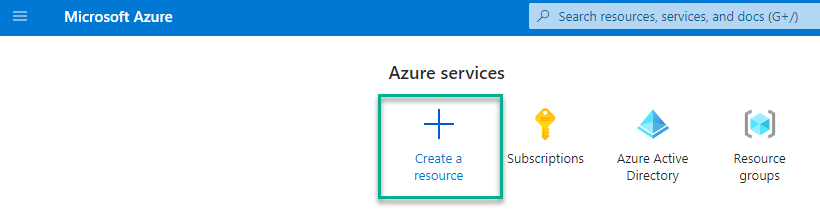

Type `Azure Container Registry` in the search box and choose **Container Registry** from the list.

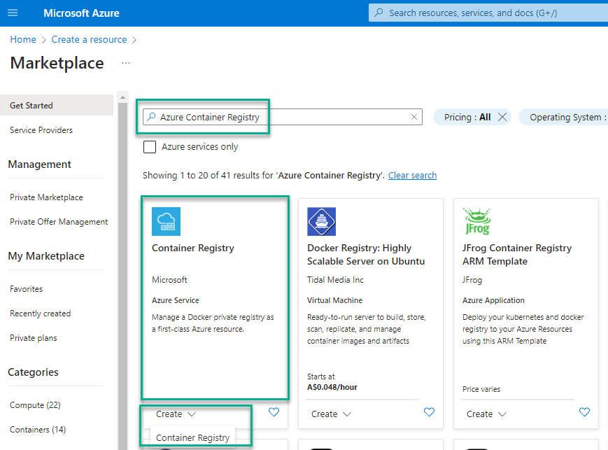

Fill in the required inputs and click **Create**.

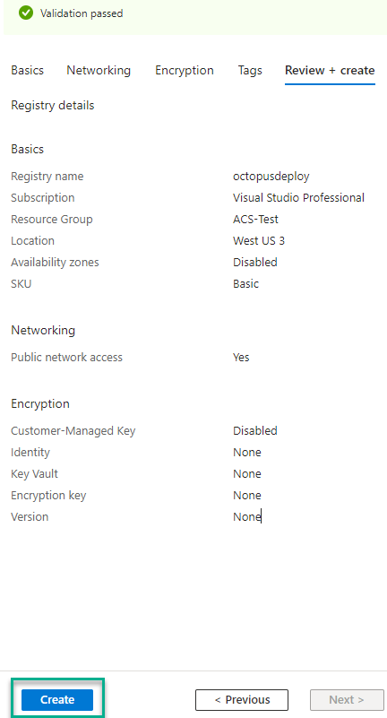

After you create the resource, copy the login server information. You need this information when you configure the Docker build task and the Octopus Deploy external feed.

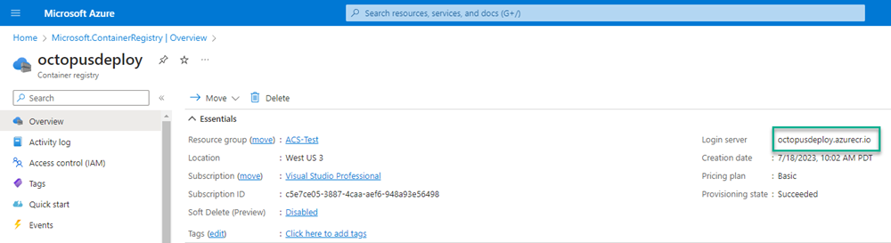


### Configuring the build server

Now that you have a container registry, you need to configure a build server to push your containers to the registry.  

For this post, I use Azure DevOps to show building the eShopOnWeb containers and pushing them to an Azure Container Registry. eShopOnWeb consists of 2 containers:

- API
- Web

My build consists of 2 Docker build tasks, both using the `buildAndPush` command.  

#### Adding the Docker build task

Filter the list of tasks by typing `docker` into the search bar. Then choose the Docker task.

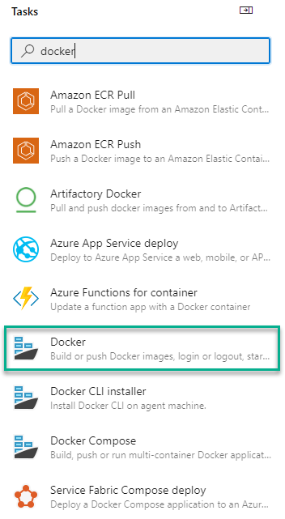

The Docker task needs a Docker Registry service connection.  Select **New** and fill in the form details.

- Docker Registry: The login server from your ACR in URL format = `https://<Login server>`, example `https://octopusdeploy.azurecr.io`.
- Docker ID: User ID for logging into your ACR.  I chose to use an app registration, so the value of the ID is the application (client) ID of the app registration.
- Docker Password: Password for the User ID. If you're using an app registration, this is the secret for the app registration.
- The rest of the fields can use the defaults.

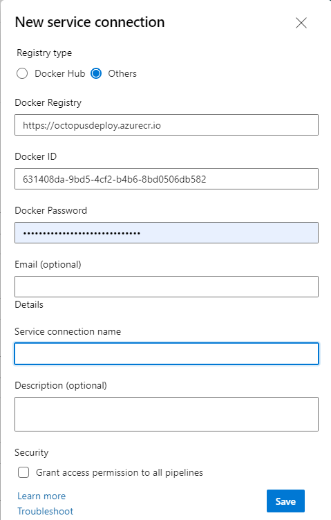

For the API Docker build task, use the following values:

- Container repository: `eshop-api`
- Command: `buildAndPush`
- Dockerfile: `src/PublicApi/Dockerfile`
- Build context: `.`
- Tags: `$(Build.BuildNumber)` (Optional, I set my build format number to `$(Year:yyyy).$(Month).$(DayOfYear)$(Rev:r)`)

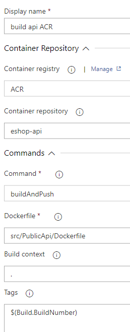

The Web Docker build task will be identical with the following differences:

- Container repository: `eshop-web`
- Dockerfile: `src/Web/Dockerfile`

After you queue a new build, it should push your containers into your registry.

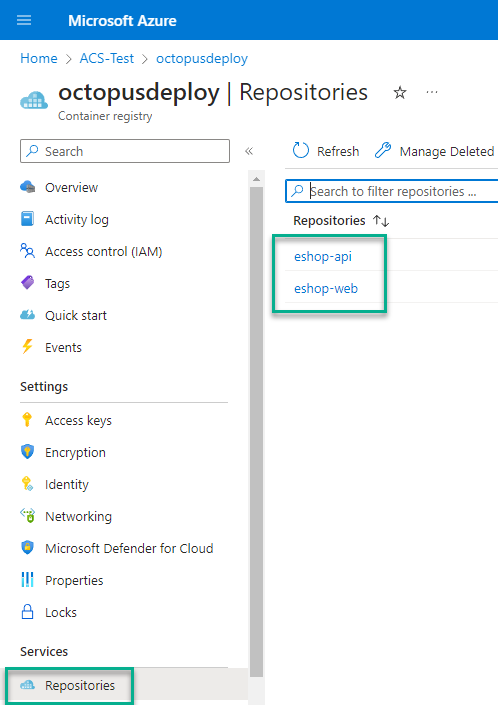

### Configuring the Octopus Deploy external feed

Now the containers are hosted in ACR, you need to configure an external feed in Octopus. Navigate to **Library**, then **External Feeds**, then click **ADD FEED**.

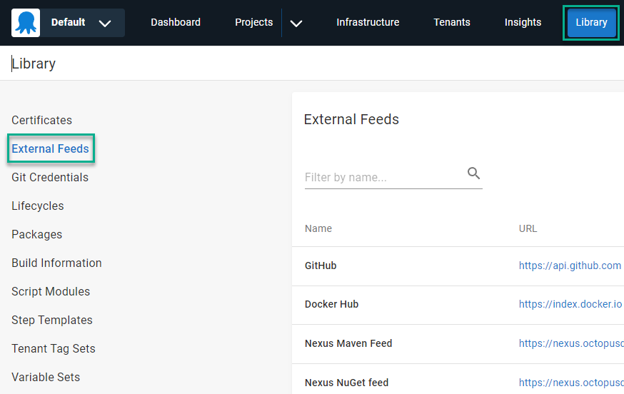

Select the feed type. For this post, I'm using **Azure Container Registry**.

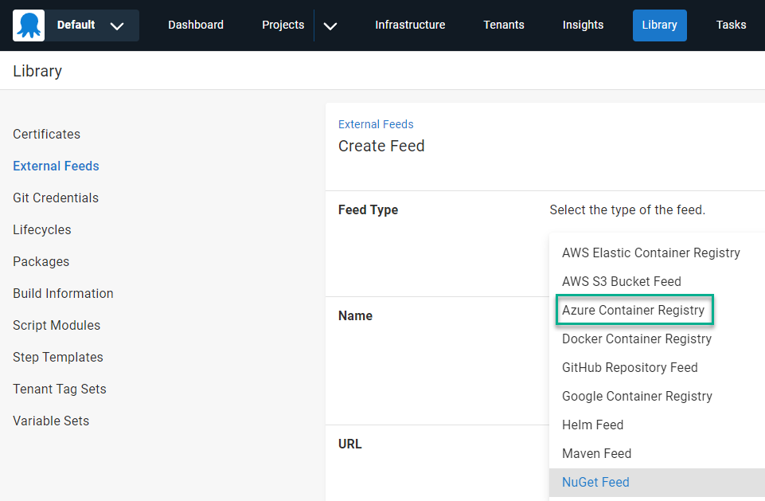

Similar to the Service Connection in Azure DevOps, add the feed details:

- Name: A meaningful name for the External Feed
- URL: `https://<Login Server>` - example: `https://octopusdeploy.azurecr.io`
- Credentials:
  - Feed Username: User to connect to the registry. I used an app registration.
  - Feed Password:  Password for the user account. Mine was the secret for the app registration.

Next, click **SAVE AND TEST**.  

Enter the image name, full or partial, you want to search for.

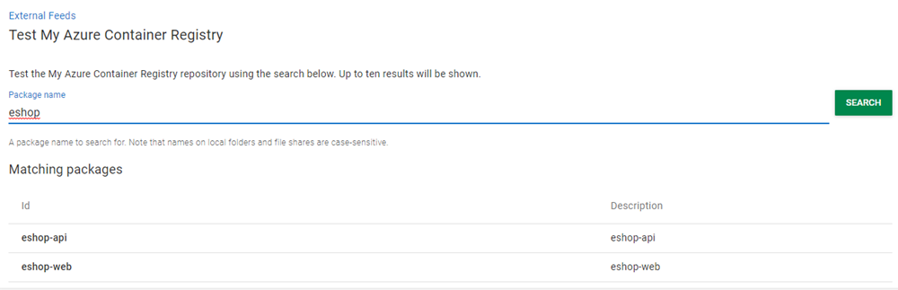

### Configuring project variables

This post assumes you know how to create an Octopus project and won't cover that topic.  For the eShopOnWeb Octopus project, configure the following variables:

- Project.Azure.Account: An Azure Service Prinicipal account variable. (Optional, the templates used can use Managed Identity)
- Project.Azure.ContainerApp.Api.Name: Value to set for the Container Name, example: `#{Octopus.Environment.Name}-eshop-api`
- Project.Azure.ContainerApp.Environment.Name: Name of the Azure Container App environment to create/use, example: `#{Octopus.Environment.Name | ToLower}`
**Note:** Azure Container App environment names **must** be lower case.
- Project.Azure.ContainerApp.Web.Name: Value to set for the Container Name, example: `#{Octopus.Environment.Name | ToLower}-eshop-web`
- Project.Azure.Region.Code: The short name for the Azure Region, example: `westus3`
- Project.Azure.ResourceGroup.Name: Name of the Azure Resource Group to create the resources in.
- Project.Catalog.Database.Name: Name of the Catalog database for eShopOnWeb, example: `#{Octopus.Environment.Name}-eshop-catalog`
- Project.Identity.Database.Name: Name of the Identity database for eShopOnWeb, example: `#{Octopus.Environment.Name}-eshop-identity`
- Project.SQL.DNS: The DNS name for the SQL database server, example: `<YourAzureSQLServer>.database.windows.net`
- Project.SQL.User.Name: Name of the SQL account for database access, example: `eShopUser`
- Project.SQL.User.Password: Password for the SQL account

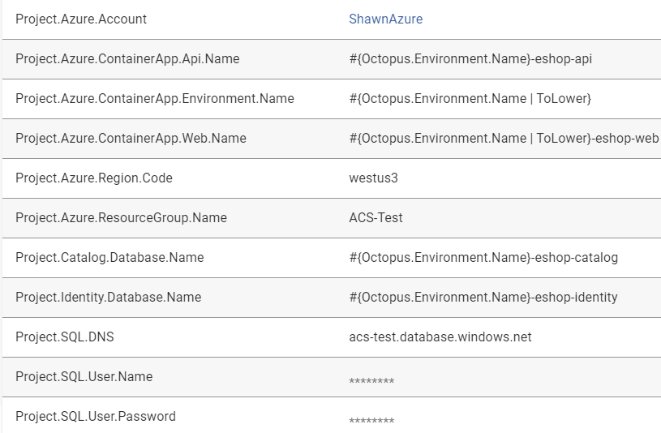

### Configuring the deployment process

With the External Feed and project variables configured, you can now configure the deployment process.  For the eShopOnWeb application, the process consists of the following steps:

- Azure - Create Container App environment
- Azure - Deploy API Container App
- Get API DNS
- Azure Deploy web Container App

#### Azure - Create Container App Environment step

To deploy to Azure Container App, you must first have an Azure Container App environment.  

Add the **[Azure - Create Container App Environment](https://library.octopus.com/step-templates/9b4b9fdc-2f97-4507-8df5-a0c1dd7464a5/actiontemplate-azure-create-container-app-environment)** community step template to your process.  The template will first check to see if it already exists, if not, create it.  

This template takes the following input:

- Azure Resource Group Name: `#{Project.Azure.ResourceGroup.Name}`
- Azure Account Subscription Id: `#{Project.Azure.Account.SubscriptionNumber}`
- Azure Account Client Id: `#{Project.Azure.Account.Client}`
- Azure Account Tenant Id: `#{Project.Azure.Account.TenantId}`
- Azure Account Password: `#{Project.Azure.Account.Password}`
- Container App Environment Name:  `#{Project.Azure.ContainerApp.Environment.Name}`
- Azure Location: `#{Project.Azure.Region.Code}`

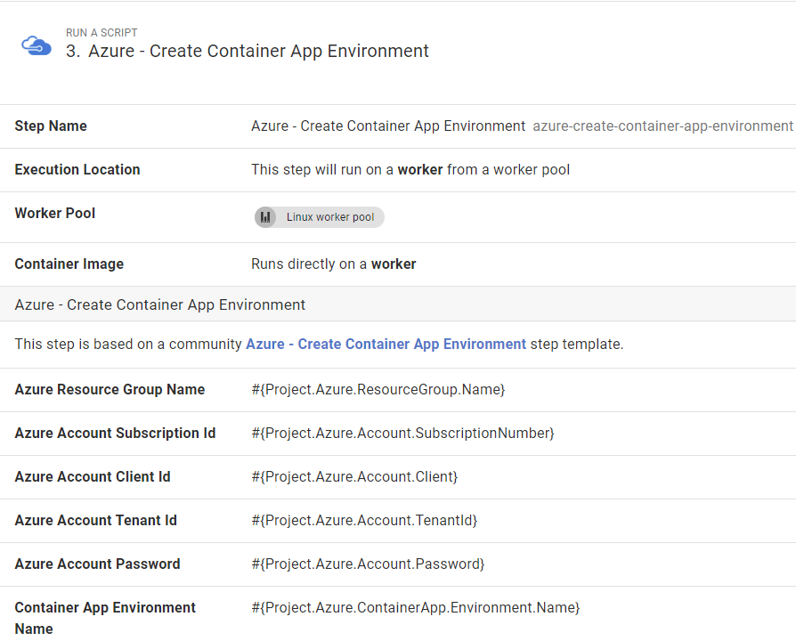

The template sets an output variable called `ManagedEnvironmentId` which is the ID value of the environment it created or found if it already exists.

#### Azure - Deploy api Container App step

Add an **[Azure - Deploy Container App](https://library.octopus.com/step-templates/db701b9a-5dbe-477e-b820-07f9e354f634/actiontemplate-azure-deploy-container-app)** community step template to your process.

- Azure Resource Group Name: `#{Project.Azure.ResourceGroup.Name}`
- Azure Account Subscription Id: `#{Project.Azure.Account.SubscriptionNumber}`
- Azure Account Client Id: `#{Project.Azure.Account.Client}`
- Azure Account Tenant Id: `#{Project.Azure.Account.TenantId}`
- Azure Account Password: `#{Project.Azure.Account.Password}`
- Container App Environment Name: `#{Octopus.Action[Azure - Create Container App Environment].Output.ManagedEnvironmentId}` **Note:**  This uses the output variable from the **Azure - Create Container App Environment** step
- Azure Location: `#{Project.Azure.Region.Code}`
- Container Name: `#{Project.Azure.ContainerApp.Api.Name}`
- Container Image: Choose `eshop-api` from feed list.
- Environment Variables:
```json
[
  {
    "name": "ConnectionStrings__CatalogConnection",
    "value": "Server=#{Project.SQL.DNS},1433;Integrated Security=false;Initial Catalog=#{Project.Catalog.Database.Name};User Id=#{Project.SQL.User.Name};Password=#{Project.SQL.User.Password};Trusted_Connection=false;Trust Server Certificate=True;"
  },
  {
    "name": "ConnectionStrings__IdentityConnection",
    "value": "Server=#{Project.SQL.DNS},1433;Integrated Security=false;Initial Catalog=#{Project.Identity.Database.Name};User Id=#{Project.SQL.User.Name};Password=#{Project.SQL.User.Password};Trusted_Connection=false;Trust Server Certificate=True;"
  },
  {
    "name": "ASPNETCORE_URLS",
    "value": "http://+:80"
  },
  {
    "name": "MyTest",
    "secretref": "mysecret"
  },
  {
    "name": "ASPNETCORE_ENVIRONMENT",
    "value": "Development"
  }
]
```
Secrets: 
```json
[
  {
    "name": "mysecret",
    "value": "#{Project.SQL.User.Password}"
  }
]
```
- Container Ingress Port: `80`
- External Ingress: Unchecked (False)

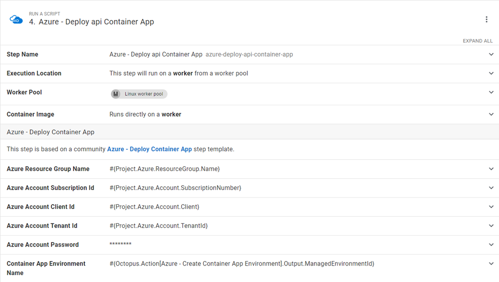

#### Get API DNS step

The eShopOnWeb web container needs the URL to the API container.  This step runs the following code to retrieve that value and sets an output variable. This code assumes that the Az PowerShell modules aren't installed, so it does it dynamically.

```powershell
$PowerShellModuleName = "Az.App"
$LocalModules = (New-Item "$PWD/modules" -ItemType Directory -Force).FullName

Save-Module -Name $PowerShellModuleName -Path $LocalModules -Force
$env:PSModulePath = "$LocalModules$([IO.Path]::PathSeparator)$env:PSModulePath"

# Import modules
Import-Module Az.App

# Get reference to the container
$apiContainerApp = Get-AzContainerApp -Name "$($OctopusParameters["Project.Azure.ContainerApp.Api.Name"])" -ResourceGroupName $OctopusParameters["Project.Azure.ResourceGroup.Name"]

Set-OctopusVariable -name "DNS" -value $apiContainerApp.IngressFQDN
```

#### Azure - Deploy web Container App step

- Azure Resource Group Name: `#{Project.Azure.ResourceGroup.Name}`
- Azure Account Subscription Id: `#{Project.Azure.Account.SubscriptionNumber}`
- Azure Account Client Id: `#{Project.Azure.Account.Client}`
- Azure Account Tenant Id: `#{Project.Azure.Account.TenantId}`
- Azure Account Password: `#{Project.Azure.Account.Password}`
- Container App Environment Name:  `#{Project.Azure.ContainerApp.Environment.Name}`
- Azure Location: `#{Project.Azure.Region.Code}`
- Container Name: `#{Project.Azure.ContainerApp.Web.Name}`
- Container Image: Choose `eshop-web` from feed list.
- Environment Variables:

```json
[
  {
    "name": "ConnectionStrings__CatalogConnection",
    "value": "Server=#{Project.SQL.DNS},1433;Integrated Security=false;Initial Catalog=#{Project.Catalog.Database.Name};User Id=#{Project.SQL.User.Name};Password=#{Project.SQL.User.Password};Trusted_Connection=false;Trust Server Certificate=True;"
  },
  {
    "name": "ConnectionStrings__IdentityConnection",
    "value": "Server=#{Project.SQL.DNS},1433;Integrated Security=false;Initial Catalog=#{Project.Identity.Database.Name};User Id=#{Project.SQL.User.Name};Password=#{Project.SQL.User.Password};Trusted_Connection=false;Trust Server Certificate=True;"
  },
  {
    "name": "ASPNETCORE_URLS",
    "value": "http://+:80"
  },
  {
    "name": "baseUrls__apiBase",
    "value": "https://#{Octopus.Action[Get API DNS].Output.DNS}"
  },
  {
    "name": "ASPNETCORE_ENVIRONMENT",
    "value": "Development"
  }
]

```

- Secrets: (blank)
- Container Ingress Port: `80`
- External Ingress: Checked (True)

When done, your process should look like this:

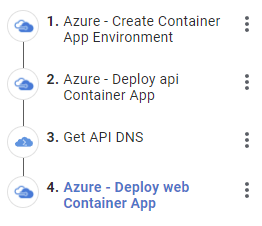

### Deployment

After the deployment is complete, it should create the following Azure resources:

- Catalog database
- Identity database
- Azure Container App environment
- eshop-api container app
- eshop-web container app

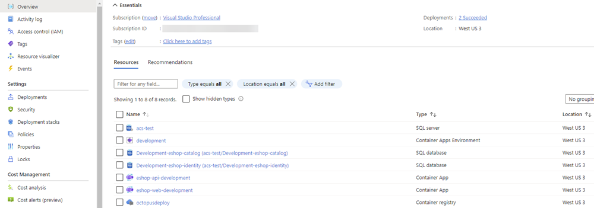

Click into the `eshop-web` Container App, then click on the application URL to see the application running.

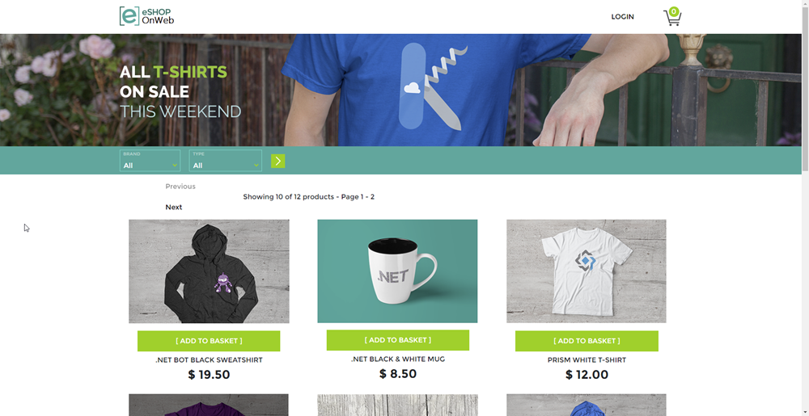

## Conclusion

In this post, I demonstrated how to deploy the eShopOnWeb application to Azure Container Apps using Octopus Deploy. 

Happy deployments!