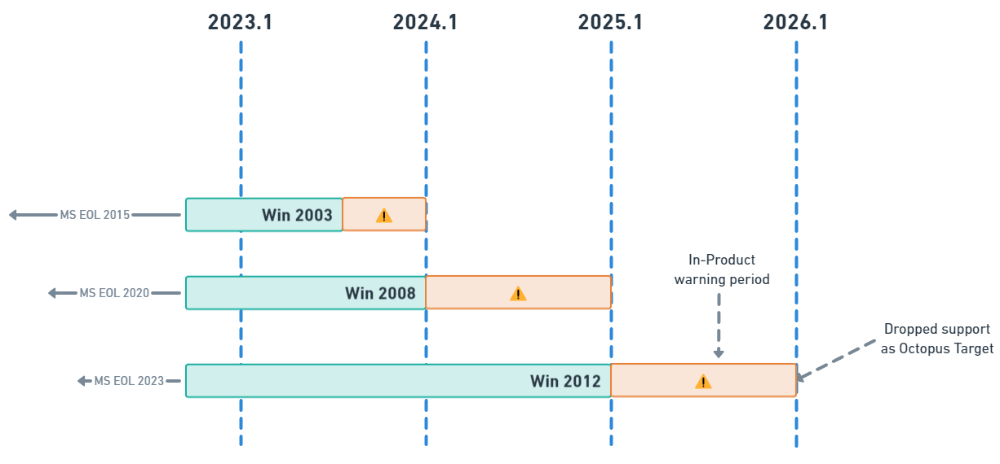

Octopus Deploy will drop support for Microsoft Windows 2003 Targets from the `2024.1` release. This change marks the start of a much more structured and hopefully predictable process to the way in which Octopus Deploy announces and executes our platform support policy.

## Why?
Microsoft Windows Server 2003, a twenty year old Operating System, was marked as end of life by Microsoft over eight years ago in 2015. With no further security updates or patches being made available the recommendation from Microsoft has for a long time been to migrate to a newer supported Operating System. Despite Microsoft themselves dropping support, it may come as a surprise to a lot of our customers that Octopus Deploy currently still officially supports Windows 2003 deployment targets. This requires a complecated architecture and compilation of [Calamari](https://octopus.com/docs/octopus-rest-api/calamari), our remote execution engine. 

Not only are we doing a disservice to our customers by not encouraging them to upgrade their systems, in doing so we hold back our own codebase which is required in many cases to cater for this lowest common OS denominator.

Although there may always be a long tail of customers requiring deployments to machines which are not running the latest version of the various supported platforms, it is still important that the guidance we provide has some alignment with what the platform vendors themselves suggest. 

## Platform support schedule

To improve predictability for our customers when it comes to these platform support decisions, we will begin announcing and putting into effect these changes on a yearly basis. 

**The first release of each calendar year will be planned to include any relevant updates that result in changes to supported deployment target platforms. This release will also embed warnings in the product for those target platforms being considered for deprecation in the following year.**

 This yearly period of warnings will provide both us and customers ample time to consider the impacts that a pending deprecation may bring.

 

 Given the age, technical limitations and customer impact of the Windows 2003 platform, the dropping of it's support will take place in the first deprecation release in `2024.1`.

## What does dropping Target support mean?                                                
All software has a lifecycle, and end of support for an Operating System in Octopus Deploy means that we will no longer develop or test for the usage of that platform during standard workloads. This may mean degraded functionality best or it could be a complete inability to run tasks on those platforms. 

In the case of Windows Server 2003, the deprecation in `2024.1` will likely be coupled with some improvements made to parts of our execution system that render the execution of complex deployments to those servers generally unavailable. 

On the rare cases that Octopus deprecates functionality we first must consider what sort of impact it will have on our users. We rely on telemetry from installed Octopus instances and conversations with our customer success team to help shape these decisions and provide insights on usage. Unsurprisingly in this case, our metrics indicate that only a very very small handful of customers still have a Tentacle running Windows Server 2003 and most of those represent a single target.
                                                                                                    
## Dropping support for Windows Server 2003 

This depreciation will take place in 2 stages. 

### Pre 2024.1
From the most recently patched 2023.2 release onwards, health checks and deployments that occur on targets detected as running soon-to-be deprecated platforms will begin generating warnings. The goal is to ensure customers are aware that they are running machines which could soon be affected by the changing support. 

### Post 2024.1
The change in support for Windows 2003 will allow our .NET Full Framework tooling to upgrade from .NET4.0 to .NET4.6.2. These tooling changes will mean that **Windows Server 2003 machines are no longer expected to function** and deployments will likely fail due to the unsupported .NET frameworks involved. 

This change should not affect any non-Windows targets as these generally already use the .NET Core version of Calamari.

**It is important that even if you are running a version of Windows later than Windows Server 2003, you should ensure that you have at least .NET4.6.2 or greater installed.** 

Windows Server 2016 onwards has .NET4.6.2 Framework or later [installed by default](https://learn.microsoft.com/en-us/dotnet/framework/get-started/system-requirements) however Windows Server 2008 and 2012 will need to have the .NET4.6.2 (or later) framework installed. 

||Preinstalled|Latest Supported|
|---|---|---|
|~~Windows 2003~~| -- |~~.NET4.0~~|
|Windows 2008 SP2| -- |.NET4.6.2|
|Windows 2008  R2 SP1| -- |.NET4.8+|
|Windows 2012|.NET4.5|.NET4.8+|
|Windows 2012 R2|.NET4.5.1|.NET4.8+|
|Windows 2016|.NET4.6.2|.NET4.8+|

#### Other changes in 2024.1
As noted in a [previous blog post](https://octopus.com/blog/deprecating-mono), `2024.1` will also deprecate support for Mono. Have a read of the earlier post for further details about this change if you are running Linux targets that use this legacy feature.

## Options for Targets that cannot be upgraded
From `2024.1` Octopus Deploy will consider Windows Server 2003 an unsupported platform for rich deployment pipelines due to its reliance on these tools.

Although our primary recommendation is that customers upgrade to an Operating System within the vendor’s support policy, that option might not always be possible. Some customers might not be ready to upgrade their targets to a later Windows Operating System or for technical reasons, unable to move away from that platform. 

There are still options available for these cases which will provide some capabilities, albeit in a limited capacity.

* **Shard Your Octopus Instance** - Octopus licensing allows more than one active instance at a time. Customers who need to run deployments on these older unsupported targets may wish to install a secondary Octopus Server instance with a version prior to `2024.1` where this capability is supported. Our LTS strategy currently allows support for Octopus Instance up to 12 months past their release date so users can expect to continue to receive security patches or major bug fixes through this period. 

* **[Raw Scripting](https://octopus.com/docs/deployments/custom-scripts/raw-scripting)** - This option allows for packages to be transferred from the server and very basic scripts to be directly invoked. This operation does not take place though Calamari and so lacks many of the rich deployment tools such as variable replacement or cloud deployments. 

* **Don’t Upgrade** - If you have no option but to continue to deploy to platforms which fall out of our support capabilities, remaining on older Octopus Server versions will allow for this requirement. Since the Octopus Server version itself will eventually fall out of support and lack the ability to deliver patches and updates, we would reccomend this option only as a last resort.

## Deprecations In Future
Octopus is aiming to make the support schedule more predictable by announcing and triggering target deprecations in the first release of the calendar year. We want to encourage users to keep their targets up to date with vendor supported platforms and will shortly be realigning our target policies with this in mind. 

## Summary
Although Microsoft themselves have dropped support for Windows Server 2003 several years ago, Octopus Deploy has continued to invest in ensuring customers who rely on this OS can deploy to it. Unfortunately supporting these outdated platforms has a cost which not only is no longer viable for us to continue and so
