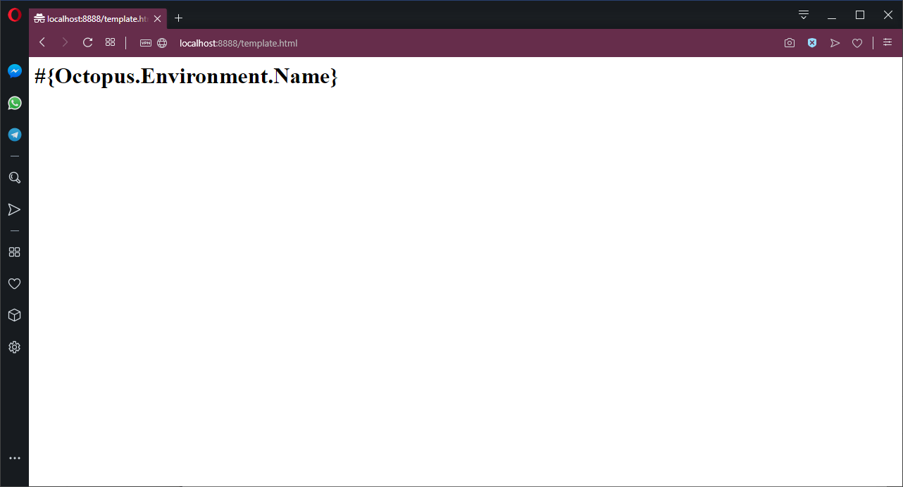
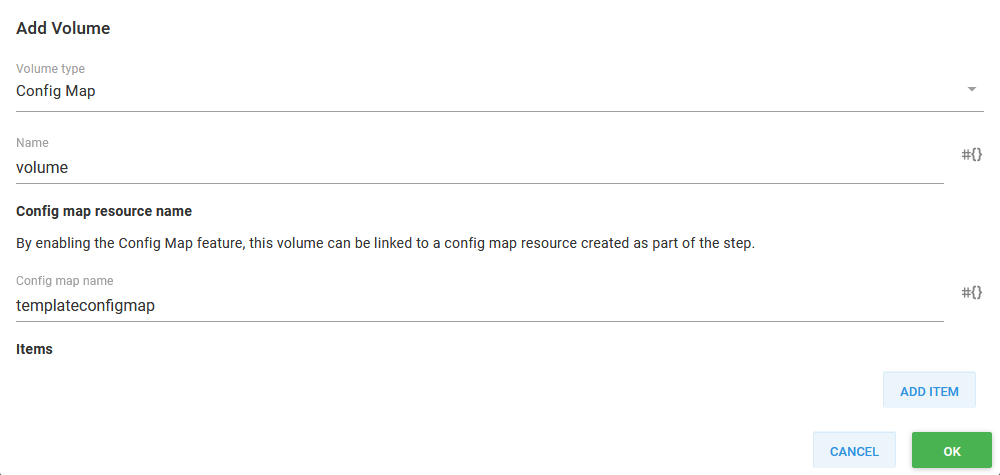
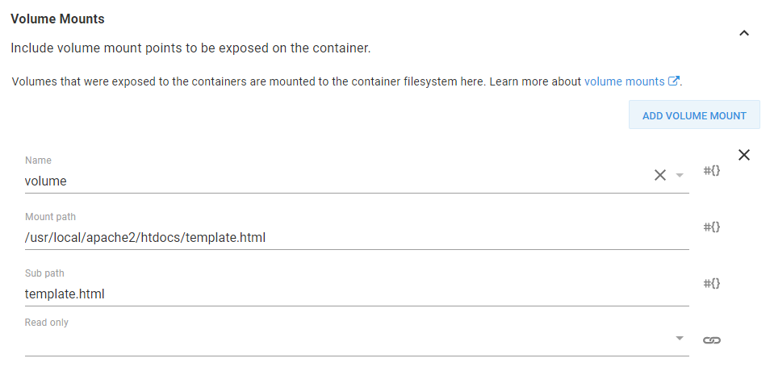
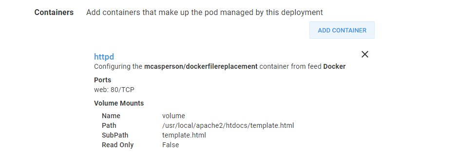
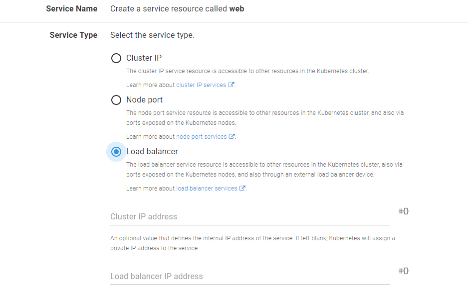
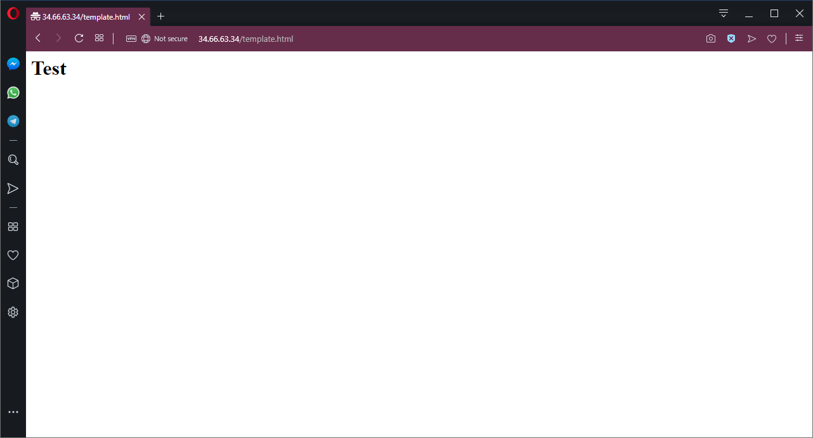

If you've ever deployed an application in Octopus before, you probably made use of variable substitution in files as a way of taking a generic application package and injecting environment specific configuration during deployment. This process is convenient because you can produce a single application artifact, and each environment is then responsible for customizing it to match the local infrastructure.

Replacing files in application packages like ZIPs or NUPKGs is straight forward because theses files are standard archives, and can be easily modified after they're downloaded from the artifact repository but before they're deployed to their final target.

Docker image files aren’t quite as easy to work with. For a start, there's some magic in the way the layers are built up to ensure that both new and deleted files are respected, meaning unpacking a Docker image file is not as simple as untar-ing the individual layers. Second, Kubernetes expects to pull down an image directly from a repository, which removes Octopus from the pipeline as far as distributing customized artifacts is concerned.

The good news is that we can take advantage of some open source tools created by the community for downloading and unpacking Docker images, and then use the built-in ability in Kubernetes to mount individual files into Pods to achieve much the same end result as deploying a modified package.

## The sample application

To demonstrate template file processing, we have a very simple Docker image based on HTTPD that will display a HTML page with the name of the current environment. The code for this image can be found on [GitHub](https://github.com/OctopusDeploy/DockerFileReplacementDemo) and has been published as the image [mcasperson/dockerfilereplacement](https://hub.docker.com/r/mcasperson/dockerfilereplacement).

The HTML file that is displayed by the Docker app is shown below. The string `#{Octopus.Environment.Name}` is intended to be replaced with the name of the environment once the deployment has been completed with Octopus:

```html
<html>
<body>
<h1>#{Octopus.Environment.Name}</h1>
</body>
</html>
```

To see this Docker image in action, we’ll run the Docker image locally with the following Docker run command:

```
docker run -p 8888:80 mcasperson/dockerfilereplacement:0.0.1
```

As you would expect, running this Docker image locally displays the web page in its unprocessed form.



*When run directly by Docker, the web server exposes the raw template file.*

## Working with Docker images, without using Docker

As we move the deployment to Octopus, the first step is to download and unpack a Docker image. Typically, interactions with Docker images and repositories are done with the `docker` CLI tool. Always having to run the Docker daemon isn’t terribly efficient though, and so additional third-party tools have been developed to work with Docker images outside of the Docker daemon.

The first tool is called [skopeo](https://github.com/containers/skopeo). We’ll use `skopeo` to download a Docker image and save it as a single, self-contained file on the local disk.

The second tool is called [umoci](https://umo.ci/). We’ll use `umoci` to unpack the file downloaded by `skopeo`, allowing us access to the final directory structure created by all the individual layers in a Docker image.

While both these tools are open source, getting binary builds can be challenging. For this exercise, I am using a SUSE Linux VM (i.e. SUSE Linux Enterprise Server) as an [Octopus Worker](https://octopus.com/docs/infrastructure/workers). SUSE created `umoci` and provides [binary downloads from the GitHub releases page](https://github.com/openSUSE/umoci/releases), while the standard SUSE package repositories contain a build of `skopeo`, which means we don’t have to go through the pain of trying to build these tools ourselves.

## Downloading and extracting the Docker image

Let’s take a look at the bash script, run by the Octopus `Run a script` step, that will download, extract and save the contents of a file from a Docker image:

```bash
read_file () {
  CONTENTS=""
  while read -r line || [ -n "$line" ]; do
    CONTENTS="${CONTENTS}${line}";
  done < ${1}
  printf -v "${2}" '%s' "${CONTENTS}"
}

skopeo copy docker://mcasperson/dockerfilereplacement:0.0.1 oci:image:latest
umoci unpack --image image --rootless bundle

cd bundle/rootfs/usr/local/apache2/htdocs
read_file template.html TemplateHtml
echo -e $TemplateHtml

set_octopusvariable "TemplateHtml" ${TemplateHtml}
```

We start with a bash function that reads the contents of the file, supplied as the first argument, line by line. The resulting string is then saved back into a global variable, whose name is passed in as the second argument (because bash functions can only return integer exit codes), using `printf`:

```bash
read_file () {
  CONTENTS=""
  while read -r line || [ -n "$line" ]; do
    CONTENTS="${CONTENTS}${line}";
  done < ${1}
  printf -v "${2}" '%s' "${CONTENTS}"
}
```

The Docker image is downloaded by `skopeo`, and saved in an Open Container Initiative (OCI) bundle called `image`:

```bash
skopeo copy docker://mcasperson/dockerfilereplacement:0.0.1 oci:image:latest
```

This file is then unpacked with `umoci`:

```bash
umoci unpack --image image --rootless bundle
```

At this point, we have the files that make up the Docker image extracted locally. The template file we are interested in is `/usr/local/apache/htdocs/template.html`. Using the bash function we created earlier, the contents of this file is read into a variable called `TemplateHtml`. We also dump the contents of this variable to the screen with `echo` to confirm that we have the content we expect:

```bash
cd bundle/rootfs/usr/local/apache2/htdocs
read_file template.html TemplateHtml
echo -e $TemplateHtml
```

After we have the contents of the file, we save it as an [output variable](https://octopus.com/docs/deployment-process/variables/output-variables):

```bash
set_octopusvariable "TemplateHtml" ${TemplateHtml}
```

## Creating the Kubernetes ConfigMap

With the contents of the file saved as an Octopus variable, the next step is to create a Kubernetes ConfigMap that holds the processed value. We’ll do this with the `Deploy raw Kubernetes YAML` step in Octopus.

The following is the Kubernetes YAML that the step will deploy to create the ConfigMap:

```yaml
apiVersion: v1
kind: ConfigMap
metadata:
  name: templateconfigmap
data:
  template.html: "#{Octopus.Action[Extract File].Output.TemplateHtml}"
```

The `template.html` field is the important part of this config map. The key defines the filename that we are replacing, and the value of `"#{Octopus.Action[Extract File].Output.TemplateHtml}"` will result in the contents of the file that we extracted in the last step being processed and then assigned to this key. Importantly this means that any nested variables references in the variable `Octopus.Action[Extract File].Output.TemplateHtml` will be replaced.

The end result is a ConfigMap that holds the original contents of the `template.html` file but with any variable replacements performed.

## Mounting the Kubernetes ConfigMap

The final step is to take the value from the Kubernetes ConfigMap and have it mounted back into the Kubernetes Pod, thus replacing the original, unprocessed file. We’ll do this through the `Deploy Kubernetes containers` step in Octopus.

This is done by defining a Volume that references the ConfigMap created in the previous step.


*The summary of the Kubernetes Volume.*



*The details of the Kubernetes Volume.*

The ConfigMap is then mounted into the Pod. The trick here is to set the `Mount path` to the full path of the individual file to be replaced and set the `Sub path` to the entry from the ConfigMap that has the contents of the file.

With this configuration we will mount a single file in the Pod containing the value from the ConfigMap, replacing the original generic file.



*A Kubernetes volume mount that adds a single file to the Kubernetes container.*

For completeness, this is the Container section from the `Deploy Kubernetes containers` step. You can see we are deploying the image `mcasperson/dockerfilereplacement`, exposing port 80, and mounting the ConfigMap as a volume.



*The summary of the Kubernetes container configuration.*

For convenience, this Pod will be exposed directly by a LoadBalancer service. This gives us a public IP address that we can use to interact with the Pod.



*The Pod is exposed by a LoadBalancer service.*


*The service exposes port 80 from the Pod.*

## The processed result

After this deployment completes, we'll have a public IP that we can use to access the web server. Now when we open the `template.html` page, we get the HTML template file with the variables replaced. This means we now see the name of the environment in the body of the web page.


*HTTPD presenting the processed template.html file from the Dev environment.*

If we then progress this deployment to the next environment, we can see that the newly created load balancer exposes a Pod with the environment name `Test` placed into `template.html`.



*The same template.html file after the deployment was pushed to the Test environment.*

## Conclusion

File variable replacements are a convenient way to create generic packages that can be deployed to any environment. Although it takes a few additional steps, this same workflow can be applied to Kubernetes deployments.

By taking advantage of `skopeo` and `umoci` to download and extract the Docker images, and then using ConfigMaps as volume mounts in Kubernetes, we can achieve the effect of replacing templated files during deployments without having to publish environment-specific Docker images.

Happy deployments!
