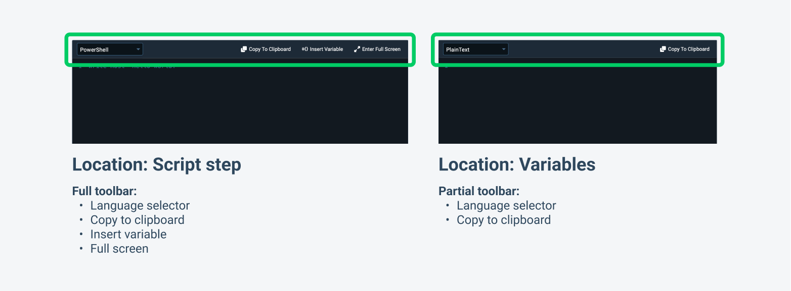

During 2022, we ran a series of usability tests to evaluate our customers' first deployment experience. We aimed to gain valuable insights into the user journey and discover areas of improvement. 

One area we identified was the script editor. Although functional, there were usability issues and the script editor wasn’t in a prominent position in the script steps. We decided to give the script editor a fresh look and improve the user experience.

In this post, I explain what you can expect from the uplifted script editor.

## Before

Here you can see what the script editor looked like before the uplift.

## After

Here you can see what the script editor looks like now.

## Changes to the script editor

### Improved hierarchy and visual prominence

To enhance the visual hierarchy of the script editor, we moved it higher in the Run a Script step and inverted it to dark theme. This styling treatment gives the script editor prominence, making it the star of script steps.

### Centralized and easy to use actions

To make the script editor easier to use, we introduced a toolbar to house its actions: 

- **Language selector**
- **Copy to clipboard**
- **Insert variable** 
- **Full screen**

Before, functionality was scattered and inconsistent across inline and full-screen modes. This limited what you could do in either mode. All actions are now available to you regardless of the mode you prefer to read and edit your code in. You no longer need to dart your cursor around the screen to click on actions.

We also looked at how we presented the actions. Previously, action buttons were icons. When observing our customers, we noticed they had trouble working out the purpose and functionality of actions. This was especially noticeable with the **Insert variable** action as its ambiguous icon was also tricky to find. Our solution was to add button labels, so you can understand what each button does at a glance.

### Other notable changes to the script editor

We also implemented several smaller yet impactful quality-of-life updates. Notably, we introduced placeholder “hello world” text that changes to reflect the syntax of the language you select. And to enhance your coding experience, the editor now expands when you click into it, to give you more room to read and edit your code inline.

## Expanding the scope

We initially only planned to update script editors in steps. But after we saw the benefits of the changes, we decided to ship the update to all instances of the editor in Octopus. 

We componentized the script editor to make actions in the toolbar togglable. Depending on where the script editor is, it may need more or less functionality, and we can toggle parts off depending on where it’s used. 

For example, the code editor in script steps has the full toolbar. The code editor for variables, however, only requires the **Language selector** and **Copy to clipboard** actions.

## Conclusion

The new script editor provides an improved experience. It's now easier for you to read and edit your code in the Octopus product. 

We’d love to hear your feedback on this update and to learn how you use the script editor. Do you prefer to edit code directly in Octopus, or copy and paste it in from somewhere else? Let us know in our feedback survey.

<a class="btn btn-success" href="https://octopusdeploy.typeform.com/to/bJfRWHyf">Share your feedback</a>

Happy deployments!