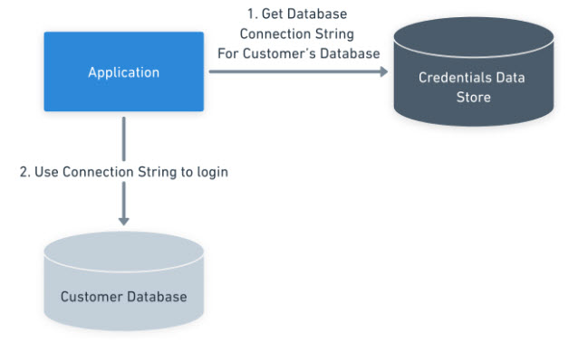

Software as a Service (SaaS) providers must isolate their customer’s data. Isolation is possible in code or through isolated infrastructure.  

In this post, I walk you through the pros and cons of each approach. You'll see why I recommend isolated infrastructure.

## Isolated data requirements

Imagine you provide software to soft-drink manufacturers. Coca-Cola doesn't want Dr. Pepper, or PepsiCo, accessing its data.  

Outside of losing business, failing to have data isolation has monetary impacts.  Generally, for B2B providers, user agreements or contracts enforce that rule.  Failure to comply could result in fines or lawsuits.  

## Data isolation options

There are 4 approaches for data isolation:

 - A unique customer identifier on every database record
 - Tenant-specific tables in the database
 - A database schema or container/collection (NoSQL databases) per customer
 - A database per customer

There are 2 options for the application layer:

- A shared application where everyone logs into the same user interface
- A copy of the application per customer with a unique login URL  

How you isolate your customer data impacts the application layer.

|                                      | Shared Application    |Isolated Application  |
|--------------------------------------|-----------------------|----------------------|
|Unique customer identifier per record |   |        |
|Tenant-specific tables in the database|   ||
|Database schema per customer          | |  |
|Database per customer                 |         |  |

:::hint
All options marked with a yellow circle and red x are possible, but they're impractical and not recommended.
:::

Combining the data isolation with the application yields 3 options:

- Shared application and database
- Shared application, isolated database per customer
- Isolated tenanted infrastructure

## Shared application and database

The shared application and database is when all customers are stored in the same database and access the same application version.  Commonly, a shared application is paired with the unique customer identifier per record or tenant-specific tables.  

That model has many benefits:  

- A single codebase to manage
- All customers get all the new bug fixes and features at once
- One production database to query
- Adding a new customer is as easy as adding a record to a table
- Deployments are simple; push all the application components and database simultaneously

Despite its many benefits, it does have drawbacks.

### Application complexity

Adding a unique customer identifier per record is not easy. If the application has existed for years, retrofitting such a change will take hundreds, if not thousands of hours.  Every query must start with `Where CustomerId =`. It's not only development time. There's also time spent testing, writing requirements, analyzing business rules, and more.

Moving all customers to tenant-specific tables makes it easier to know when to use `Where CustomerId = ` in the where clause.  But that doesn't remove the requirements.  Opting for a set of tables per customer will remove the `Where CustomerId =` requirement.  However, every query becomes dynamic, as table names must change per customer when the query is being built.  

:::warning
Picking the customer identifier per record will impact your application for the rest of its life.
:::

How you develop features will change.  Is the feature global, like a sign-in flow?  Or is the feature specific to the customer?  A robust series of tests ensures one customer cannot access another customer’s data.

### Noisy customer performance impact

A noisy customer consumes more CPU, RAM, and database resources than their counterparts.  Going back to the soft drink example, Coca-Cola has many brands, while a specialty manufacturer of root beer might have one or two.  Coca-Cola will consume more resources for its queries than the specialty manufacturer.

I was a developer on an application that used this model about 10 years ago.  One feature generated reports for customers.  We didn’t specify a date range for the report.  One customer decided they wanted 3 years of data.  While that report ran, no other user could use the application.
 
### Database and table size

You'll likely have huge tables if your application uses a relational database.  Those tables (and attached indexes) consume a lot of space.  That increases the database size.  Routine maintenance tasks such as rebuilding indexes or full backups will take longer.

### The risk of cross-talk

Cross-talk is when one customer’s data gets exposed to another. There are various ways cross-talk can occur. Some examples include:

- A where clause has a hardcoded customer identifier. Every other customer can see that customer’s data.
- The authentication/authorization mechanism has a bug; a user gets the wrong customer identifier. They can view and change that customer’s data.
- A malicious user discovers a SQL injection flaw in the application.  They can change their user record to view any customer’s data.

### Customer sign-off and deployments

Every customer will be on the same application version.  That is both beneficial and detrimental.  The benefit is there is one version to support.  It’s detrimental because each customer has a different capacity for change. Changes include UI updates, security and fixes, or system-wide features.

Returning to the soft drink example, imagine a security flaw that harmed Coca-Cola and PepsiCo.  Both customers demand sign-off from their security teams before deploying to production.  PepsiCo’s security team had the capacity and signed off on the fix in a few days.  Coca-Cola’s security team didn’t have the same capacity, and the sign-off couldn’t happen until next month.

PepsiCo must now wait for Coca-Cola to sign off.  Meanwhile, that issue still exists.  To help PepsiCo, you can add a feature flag turning off the fix for Coca-Cola.  But that requires more testing.

If you have a customer sign-off process, you must reduce deployment frequency or increase application complexity. 

## Shared application with a database per customer

The logical step to solve application complexity, cross-talk, and database size issues is using a shared application with a database per customer.  Looking at the table from above, this section represents the yellow circles.

Before working at Octopus Deploy, I worked on 3 enterprise-level applications at 3 companies that adopted this approach.  I won't lie, the shared application, database per customer approach, is appealing for many reasons:

- You have a single code base *without* needing a where clause containing `where customerId=` for every query.
- You can make an existing application "multi-tenant" with minimal code changes.
- The customer’s data is isolated from other customers.  Unique database accounts help prevent customers from seeing each other’s data.
- Isolated databases lower the risk of a noisy customer causing issues with other customers.
- Every customer is on the same version of the application.  

:::hint A schema per customer is nearly identical to this approach.  The primary difference is that it doesn’t solve the database size, performance, and maintenance issues.  All the issues discussed in this section apply to that approach.

I spent more than 5 years building multi-tenant applications using this approach.  After seeing the good and the bad, I would avoid it at all costs.
:::

### Doesn’t solve all the problems

The shared application with an isolated database model doesn't solve all the problems found in the shared application and database model.

- Noisy customers can still consume a lot of computing resources.
- Customer sign-off still requires a reduced deployment frequency or increased application complexity.

### Switching connection challenges

The database connection string will be dynamic; it must be retrieved and stored per user.  That's much more complex than storing database connection information in an environment variable or configuration file.

A shared application with an isolated database model requires a "database mapping" layer.  When a user logs in, the application looks up customer connection information in a database, secret vault, or data store.  Only then can the application connect to the correct customer database.

Managing those connection strings becomes more complex and risky because the application source code requires access to the data store. With the other approaches, the deployment tool retrieves those values during a deployment.  

### Cross-talk still occurs and is more insidious

The connection information is likely tied to a user's session in server memory for performance reasons.  With the rise of SOA and microservices-based architecture, customer data exists across multiple applications.  When the application needs to invoke a service on behalf of the user, it’ll send the customer identifier to that service which also has a database per customer.  

This architecture assumes the connection lookup will be perfect 100% of the time. That’s an impossible standard. It's complicated identifying back-end errors.  A user will notice if that connection lookup is incorrect on the front-end. A back-end error might not get noticed for weeks until someone complains about missing or strange-looking data.

Fixing the data with a shared application and isolated database model requires moving data (and all the child data) between databases, and then there's the required clean-up. Fixing the data with a shared application and database model only involves updating a few records. It's risky to generate a script per incident.  Development teams will create custom tooling enforcing business rules to mitigate risk.

### Each new customer increases the deployment time

Every customer uses the same application version. Because of that, the deployment must update all the customers’ databases before deploying the code.  Depending on the complexity of the changes, an application with 50 to 80 customers could need 2-3 hours to update all databases.

### A shared database will likely exist

Not all data is the same.  Some data is static and common across customers, for example, a list of states and countries.  I’ve seen applications with a shared database to store that common data to avoid synchronizing to all the customer databases.  Each new feature and bug fix must know which data store to use.

## Isolated tenant infrastructure

The isolated tenant infrastructure model solves all the above problems:

- There's no risk of cross-talk; a customer’s copy of the application can only communicate with the customer’s database.
- CPU, RAM, and database resource limits control noisy neighbors. When they consume all their resources, they don’t impact other customers.
- There's no complex connection string mapping. An environment variable or configuration file stores the connection string.
- It's a simpler code base, because no `where customer=` logic permeates throughout the code.
- Sign-off is much easier. Upgrade the customers signed off on a bug fix, new feature, or security enhancement.  Leave the other customers alone until sign-off.
- You get performance and latency improvements by running the application closer to the customer’s primary users in a specific region or country.  
- It's easier to support multiple application versions.  
- You can schedule deployments for each customer’s "off-hours."

The isolated tenant infrastructure has its faults, though.

### It takes more time to add a customer

With the shared application and database model, adding a customer was as simple as adding a row to a table.  With isolated tenant infrastructure, customers must wait minutes or hours for their infrastructure.  

You need Infrastructure as Code (IaC) and automation for the isolated tenant infrastructure to scale.

### More deployments

You only need a single deployment with the shared application and database, and shared application and database models.  A deployment could take a single night.  

With isolated tenant infrastructure, each customer will require a deployment. It could take many days to deploy a change to all customers. You need a deployment automation tool to manage all these deployments.

### More versions to support
 
The likelihood of all customers being on the same version is low.  One group of customers might be on 2023.3.568, while another group is on 2023.2.990.  Most SaaS products have different tiers or features available as add-ons.  

The possible versions and feature sets to support will exponentially grow.  That requires robust testing automation, including the ability to spin up new "test customers" or "test environments" to support all the permutations.  

### Higher cloud bills

With a shared application and database model, all customers share the same pool of resources.  The chances of all customers needing all the resources at any given time are near zero.

However, the opposite is true with isolated tenanted infrastructure.  Applications that can only run on virtual machines (VMs) will have "bursty" resource use.  A lot of the time, the VMs will be idle, consuming minimal resources.  As such, they'll incur higher cloud bills than those running on platforms that allow sharing of resources with the required isolation. For example:

- Container platforms, like:
   - ACS 
   - ECS
   - Kubernetes
- Platform as a Service (PaaS) platforms, like:
   - Azure Web Apps
   - Lambdas
   - Functions
- Azure’s Elastic database pools

That said, the cloud bills will likely be cheaper than the people-hours to manage code complexity found in the shared application and database model.

## Conclusion

Unless there's a compelling business reason otherwise, I recommend isolated tenanted infrastructure.

There are many risks associated with customers sharing the same application and database. You can mitigate almost all those risks by using isolated tenanted infrastructure.  Until recently, many considered that approach too costly and complex to manage at scale. With today's tools and technologies, isolated tenanted infrastructure at scale is achievable. 

Happy deployments!