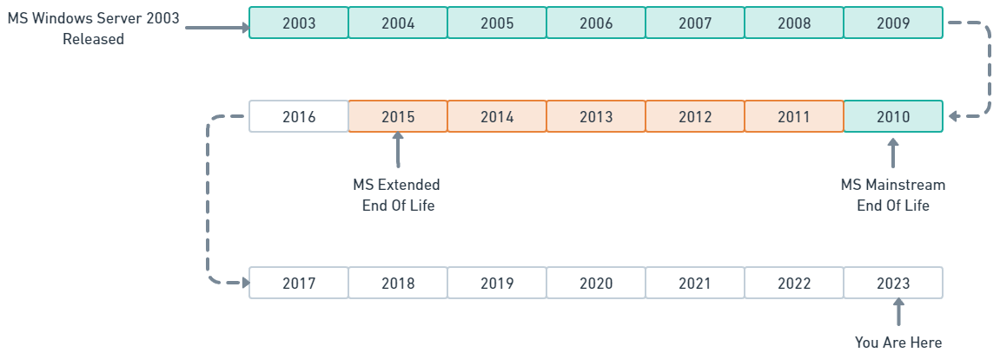

Supporting outdated operating systems comes with a cost that gets more expensive over time. As a result, Octopus Deploy will drop support for Microsoft Windows 2003 targets and Workers from the 2024.1 release, early next year. 

This post explains why we have to make this change, and what you can do if this affects you.

## What does dropping target support mean?  
                                              
All software has a lifecycle, and the end of support for an operating system in Octopus Deploy means no longer developing or testing that platform's use during standard workloads. At best, this may lead to degraded functionality, at worst, a complete inability to run tasks on those platforms.

For Windows Server 2003, we'll likely couple the deprecation in Octopus Server 2024.1 with improvements to parts of our execution system that render the execution of complex deployments to those servers generally unavailable.

We rely on telemetry from installed Octopus instances and conversations with customers to shape these decisions and provide insights on use. Unsurprisingly, our metrics show only a very small handful of customers still have a Tentacle running Windows Server 2003. And most of those represent a single target or Worker.

## Dropping support for Windows Server 2003 

This deprecation will take place in 2 stages. 

### Before 2024.1

From the most recently patched 2023.2 release onwards, health checks and deployments on targets or Workers we detect as running Windows Server 2003 will begin generating warnings. The goal is to ensure our customers know if this change affects the machines they're running.

### After 2024.1 (February 2024)

The changes introduced from this release will allow our .NET Full Framework tooling to upgrade from .NET4.0 to .NET4.6.2. These tooling changes will mean that **Windows Server 2003 machines are no longer expected to function**. Deployments will likely fail due to the unsupported .NET frameworks involved. 

This change should not affect non-Windows targets as these generally already use the .NET Core version of Calamari.

:::warning
It's important that even if you're running a version of Windows later than Windows Server 2003, you ensure you have at least .NET4.6.2 or greater installed.
:::

Windows Server 2016 onwards has .NET4.6.2 Framework or later [installed by default](https://learn.microsoft.com/en-us/dotnet/framework/get-started/system-requirements) however Windows Server 2008 and 2012 will need to have the .NET4.6.2 (or later) framework installed. 

||Preinstalled|Latest Supported|
|---|---|---|
|~~Windows 2003~~| -- |~~.NET4.0~~|
|Windows 2008 SP2| -- |.NET4.6.2|
|Windows 2008  R2 SP1| -- |.NET4.8+|
|Windows 2012|.NET4.5|.NET4.8+|
|Windows 2012 R2|.NET4.5.1|.NET4.8+|
|Windows 2016|.NET4.6.2|.NET4.8+|

## Options for targets that cannot be upgraded

From 2024.1, Octopus Deploy will consider Windows Server 2003 an unsupported platform for rich deployment pipelines.

Our primary recommendation is that customers upgrade to an operating system in the vendor’s support policy. However, we know that option might not always be possible. Some customers might not be ready to upgrade their machines to run a later Windows operating system (OS). Some might be unable to move away from that platform for technical reasons.

There are still options available for these cases, which will provide some capabilities, albeit in a limited capacity.

- **Shard your Octopus instance** - Octopus licensing allows more than one active instance at a time. To run deployments on these older unsupported targets, you can install a secondary Octopus Server instance with a version prior to `2024.1` where this capability is supported. Our LTS strategy currently supports Octopus versions up to 12 months past their release date, so you'll continue to receive security patches or major bug fixes through this period.

- **[Raw scripting](https://octopus.com/docs/deployments/custom-scripts/raw-scripting)** - This option lets you transfer packages from the server and directly invoke very basic scripts. This operation does not take place through Calamari, so lacks rich deployment capabilities like variable replacement and cloud deployments.

- **Don’t upgrade** - If you have no option but to continue deploying to platforms that fall out of our support, you can remain on older Octopus Server versions. Since the Octopus Server version will eventually fall out of support and stop delivering patches and updates, we recommend this option only as a last resort.

### Other changes in 2024.1

2024.1 will also deprecate support for Mono. Read our [post about deprecating Mono](https://octopus.com/blog/deprecating-mono) for further details about this change if you're running Linux targets that use this feature.

Check our [Deprecations page](https://octopus.com/docs/deprecations) for other changes we may introduce in this release.

## Why deprecate Windows Server 2003?

More than 8 years ago in 2015, Microsoft marked Windows Server 2003, a 20-year-old operating system, as end of life. With no further security updates or patches available, Microsoft has long recommended migrating to a newer, supported operating system (OS). 

Despite Microsoft themselves dropping support, it may surprise many of our customers that Octopus still officially supports Windows 2003 deployment targets and Workers. This requires a complicated architecture and compilation of [Calamari](https://octopus.com/docs/octopus-rest-api/calamari), our remote execution engine. 

We think it's a disservice to our customers not encouraging them to upgrade their systems. And we're holding back our own codebase which needs, in many cases, to cater for this lowest common OS denominator.

Running on this platform requires compiling our tooling with .NET4.0. That itself lacks support for some of the more modern deployment scenarios. We have to generate multiple builds of this tooling, requiring a complex multi-project dependency structure. We need to test all these different artifacts and package and reference them in the Octopus Server installer, even though the majority of our customers never rely on it. This setup in the shared tooling introduces risks for all customers and creates a significant development cost to maintain.

Given the age, technical limitations, and customer impact of the Windows 2003 platform, we'll drop support in the first planned deprecation release in 2024.1.

## Summary

Although Microsoft dropped support for Windows Server 2003 several years ago, Octopus has continued to invest in ensuring customers who rely on this OS can deploy to it. Unfortunately, supporting outdated platforms has a cost for us and encourages bad practices.

From the 2024.1 release onwards, Windows Server 2003 will become an unsupported platform for deployment targets or Workers.

If there's anything in this post that concerns you, or you'd like further information, please get in touch with our [support team](mailto:support@octopus.com) or add a comment below.

Happy deployments!