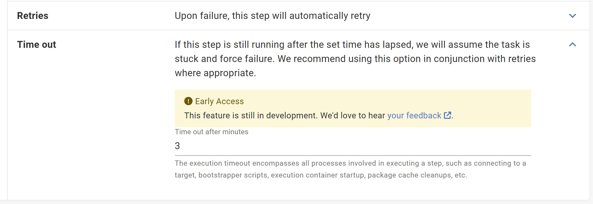
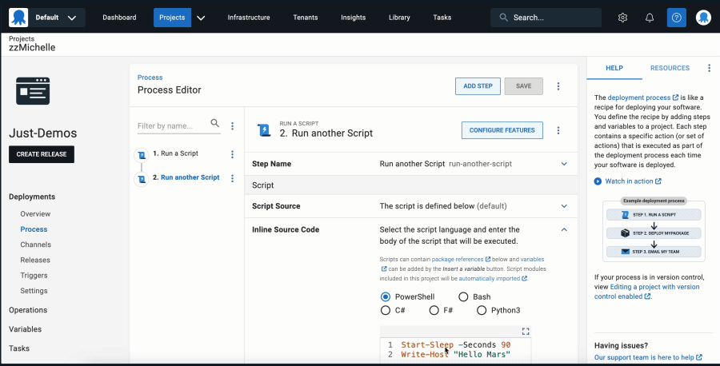
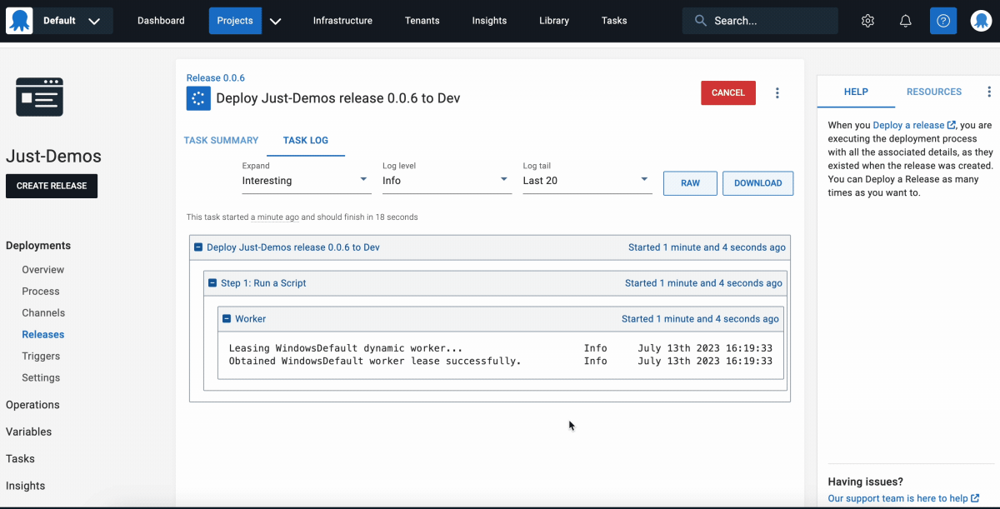

We received [feedback](https://roadmap.octopus.com/c/55-timeouts-for-steps) requesting execution timeouts to handle hung deployment processes.

Octopus 2023.3 introduces Execution Timeouts, a feature to configure automatic step cancellations. Some deployment processes, like Azure FTP connections and CloudFormation updates, include long-running actions. These can last for hours or even hang indefinitely. With Execution Timeouts, you can set a time limit, in minutes, in a step's configuration. When this timeout lapses, the action fails, and the deployment process continues. Paired with [Step Retries](https://octopus.com/blog/step-retries), this increases the likelihood of successful deployments.

<!-- Watch the video below to see this new feature in action:

<iframe width="560" height="315" src="TODO" title="YouTube video player" frameborder="0" allow="accelerometer; clipboard-write; encrypted-media; gyroscope; picture-in-picture; web-share" allowfullscreen></iframe> -->

## How Execution Timeouts work

You can enable Execution Timeouts on individual steps found in the **Conditions** section of each step, as shown below:

You can configure Execution Timeouts in minutes. An unset value or zero won't timeout. 

It's important to note that Execution Timeouts encompass all processes involved in step execution. This includes: 

- Connecting to a target
- Worker leasing
- Bootstrapper scripts
- Execution container start-up
- Package cache clean-ups

We recommend setting a slightly longer timeout than expected. In most cases, an additional minute should account for this.

### Steps you can't use Execution Timeouts for

You can use Execution Timeouts on all steps except for:

- **Send an Email** step
- **Manual Intervention** step
- **Health Check** step
- **Deploy a Release** step
- **Kubernetes** steps (as these have a kubernetes specific implementation in the step configuration)

### How to configure Execution Timeouts

Execution Timeouts are available from Octopus 2023.3 and can be enabled by setting the `ActionExecutionTimeOutFeatureToggle` environment variable to true. If you're an Octopus Cloud customer and want to try this feature, please email our [support team](mailto:support@octopus.com). 

After you enable Execution Timeouts, you can configure them manually through the step UI, or through the Octopus variable: `Octopus.Action[stepName].ExecutionTimeout.Minutes`. 

To avoid warning logs about overriding variables, you need to also set the variable `OctopusSuppressDuplicateVariableWarning` to **true**.

### Can I set Execution Timeouts to a default value for all my steps?

No. You must configure Execution Timeouts on each step in each deployment process.

### Do Execution Timeouts trigger at all stages of a deployment process?

No. Execution Timeouts won't trigger during package acquisition.

## Conclusion

To help improve the success rate and automation of deployments, you can now add [Execution Timeouts](https://octopus.com/docs/projects/steps/conditions#retries-and-execution-timeouts). This lets you configure unpredictable long-running processes to fail early. Combined with automatic [Step Retries](https://octopus.com/blog/step-retries) this feature can improve deployment success rates.

## Feedback

We'd love to hear [any feedback](https://oc.to/ActionExecutionTimeOutFeedbackForm) to help us improve this feature.

Happy deployments!
