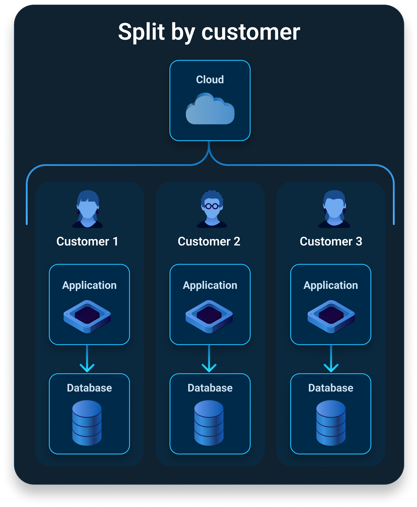
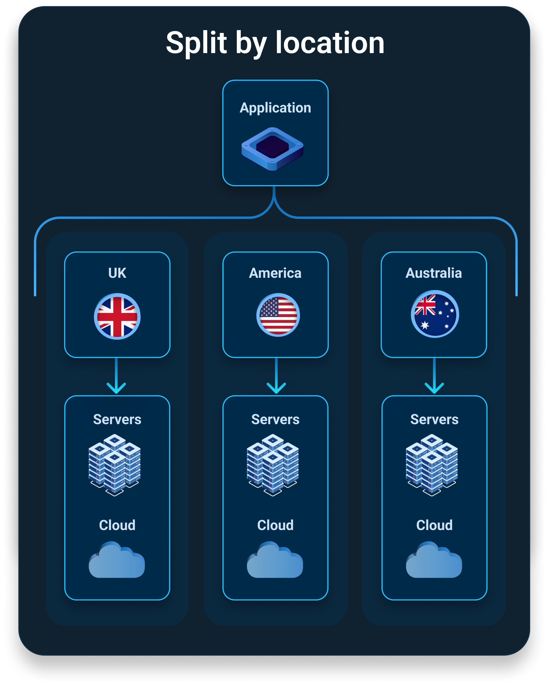
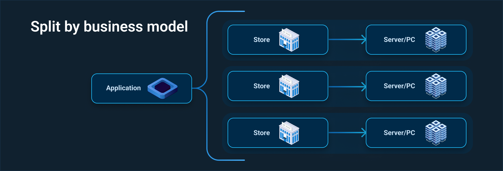
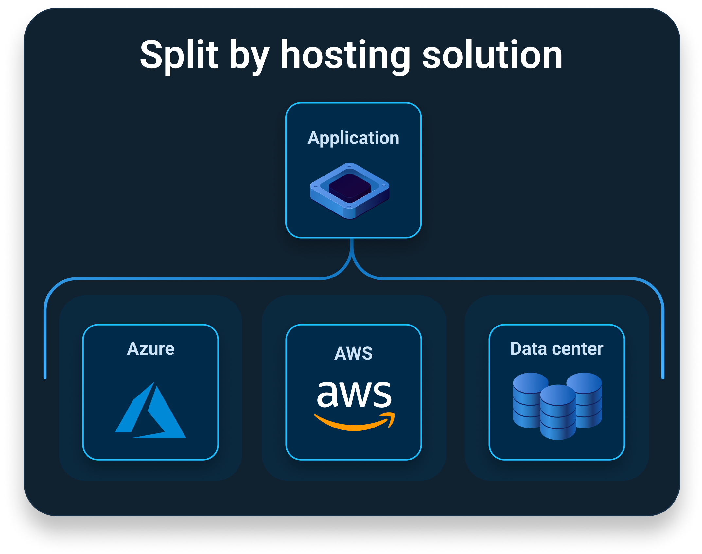

'Multi-tenancy' was once a term that described a very particular software architecture: Where an application lives on a server for other computers - tenants - to use it.

Over the years, the definition expanded and now describes much more than that. Sometimes we use it for software architecture, sometimes not. Sometimes we use it to explain how we serve or deploy applications, and even how users access them.

At its simplest, the software industry uses 'multi-tenancy' to explain where software or its architecture splits into manageable chunks. These chunks could save money, simplify processes, or make things safer or easier for customers.

Rather than try to unravel the whole term, it's easier to explain the scenarios typically described as multi-tenancy.

## Split by customer

Splitting tenancy by customer is a common architecture for Software as Service (SaaS) applications. A SaaS application is software delivered via a subscription model and usually accessed by a web browser. SaaS software providers manage the application's infrastructure so users don't have to.

Multi-tenancy in SaaS sees each customer get the same product but with resources separate from other customers.

For example, your customers would get isolated:

- Space on your hosting platform
- Identity management and security functions
- Databases

Here, your tenants could be your customers or infrastructure.

## Split by location or region

This is where organizations, like big enterprises, serve customers worldwide.

Worldwide or regional support usually means accounting for regional differences. That includes region-specific:

- Content
- Languages
- Outage windows
- Legal requirements

Here, your tenants could be your regional infrastructure.

## Split by business model

Your business model could dictate where your application becomes multi-tenancy. The best example is delivering software to many brick-and-mortar locations, like retail chains, hospitals, hotels, and more.

In this scenario, you could be: 

- Working for an international organization delivering software to its worldwide branches
- An independent organization delivering software to physical locations for many organizations

Here, your tenants could be each store or a group of stores.

## Split by hosting solution

Due to strict processes or legal requirements, you may need to deliver your software to your customers' own hosting solutions. This could be common if you support government agencies or businesses in other sensitive industries.

For example, you may need to deliver your software to your customer's own:

- Cloud services
- On-premises servers or desktop computers
- Data centers
- Hybrid setups

Here, your tenants could be a deployment target or a group of deployment targets.

## And everything in between

At this stage, you may be thinking, "*our multi-tenancy application fits a couple of these descriptions*", and you'd be absolutely right.

These scenarios can crossover, for sure. And some apps may use more than one multi-tenancy variation at different stages.

That's because software development is only growing more complex and with it, the term evolves too. The lines we draw between these scenarios are blurry and will only get blurrier.

## What next?

See Octopus's [Tenants use-case page](https://octopus.com/use-case/tenanted-deployments) for more information on how Octopus can help you deploy your multi-tenancy applications faster and more reliably.

Happy deployments!