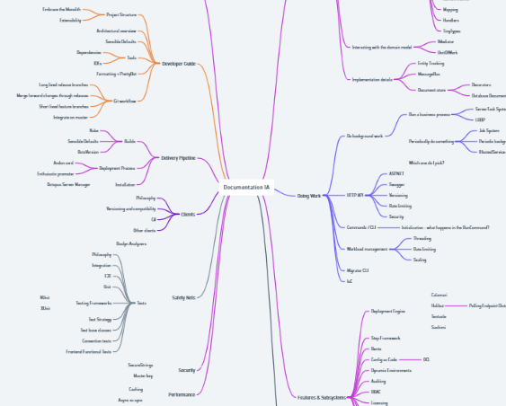
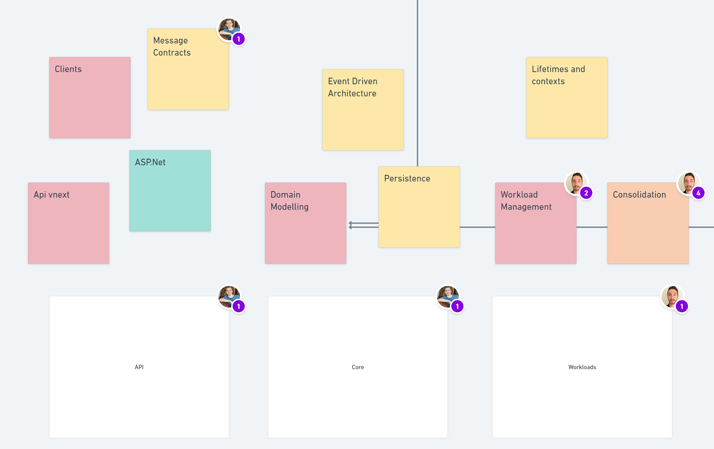
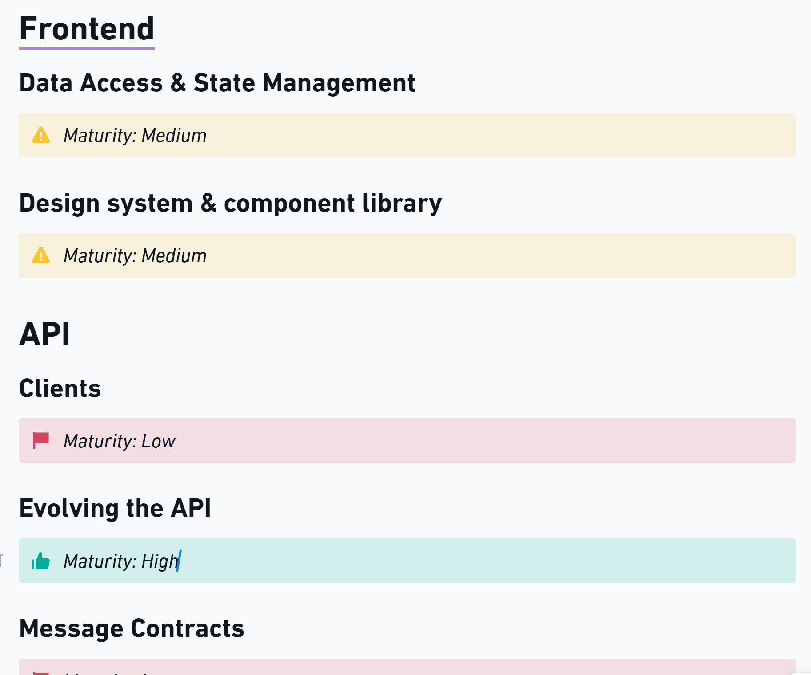
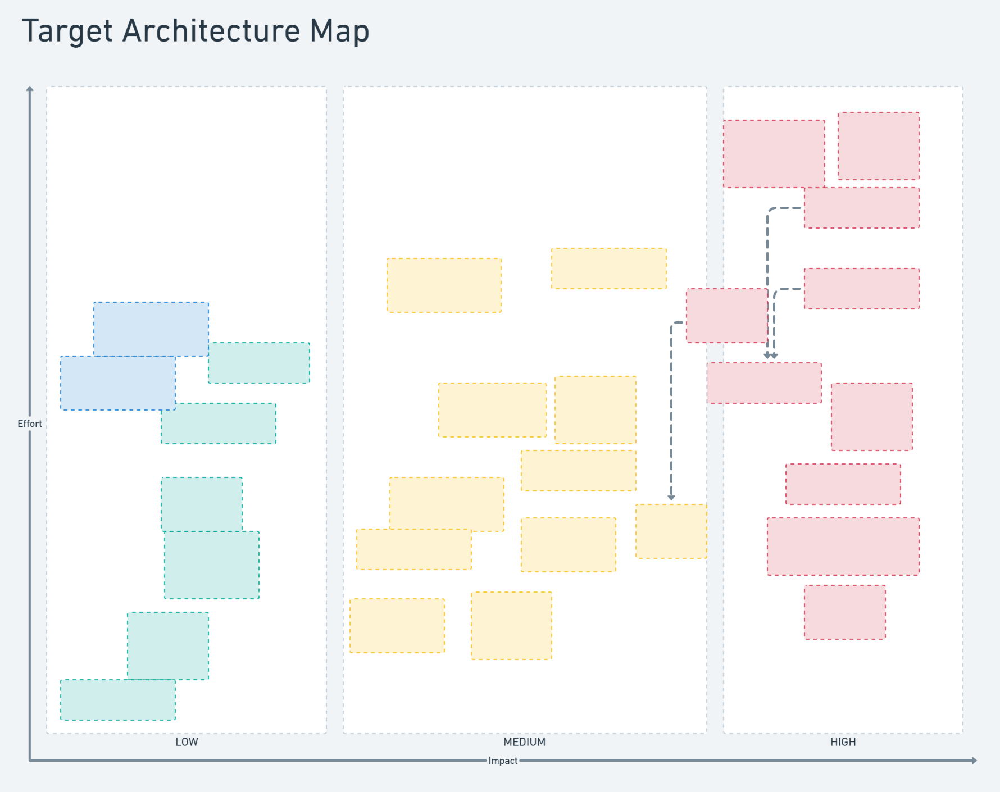

When writing a technical strategy, it is useful to have a very clear picture of the technical problems you are facing in your organization.

Ideally you should be able to make a clear problem diagnosis based on knowing where the problems you are facing are going to impact your organizations business strategy, and at what magnitude.

A common state that many engineering organizations end up in is where each team in the org has their own perspective on what _the biggest problems_ are. Often they are the problems that have an out-sized impact on that particular team.

Occasionally there are shared problems that all teams can agree on. This is more likely if teams use shared infrastructure, or are working within a monorepo or monolithic application. Even if the teams agree on the problem though, they may have different perspectives on the impact of the problem, particularly when it comes to how much it impacts the business's strategy.

Without a shared understanding of the problems that exist, and their impact on the organizations future success, it can be difficult to form the clear diagnosis that is the cornerstone of a [good technical strategy](https://www.andrew-best.com/posts/good-technical-strategy/).

One tool that can help build clarity and consensus on technical problems is a Target Architecture.

> Target Architecture: A framework that enables the necessary planning and actions required to reach a desired target state.

A target architecture is something that helps us reason through our current state, and plan the shifts necessary to meet one or more target states.

It is not _just_ the target state. It is not _just_ the current state. To be a useful tool, it needs to address both.

## Making A Start

When we started the work of defining our target architecture for Octopus Server, the first thing we were met with was the common thing you run into starting any complex endeavour: where do you start?

At this stage, any start is likely a good start.

You might choose to start by digging into your business objectives. If these are not clear to you, this is where you need to start. I'm not going to dive into how good business strategy is created in this post, but it is important to remember: if you do not know where your destination is, any road will get you there.

Our business objectives were well-defined, so this wasn't a challenge we needed to solve, and we had a strong foundation to work from.

We'd recently done some work on defining the information architecture of our system documentation, so this felt like a good start for us - it provided a model that broke down our system into chunks that could be reasoned about.

We quickly found that there were gaps between our documentation's information architecture, and the sorts of things we cared about from an architectural perspective. We referred to these things as _capabilities_. We started cataloging those capabilities into a rough mudmap in Whimsical, and then worked to group them into categories, where categories were either:

- A physical view (such as hosting)
- A logical slice (such as API)
- A development view (such as monolith)
- A process view (such as scalability)

These happened to emerge naturally for us, but they map neatly to the [4 + 1 architectural view model](https://en.wikipedia.org/wiki/4%2B1_architectural_view_model) concept.

> Boundaries
>
> It is important at this point to stop and talk about boundaries. Octopus Server as a software system is a modular monolith. The architectural boundary we drew for the target architecture is the whole monolith, including things like the client libraries we develop for customers to work programatically with our product.
>
> If instead you had separate systems that work together in your situation, you'd consider where it was useful to draw your boundaries for your target architecture. If you wanted to address integration challenges between the systems, it might be useful for the architecture to encompass several systems.

For the target architecture not to be anemic, you're going to need enough expert input to map out your architecture and ensure critical capabilities are not missed. At Octopus, we leveraged the collective knowledge of the Principal Engineers group to ensure we had covered all necessary capabilities.

## Defining Current State

With our architectural mudmap populated, the next step was to define our _current state_. We settled on identifying each capabilities current _maturity level_, and color-coded our mudmap to suit. Green items were very stable and mature - they were already fit-for-purpose, and so did not need additional definition or investment. Red items had significant known problems to solve and work ahead to bring them to a desired target state. They may not even have a well-defined target state yet! These items were marked as low maturity.

At this point we were not deep-diving into each capability. This was an initial pass, based on expert knowledge, to help us understand and visualise current state, and identify the areas that we would likely need to spend the most time within to achieve a good result.

## Exploring Target State

The architectural mudmap had now fulfilled its purpose - we had a full picture of the things that matter within our architecture, and an understanding of their current state.

The next step was to start deep diving into each category and capability to reason through the problems contained within, and to form opinions on what our desired target state was.

My weapon of choice for exploring complex spaces is _writing_ (followed closely by diagramming). Writing things down when dealing with complex things is a superpower. It helps:

- Build clarity
- Encourage depth of thought
- Provide context for decisions and rationale
- Prevent re-litigating decisions
- Promote early collaboration

We took the contents of the mudmap and used them to scaffold a document structure, with each category and capability becoming a heading we could then start our written exploration underneath.

### Principles

To align the exploration, we started by agreeing on a set of principles we would follow when reasoning through the problems we were facing, and forming opinions on how we would solve them:

- We prefer solving for our known current and future state, over building for the unknown
- We prefer working within our constraints over setting unachievable goals
- We are optimising for high quality product velocity within our core product
- We are optimising for a scalable, performant product
- We are not optimising for building new products independently of our core product

These principles ensured that the problems identified were real and material, and solutions were realistic, achievable, and optimised for business goals.

Having these principles not only helped contributors by providing a frame for their exploration, but also helped future consumers of the target architecture by providing them with the knowledge of that frame, so that they could empathize with how the opinions offered within the document were formed.

### Focus What Matters

As we dove into individual capabilities, we quickly found that:

- Spending time writing about things that were marked as high maturity felt low value
- Fully exploring areas that we'd marked as low maturity took _a lot of time_

The combination of these two insights led to us removing everything marked as _high maturity_ from the document, so that we might focus our time and effort on the problems that needed to be solved.

It is worth highlighting the impact of this choice: it meant that instead of the target architecture painting a full picture of the architecture underpinning our product, it would focus on the problems that needed to be solved. We felt like this was a good tradeoff - by focusing on the problems that needed solving, we could generate a stronger signal, and reduce the noise that would come from communicating the detail of capabilities that were already fit-for-purpose.

### Impact And Effort

Once our target state exploration was completed, we had a set of well-defined problems and solution preferences underneath each capability.

It became quickly apparent that the documented target state was hard to reason about:

- The document was very large, and took a lot of time to consume if you wanted to get "the full picture"
- There was no way to understand which problems we might want to solve first
- There was no way to reason about the cost of the proposed solutions

To solve these problems, we did two things: we replaced _maturity_ with _impact_, and we created a target architecture map that plotted each proposed solution by impact and effort, and linked back to the appropriate section in the document.

This map gives anyone reading the architecture the ability to understand it _at a glance_ - they can see which items are most important, and compare the relative efforts they might take to deliver. It also helps them dive into individual items if they want more detail.

When determining impact, we assessed whether the proposed change unblocked a business goal, provided a speed-boost to achieving a business goal, or could not easily be attributed to a business goal. Effort was informed by experts reasoning about the relative efforts of particular solutions - "This is going to take more effort than that" was an appropriate level of granularity for us.

## Execution

As we have executed on our technical strategy, informed by our target architecture, we've found that some of our opinions have changed as we have dug deeper into the problems at hand.

> Everyone has a plan, until they get punched in the mouth.
>
> - Mike Tyson

This is normal, and expected. The value in the target architecture is not that it is perfect - it is that it provides a well-rounded, thorough exploration of the technical problems that needed to be solved to achieve business goals, and some initial expert opinions on how those problems might best be solved.

These opinions should be _strong opinions, loosely held_.

It is critical that as you go about realising your target architecture and solving its problems, you adapt to new information discovered along the way, and update the documented opinions as necessary. This is [last responsible moment](https://blog.codinghorror.com/the-last-responsible-moment/) decision making at its finest - it helps us make high quality decisions, once we have the most information at-hand, and helps us avoid falling prey to sunk cost fallacy.

> Adapting to new information
>
> We are on a journey to better normalize Octopus's database schema. Doing so will unlock the ability so solve many known performance and concurrency issues.
>
> We had an initial stated opinion that we thought we could achieve a good deal of this normalization using our current ORM, [Nevermore](https://github.com/OctopusDeploy/nevermore/).
>
> As we dug into the problem with a team, we encountered problems we would need to solve within Nevermore if we wanted to use it as the tool to meet our normalization needs, particularly when it came to loading and querying data across multiple database tables that might back a single logical model.
>
> The team then evaluated the cost of solving these problems within Nevermore against the cost of migrating to a tool that was already capable of doing these things like Entity Framework.
>
> Moving to Entity Framework was already in our plans as we want to use commodity tools for most common things, but we had originally thought we could delay the cost of the migration so that we might achieve our more immediate goals sooner.
>
> Once this assumption was disproven, it became obvious that moving to Entity Framework sooner was the better option. We updated the target architecture accordingly, and are now deep into the work of moving ORMs in the core of Octopus.

## Organizational Impacts: Scaling Engineering

The biggest impact we have seen from creating and distributing our target architecture, is that it has effectively democratized it.

The target architecture is often cited when teams are making key implementation decisions within Octopus Server. Teams are aware of our stated goals, and orient their own changes in support of those goals.

I often open the target architecture document and see a collection of user avatars at the top of the document. Engineers and managers use the document as reference material as they are doing their daily work.

Teams dig deep into the stated intentions within the document, debating their merits and ideating alternatives. This is valuable, as it either serves to galvanize the stated opinions, or uncovers higher-value alternatives that can be adopted.

The most important aspect of all of this is that _the authors do not need to be present for this to happen_.

And this is the secret to unlocking scale in engineering. As much as possible, you want to remove any key-role dependencies, and enable teams and individuals to reason autonomously, leveraging clearly communicated frames and goals to do so.

## Organizational Impacts: Predictable Growth

As your engineering team scales, and your software scales, you want the maintenance cost of your software to look logarithmic. This can be achieved when your system has uniform building blocks. Adding a new feature or capability, that is built and designed in a similar way to the other features of the system, makes it cheap to maintain. Maintaining ten similarly-shaped things is much cheaper than maintaining ten snowflakes.

When teams understand target architectural state, and take it into consideration when making decisions in their daily work, their additions will be uniform, and similar. This will mean your software will evolve in a predictable way, minimising technical debt and costly architectural sprawl, and keeping the maintenance burden in check.
