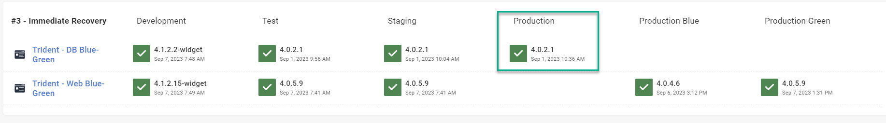

Rollbacks are the escape hatch everyone wants. 

Harmful code made it to production. The website refuses to start. Users get error messages when browsing. It's time to roll back. Yet, the rollback scripts weren't tested. You last rolled back 4 years ago. The last 20 production deployments took less than 30 minutes. Will this rollback work? You don't know. 

In this post, I walk through 3 modern rollback strategies based on recovery time. Recovery time is how long it takes to go from "problem found" to "restored."

## A brief primer on rollbacks

Before getting started, let's define rollbacks.  

**A rollback is reverting to a previous version of the application.**  

There is nuance in reverting to an application's previous version. The reversion could involve redeploying the previous version. Or, the reversion could update a load balancer.  The strategies presented in this post will cover both.

### Why roll back?

There are many reasons to roll back.  

-   The application won't start
-   Users can't sign in or use the application
-   Incorrect username, password, or token for database authentication
-   Expired credentials
-   Missing or incorrect configuration entries
-   During verification, testers find a "showstopping" bug
-   You need to deploy one or more external services on schedule
-   The database migration scripts failed

That is not an exhaustive list.  I'm sure you have many more reasons why you've rolled back.  

### Rollbacks can be a symptom of a bigger problem

Many of the reasons listed above are a result of human error.  That occurs when the software delivery pipeline relies on too much manual intervention.  Manually building code, deploying build artifacts, and verifying changes is a recipe for disaster.  I can't count how often a configuration was the result of human error.  

I recommend you follow the principles in Dave Farley and Jez Humble's book [Continuous Delivery.](https://continuousdelivery.com/) Doing so will force you to automate many manual tasks. Also, you'll follow the same deployment process for all environments. That will prevent many of the reasons to roll back.

### Rollback risks

No rollback is risk-free.  Part of the rollback process is deciding to roll back.  Often, it's a question of which option is riskier.  Sometimes, a roll-forward is less risky than a rollback.  Other times, a rollback is less risky than a roll-forward.

Even if your deployment schedule is once a week, each deployment will have a mix of fixes and features.  The fixes could squash a critical bug or close a security vulnerability.  You cannot choose to roll back a specific change when rolling back.  All the changes roll back, or nothing rolls back.  

### There's no magic bullet, or one size fits all solution

I often talk to prospective customers looking for an "easy" rollback solution.  They want a tool or process that will immediately roll back their application.  A process that covers all their rollback scenarios with a minimal amount of work.  

*Such a solution does not exist.*  

The 10-minute strategy detailed below should take less than a day to configure.  It covers the majority of rollback scenarios.  Having an automated deployment process removes many of the reasons rollbacks occur.  But, the process only covers some possible rollback scenarios.  

*Implementing an immediate rollback strategy for all scenarios requires architectural and process changes.  It goes beyond the deployment tool.* 

I'm not referring to deployment process changes.  An immediate rollback strategy changes how you make code and database changes in your application.  It requires a robust automated suite of tests.  That all takes time and money to create.  

## Don't rollback the database

The database is a critical component of your application.  It stores all your user data.  Unless a catastrophic event happens, data loss is unacceptable.  Data loss has real-world impacts.  Imagine losing a lifesaving prescription from a patient database in a hospital.  Or a loan entry to save a family farm.    

There are 2 ways to roll back a database—both of which will likely result in data loss:

1.  Run rollback scripts
2.  Restore a database backup

### Rollback script pitfalls

Missing or corrupted data impacts your users.   Relational databases are responsible for referential integrity.  The code base handles business rules.

Despite that, we write rollback scripts to remove or manipulate data.  For example, you add a column to an existing table.  You need to roll back that change.  The rollback script removes that added column.  Simple.  But, that script may not take into account nuances.

- Was there any data in that column?  If so, who added it, the users or the migration script?
- Will users have to re-key the data after that column is re-added?
- Is that column used as a foreign key to other tables?

### Restore database backup pitfalls

A database backup has a finite useful lifespan.  A database backup from 15 minutes ago is much more useful than one 24 hours old.    

Restoring a database backup will result in data loss. The restoration will remove any data changed since that backup. If you're lucky, no users used the application since the database backup creation. But luck isn't a strategy.  

### Restore databases as a last resort

Restoring database backups should be a last resort.  It's not the default option. Only do it when a catastrophic error occurs and there's no other option. For example when:

- Several disks on a SAN fail
- A hurricane hits the data center hosting the database
- The database file gets corrupted due to a bug

### Take the database out of the rollback process.

The 3 rollback strategies below rely on never rolling back a database. They rely on every database change being a roll forward. 

The risk of data loss or something going wrong is too high.  With enough time and effort, you can mitigate those risks.  But how often do you plan on rolling back?  It should be an exception, not the norm.  You'll end up spending a tremendous amount of time and money working on a script that will never run.  That time and effort could be better spent on improving the rollout process.

Taking the database out of the rollback process makes rollbacks more workable. You'll still have challenges, but they won't be "data lost" challenges.

## 10-minute recovery rollback strategy

The 10-minute recovery rollback strategy redeploys the previous application version.  But during the redeployment, it skips any database steps.

### How it works

The post-deployment verification discovers a catastrophic problem.  Should you roll back?  Should you roll forward?  Before deciding, review the database migration scripts.  

- No schema changes = Safe to rollback.
- Existing column added to a select stored procedure or view = Safe to rollback.
- New nullable columns added = Developers must review before rolling back.
- Significant schema changes = Unsafe to rollback.

The next decision is how long it will take to fix the issue.  Is it a configuration issue?  Is it an undiscovered bug?  

Assuming it's safe to roll back, you redeploy the previous code version.  The deployment process detects it's a rollback and skips the database steps. 

### Octopus Deploy configuration

Of the 3 rollback strategies, this requires the most configuration.

Step 1.  Add the community library step template **[Calculate Deployment Mode](https://library.octopus.com/step-templates/d166457a-1421-4731-b143-dd6766fb95d5/actiontemplate-calculate-deployment-mode)** to your process.  

Step 2.  Move that step to the start of the deployment process.

Step 3.  Set the run condition to **Variable** for each step to skip during rollback.  Set the value to: `#{unless Octopus.Deployment.Error}#{Octopus.Action[Calculate Deployment Mode].Output.RunOnDeploy}#{/unless}.`  I'm skipping steps 2, 3, 4, 5, and 6 for my example application.

Step 4.  Test the changes. Create a release and deploy it to a test environment. You'll see the skipped steps run for the deployment.

Step 5. Create another release and deploy it to the same environment.  

Step 6. Redeploy the first release.  

Step 7. In the deployment, you'll see all the database steps skipped.

### Recovery time explained

The redeployment will not take long unless you have a complex process.  That's because you are skipping the most time-consuming steps.  It's common to see a redeployment take one-third to half of the time.

You spend the majority of the recovery time reviewing database migration scripts.  Is it safe to roll back?  Would a rollback introduce too much risk and unknowns?  

### Who the strategy is for

Anyone not doing rollbacks today should consider this strategy first.

- You only need to change the deployment process, not how you make database changes.
- With minimal effort, you have covered most use cases.

After I implemented automated deployments, the vast majority of rollback requests came from QA.  Development and test environments are unstable during normal software development.  An unexpected bug can slip through despite pull requests, code reviews, and automated tests.  

There are far more code changes than database changes.  Especially in development and testing environments.  It's common to see 20 code check-ins for every database check-in. There's a high likelihood you can roll back a showstopping bug. 

### Downsides and pitfalls

The primary downside of this strategy is you can only roll back in some situations.  A breaking schema change prevents rollbacks.  The only course of recovery is to roll forward.  That could take hours or days.  

### Deployment automation removes a lot of reasons to rollback

Don't dismiss this strategy because of the potential for multi-hour recovery.  That's looking at this strategy through the lens of manual deployments.  Look at it through the lens of automated deployments.  Many scenarios requiring a rollback don't apply with automated deployments.

- Source control houses all the application configurations.  The deployment tool automatically applies those configurations.
- Code is automatically built following the same process.  No steps are accidentally skipped.
- The same build artifact gets deployed to all environments.  What passed testing, automated or manual, goes to production.
- The build artifacts are automatically deployed using the same process for all environments.  The process gets tested at least once before production.
- Most automated deployments take 10–15 minutes to complete.  Pushing a fix through all the required environments can take less than an hour.  
- Most failures requiring a rollback will now occur in testing environments, not production. 

This strategy requires minimum effort but has a significant pay-off.

## 3-minute recovery strategy

The 3-minute recovery strategy decouples the database changes from the code changes. You need to deploy the database changes hours or days before code changes. The previous application version will work with the current database changes. That removes a significant risk when rolling back.

### How it works

Decouple the deployment processes for the code and database:  

1. Hours or days before deploying the application, deploy the database changes
2. After a period of time, deploy the code changes
3. Roll back the code changes when you discover a showstopping bug

There's no need to check database migration scripts before rolling back.  You already know the previous application version works with the current database.  

Automated testing is a must for this strategy.  The only way you know database changes are backward compatible is via testing.  The only way to test everything is via automation.  Without an automated testing suite, you'll miss something.  

### Expand and contract pattern

This strategy requires the adoption of the expand and contract pattern.

Image Source: https://openpracticelibrary.com/practice/expand-and-contract-pattern/

Unlike the previous rollback strategy, the expand and contract pattern requires 4 deployments.  Using the example from the diagram, change the colorName column name to `colorCode`.

1. The first deployment adds the new column `colorCode` to the database.  That is the expansion.
2. The second deployment updates the source code to write to both columns.  Also, backfill `colorCode` if possible.
3. The third deployment removes the code that writes to `colorName`.
4. The fourth deployment removes the `colorName` column from the database.

It's an iterative approach to making database changes.  Each deployment makes small changes that you can roll back.  But you can't roll back after the fourth deployment occurs.

### Octopus Deploy configuration

Of the 3 strategies, this strategy requires the least amount of configuration.  Move the database deployment process into a separate project.  Note: this process does not have the **Calculate Deployment Mode** step.

None of the steps in this process have a variable run condition.  They're all set to run when the previous step succeeds.

Remove any database steps from the application project.

If you need to share variables between projects, use the Octopus Deploy [library variable sets](https://octopus.com/docs/projects/variables/library-variable-sets).

### Recovery time explained

Like the 10-minute strategy, this strategy involves a redeployment.  Unlike the 10-minute strategy, this 3-minute strategy doesn't need a migration script review.  Because of that, this strategy makes it quicker to recover.

### Who the strategy is for

This is the strategy for anyone looking to improve their automated deployment process.  This strategy will speed up both recovery and deployment time.  

- Only deploy the application code during the deployment window.
- All the database work occurs hours or days before the application deployment.
- The database changes are small incremental changes that are backward compatible.

That improvement is not free.  You have to commit to changing how you make your code changes.  

### Downsides and pitfalls

Decoupling database and code changes is a challenging task.  There's more work outside of implementing the expand and contract pattern.  That includes moving the database schema to a separate Git repository and creating a new delivery pipeline.  

There'll be a lot more deployments with this strategy.  Everyone has to be on board with the expansion and contract pattern. That includes developers, database developers, QA, DBAs, web admins, and support staff.  One person not on board can de-rail the whole process.  

Building out the testing suite to test database changes will take time.  The application may not support automated testing.  If it does not, it will need extra work to rearchitect the application to support automated testing.  That alone is a monumental effort.  

All that extra work can be overkill, depending on the application. 

## Immediate rollback strategy

This strategy builds on the 3-minute recovery strategy.  It adds blue/green or a staging deployment pattern.  It involves:

- Running 2 versions of your application in production
- Using a load balancer or ingress controller to control traffic
- Deploying the code to production the load balancer isn't pointing to
- Testing the code before releasing it to users

### How it works

This strategy is like the 3-minute rollback strategy, but has a couple of extra steps.

- Deploy the database changes hours or days before the code changes.
- Deploy the latest version of the application to a "staging" or "blue/green" set of servers in production. All users will continue to use the older version of the application.
- Verify the latest version of the application. The verification process can take anywhere from 15 minutes to 4 hours.
- Assuming verification passes, update the load balancer to redirect all traffic to the new version.
- Don't update the load balancer if verification fails.
- Update the load balancer back to the previous version in the event of a showstopping bug.

### Modeling in Octopus Deploy

Like the 3-minute recovery strategy, the database and application are in different projects.  The critical difference is the application deployment process will deploy to a blue or green environment.

Step 1.  Create 2 new environments, `Production-Blue` and `Production-Green`.

Step 2.  Create a new lifecycle called `Blue/Green Deployments`. Create a phase called `Production` and add both environments to it.

Step 3.  In the application's project, update the channel to use the new lifecycle.

Step 4.  In the project variables, review the variable values scoped to Production.  Add scoping for Production-Blue and Production-Green.  Repeat for any library variable sets.

Step 5.  Create new targets for your application for Production-Blue OR Production-Green.  You can re-use existing ones, but you must choose either blue or green for the environment.

Step 6.  In the project, create a runbook to update the load balancer.  

Step 7.  Add the appropriate steps to the runbook process to update your load balancer to Production-Blue or Production-Green.  

Step 8. **Optional:** Add the **[Run Octopus Deploy Runbook](https://library.octopus.com/step-templates/0444b0b3-088e-4689-b755-112d1360ffe3/actiontemplate-run-octopus-deploy-runbook)** step to your deployment process to invoke that runbook.  This step is optional; you may invoke that runbook manually.

:::warning
**Please note:** The database won't get deployed to Production-Blue or Production-Green.  There is one copy of the database.  That database lives in the Production environment.  Your dashboard will look like the screenshot below.
:::

### Recovery time explained

Unlike the previous strategies, there are no redeployments.  Two versions of the application run in Production.  A rollback involves updating a load balancer or a configuration.  With automation, it takes seconds to go from "problem found" to "recovered."  

### Who the strategy is for

This strategy is for anyone who has implemented the expand and contract pattern and wants to take the next step.  This strategy has several benefits:

- Like the 3-minute strategy, deploy database changes hours or days before the application.
- Deployments can occur in the middle of the day.
- You can take as much time as needed to verify the latest application version.  No users are using it.  
- Updating the load balancer can occur during off hours via a scheduled task or runbook.

### Downsides and pitfalls

You need all the work of the 3-minute strategy with this approach.  Also, you must figure out how to run 2 application versions in production.  That's a challenging task.

-  Create or configure additional application hosts.
-  Verify how data from the old version interacts with data from the new version.  Write more automated tests when fixing issues.
- Verify how the application behaves after updating the load balancer.  Expect cross-talk between the old UI version and the new API version.  Especially with modern SPA JavaScript applications.

Of all the rollback strategies, this requires the most time and money.  Depending on the application, it can be overkill.  For example, an internal application used by a dozen people doesn't need a blue/green strategy.  

### Feature flags

It's common to use feature flags and tools like LaunchDarkly with the immediate rollback strategy. Releasing a new feature to _everyone_ has its own pitfalls.  It's common to see blue/green and feature flags used together.  

- Update the load balancer for users to use the new application version.  
- But prevent users from using a new feature.  
- Release the new feature to a subset of users using a feature flag and gather feedback.
- Continue to release the feature to more users.
- Stop releasing the feature when encountering an issue. 

## The perfect roll-forward strategy

Ironically, the immediate rollback strategy is the perfect roll-forward scenario.  

- You deploy to production on an isolated set of application hosts.
- You verify that new version while users continue to use the old application version.  
- Keep the users on the old application version if you find any issues.  
- Take the necessary time to fix the issues.
- Deploy the fixes to those same set of application hosts from before.  
- Verify the fixes.
- Assuming verification is successful, redirect the traffic to the new application version.

Adding feature flags makes rolling forward more workable.  With feature flags, you can restrict how many users can access a new feature. You can enable the feature flag for a subset of users.  If you find any new issues, you don't enable the feature flag for other users. You fix the issue, verify it, and then enable the feature flag for other users.

The point is the immediate rollback strategy created several "gates".  Those gates prevent bad code from reaching your entire user base.  Fixing an issue impacting a limited number of users is much easier and less stressful.  

## Automatically rolling back

Automated rollbacks are possible with the 3-minute and immediate rollback strategies.  Decoupling the database changes from the application changes makes automated rollbacks possible.  They're not possible with the 10-minute rollback strategy.

- For the 3-minute rollback strategy, add a step after the application is deployed that looks for specific errors.  If those errors are found, automatically redeploy the previous version of the code.
- For the immediate rollback strategy, add 2 scripts:
    - In the deployment process, add a step that looks for specific errors prior to invoking the change load balancer runbook.  If those errors are found, fail the deployment and don't update the load balancer.
    - Add a step in the change load balancer runbook that looks for specific errors.  If those errors are found, undo the load balancer change.  

That said, you need to be careful with an automatic rollback process.  There is a finite amount of time an automatic rollback is feasible.  That window closes after 30 minutes of users using the new application version.  Adding a feature for a couple of days before removing it confuses users.  Limit the automatic rollbacks to check for specific conditions during deployment or runbook processes.  

Evaluate your software delivery pipeline to prevent needing an automated rollback.  For example, the application does not start up.  If you follow the principle of "build once, deploy everywhere" what are the chances that happens?  It will be the same exact code and configuration from the lower environments.  

- Is it an expired password or incorrect credentials?
- Is it because you have to update the secret store and Octopus Deploy? 
- How can Octopus reach out to your secret store for that information instead?

## Conclusion

Creating a zero-downtime, immediate rollback process is one of the most challenging tasks in DevOps.  It involves many changes.  And not just in the software delivery pipeline.  Many internal processes and development practices need to change.  

Unless you're prepared to make all those changes, I'd push that scenario down your to-do list.  Solve the more significant problems first.  A rollback happens when an unexpected issue occurs.  Typically, humans and manual processes are the cause of those issues.  

The first step to creating a rollback process is to automate your software delivery pipeline.  The software delivery pipeline should deploy all the components, including code and databases.  That will resolve many issues causing rollbacks in the first place.  Then you can start with the 10-minute recovery strategy.  You'll cover most of the possible rollback scenarios that way.

Next, implement the expand and contract pattern.  Making small, incremental, backward-compatible changes to the database is always a win.  That will prepare you for the 3-minute and immediate rollback strategies.  

Implement the 3-minute and immediate rollback strategies strategically.  They're not needed for every application.  Discuss it with your team, business owner, and product owner, and get a consensus.  

Happy deployments!