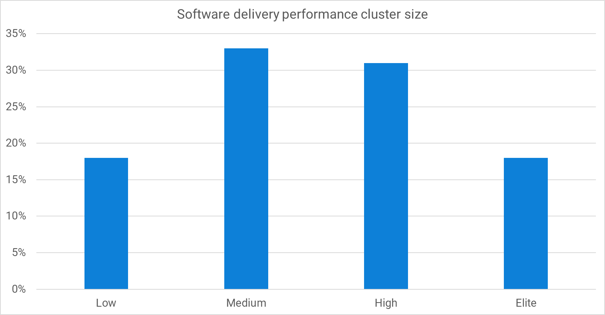

The 2023 Accelerate State of DevOps Report has arrived and we're excited to be sponsors once again. This long-running research effort has shown how software delivery performance has a positive impact on organizational goals. Using the insights into concrete practices that drive performance, you can make a real impact on your commercial and non-commercial goals.

The full report is available from the [DORA website](https://dora.dev/research/2023/dora-report/), but in this article you'll find an overview of some key changes the survey used to collect data this year. You'll also find out why we are able to welcome back the *elite* performance cluster and why this group can inspire improvements across many industries.

## Software delivery performance

Software delivery performance is measured using metrics that balance throughput and stability. Throughput is based on how quickly you can progress a change to production and how often you deploy. Stability is measured with the rate of failed changes and how long it takes to recover when things go wrong.

In traditional software development, the developers were responsible for throughput and the operations team handled stability. There was an assumption that throughput and stability were in conflict; if you made a lot of changes, surely you'd break things more often. This led to developers wanting to move faster, and operations pulling on the reigns to slow things down.

The research has shown this assumption is wrong. High-performing teams demonstrate that throughput and stability are found together. The DevOps approach of breaking down the silos and sharing the responsibility results in the best performance against all four measures.

Once you know the answer, it's easy to work out why this counter-intuitive approach works. If you are able to deploy many times a day and you discover a fault in the software, you can quickly resolve it without expediting the fix. When you deploy software that has a single change, the deployment has lower risk and fewer unintended interactions than if it has 10 changes.

The [DORA metrics](https://octopus.com/devops/metrics/dora-metrics/) are the best known way to measure software delivery performance.

:::hint
There are 4 metrics for software delivery performance. There is also a reliability metric that extends the set to cover software delivery *and operational* performance. Operational performance increases the liklihood that software performance will impact organizational goals.
:::

In the 2022 report, three performance levels were found:

| 2022 Performance level | Lead time         | Deployment frequency   | Change failure rate | Mean time to resolve |
|------------------------|-------------------|------------------------|---------------------|----------------------|
| Low                    | 1-6 months        | Monthly to biannually  | 46-60%              | 1 week - 1 month     |
| Medium                 | 1 week to 1 month | Weekly to monthly      | 16-30%              | 1 day - 1 week       |
| High                   | 1 day to 1 week   | Multiple times per day | 0-15%               | < 1 day              |

Each performance level shows that throughput and stability are linked. When you improve one, you improve the other. This happens because the technical practices required to improve throughput have a positive impact on stability. For example, if you deploy once a month manually, you'll need to automate the deployment to increase your deployment frequency. Automation removes manual errors introduced during the deployment, which reduces the change failure rate.

## Changes to stability metrics

In the 2023 survey, the stability metrics were changed to improve our understanding of software delivery performance. The [DORA Community](https://dora.community/) has been a thriving source of healthy discussions between researchers and practitioners. As a result of these conversations, two changes were made.

### Change failure rate

Previously, change failure rate was collected using a number of ranges, such as "0-15%" and "16-30%". This year, respondents could select the exact number that matched their change failure rate, which means the buckets can be replaced with high-fidelity numbers.

Instead of selecting "0-15%", you could enter "5%", for example.

### Time to restore

There were two problems with the mean time to restore (MTTR) metric. A production fault might be caused by an unsuccessful change, or it could be the result of an infrastructure failure. Representing this full range of incident types made it hard to establish software delivery performance in isolation of massive network faults and natural disasters.

In place of MTTR, the researchers asked people to say how long it took them to recover after a failed deployment. This made the measurement specific to faults introduced with a new software version, or by a deployment that impacted service (for example, because the checklist wasn't followed correctly).

## Software delivery performance changes

Last year, the performance clusters changed. The *elite* performance group didn't emerge and we wrote about [why we think this happened](https://octopus.com/blog/new-devops-performance-clusters). This year, we welcome back the elite performers. The demographic information certainly hints that elite performance depends on professionals with more than 10 years experience.

The software delivery performance clusters based on the new survey questions are:

| 2022 Performance level | Lead time            | Deployment frequency           | Change failure rate | Failed deployment recovery time |
|------------------------|----------------------|--------------------------------|---------------------|---------------------------------|
| Low                    | **1 week - 1 month** | **Once a week - once a month** | **64%**             | **1 month - 6 months**          |
| Medium                 | 1 week - 1 month     | Once a week - once a month     | **15%**             | 1 day - 1 week                  |
| High                   | 1 day - 1 week       | **Once a day - once a week**   | 10%                 | < 1 day                         |
| **Elite**              | < 1 day              | On demand                      | 5%                  | < 1 hour                        |

The differences from the 2021 clusters are highlighted in bold. Compared to last year, the low performance cluster has higher throughput and lower stability, but the trend of higher-performance clusters improving against both measures is as strong as ever.

## How to use these clusters

With any software delivery metrics, the best way to compare performance it to focus on a single application over time. Comparing the performance between different teams and application fails to account for many contextual differences, but looking at performance for an application over time demonstrates the vector of change.

For software delivery, metrics should inform improvment activities rather than drive them. You should take an experimental approach to applying these capabilities, introducing or improving a capability and observing its impact on the metrics. This is how you'll find which practices make an impact for your specific application and team.

The clusters can still be useful as a reference for continuous improvement.

### Opportunity identification

If your measurements are similar to one of the clusters, but you are under performing on one metric, you now have a good place to start improving. For example, if you fit the *medium* performance cluster, except for having a higher change failure rate, what could you do to improve this? You can use the [DORA Core Model](https://dora.dev/research/) to find capabilities that can help, such as test automation.

### Aspirational examples

The other key use of the clusters is in imagining what is possible. There are organizations in many industries represeted in the *elite* cluster, including safety-critical and regulated industries. It is possible to achieve this performance level without making things less safe and without taking shortcuts.

## Conclusion

After last year's report, it seemed likely that there was a link between experience and software delivery performance. The presence of respondents with more than 10 years' experience seems linked to the number of higher-performing teams.

The lower performers are increasing their throughput and there are signs this impacts their stability. This is because they don't yet have the set of capabilities that higher-performers have used to break the trade-off between the two.

- Deployment automation is a great way to improve several DORA metrics and also enables more feedback loops to super-charge your other improvement experiments

Happy deployments!

[specific definitions of lead time](https://octopus.com/blog/definitions-of-lead-time)

[common mistakes in DevOps metrics](https://octopus.com/blog/common-mistakes-devops-metrics)

[DevOps metrics](https://octopus.com/devops/metrics/)

[Workplace cultures](https://octopus.com/devops/culture/workplace-topologies/)

You can read .
