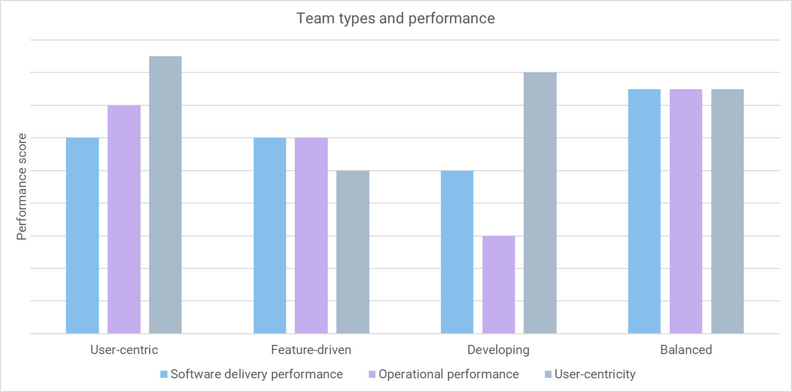
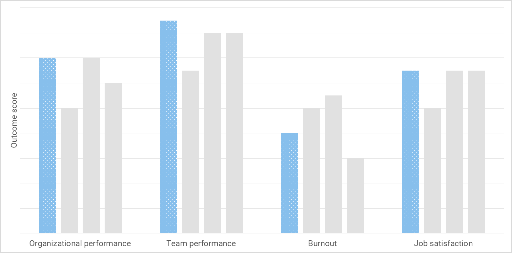
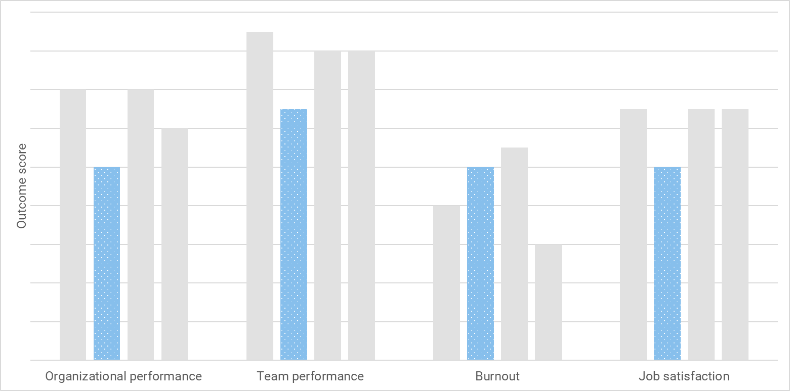
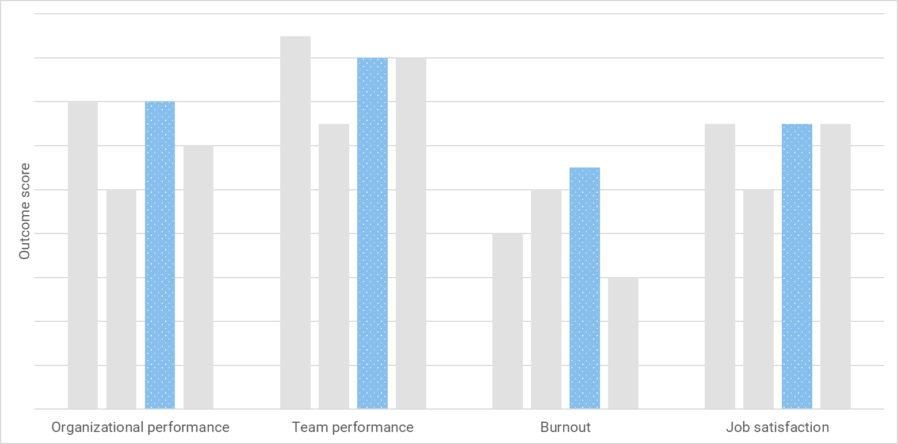
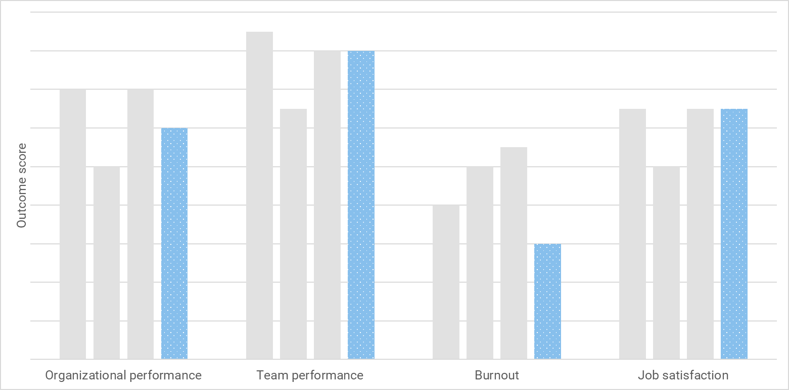
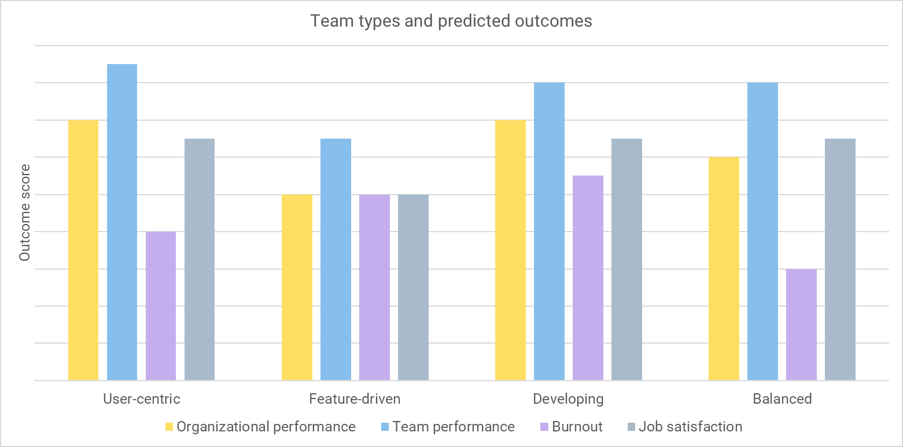

Thanks to the work of the research team at DORA, we have access to a [model of technical and cultural capabilities](https://dora.dev/research/) we can use to direct our continuous improvement activity.

The goal isn't to adopt every item like a checklist as it's [not a maturity model](/blog/devops-uses-capability-not-maturity). Instead, you can use the model to find practices that will help you improve your current circumstances.

For example, if you find it hard to create automated integration tests because it's difficult to create the right application state, you might need the *test data management* capability.

The [2023 State of DevOps Report](https://dora.dev/research/2023/) provides another way to examine and improve your performance. Using four team types based on a combination of:

- Software delivery performance
- Operational performance
- User-centricity

## Why clusters are useful

The software delivery performance clusters have been a feature of the State of DevOps Report for years. Teams can be divided into groups based on throughput and stability. This usually results in low, medium, high, and elite performance clusters.

Although clustering is a statistical exercise, it provides personas you can use to think about how you delivery your own software. You can assess your own performance and compare yourself to the clusters in the reports. Knowing that there are safety-critical and regulated industries represented in the elite cluster provides inspiration that you can also achieve this level of performance.

In the 2022 report, [descriptive clusters](https://octopus.com/blog/new-devops-performance-clusters#the-sdo-performance-clusters) were introduced. Instead of providing a continuum of performance levels, the descriptive groups provided situational performance based on software delivery and operational performance.

Instead of aiming for elite performance, the descriptive clusters let you assess the needs of the software and match it with an appropriate performance level. For example, a team searching with product/market fit could sacrifice reliability to increase their experimentation.

You can use performance and descriptive clusters as lenses through which you can critique your own practices.

## The new descriptive team types

With the addition of user-centricity, four team types emerge.

- User-centric
- Feature-driven
- Developing
- Balanced

The team types are found by splitting performance using the assessment criteria (software delivery and operational performance, and user-centricity), but they also predict certain outcomes. You can use these team types as personas to work out how to increase the impact of software delivery and improve developer experience.

You won't necessarily fit a single team type and you'll move around as you adjust your process.

Let's look at each type in more detail.

### User-centric

User-centric teams have strong software delivery and operations performance. Their focus on user needs leads to the highest levels of organizational performance. These teams have worked out how to unlock the impact of software on the organization's goals.

If you are a user-centric team, you need to watch out for burnout and ensure you are taking opportunities to remove toil with automation.

### Feature-driven

Feature-driven teams have incredible software delivery performance, but are disconnected from users. This means the software fails to impact organizational performance. These teams have high levels of burnout and lack job satisfaction.

If you are feature-driven team, you need to reconnect with users. Delivering features regularly should provide an opportunity for valuable feedback loops, so find ways to bring user feedback into the planning process to increase the value of the features delivered. 

### Developing

Often found in smaller organizations, developing teams are often building towards one of the other team types. These teams are searching for the features that will make their product attractive to customers while building their skills. Despite high job satisfaction, these teams are the more prone to burnout.

If you are in a developing team, look for opportunities to replace heavyweight process with automation. This will improve your operational performance and result in a reduction in unplanned work and interruptions.

### Balanced

Balanced teams have worked out how to achieve strong performance with low burnout. These teams have skills across many technical practices and cultural capabilities.

If you are in a balanced team, you can increase performance at the organizational level by being more user-centric.

## The best team type

There's no correct team type. A different team type will emerge with different skill sets and at different stages of product development. Each team type has an adjustment they could make that will optimize one or more outcomes.

After you assess your team type, you can work out your desired state and make adjustments accordingly.

TODO: IS THERE A DIAGRAM FOR WHAT TO CHANGE TO MOVE FROM A -> C, etc. Each arrow could have a "kind of thing to change".

## Flat out speed isn't the goal

There has been a problem with speed in the Agile community. Successful teams don't aim to release as much as possible as fast as they can. Instead, they focus on delivering small experiments sooner. That means slicing up a feature idea into smaller parts that can be used to test the assumption that people want it and will pay for it.

When you deliver sooner, you're more likely to see your software delivery performance translate into hitting organizational goals. This happens when feedback is incorporated into the decision-making process. While you might go faster without stopping to listen to feedback, you're more likely to increase the size of your codebase without economic benefit.

For example, imagine two teams writing a document management product for solicitors. The first team creates a small working example and shares it with their customers and potential customers. The second team opts for flat-out speed.

After a couple of months, the team focusing on user needs has a smaller codebase with fewer features, but they have validated those features based on feedback. By testing their assumptions, they are able to rule-out many features that aren't useful to users and that might make the software more complex for users and developers.

The second team has more features and all the associated costs, but are still behind the first team when it comes to winning customers. The team is more likely to burn out as they race to keep pace.

DIAGRAM OF SUCCESSFUL FEATURES - TEAM A has minimal wasted feature developments, TEAM B is 33% good, 66% waste... I think this ratio is in Lean Enterprise...

A study of [feature experimentation at Microsoft](https://ai.stanford.edu/~ronnyk/ExPThinkWeek2009Public.pdf) found that without a functioning feedback loop, 60%-90% of your ideas won't improve the metric they were intended to improve.

The distinction between *sooner* and *faster* is highlighted in the team types, where feature-driven teams have good local performance that doesn't translate into better performance for the organization. In other words, feature-driven teams deliver the wrong thing with great speed. They have lower job satisfaction and higher burnout.

## User focus is crucial

The solution to the problem of *fast delivery* of the *wrong thing* is user focus.

User focus concerns:

- How well teams understand the needs of their users. 
- How well aligned the team is toward meeting 
user needs.
- How user feedback is used when prioritizing work.

## TODO

Perhaps the greatest missed opportunity in DevOps is creating software teams who are able to deliver rapid change, but that doesn't adapt to feedback from users.

Taking a user-centric approach reduces time wasted on low-value features.

You need to understand your users and collaborate with them to obtain and use their feedback.

Happy deployments!
