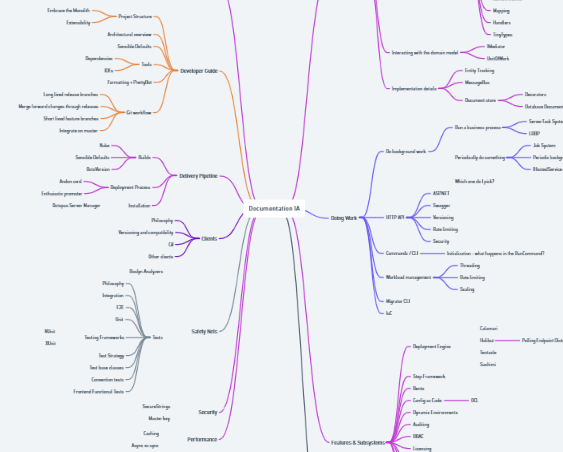
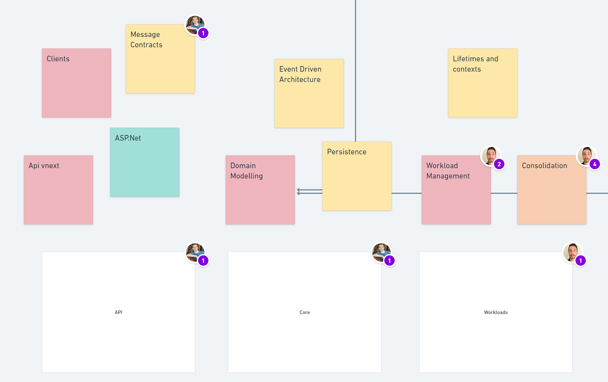
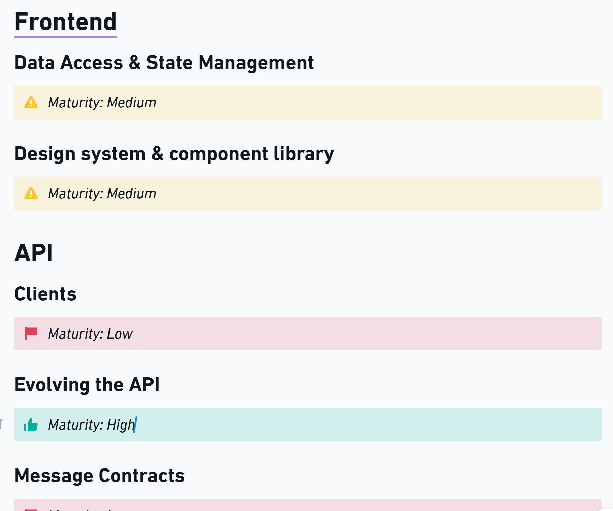
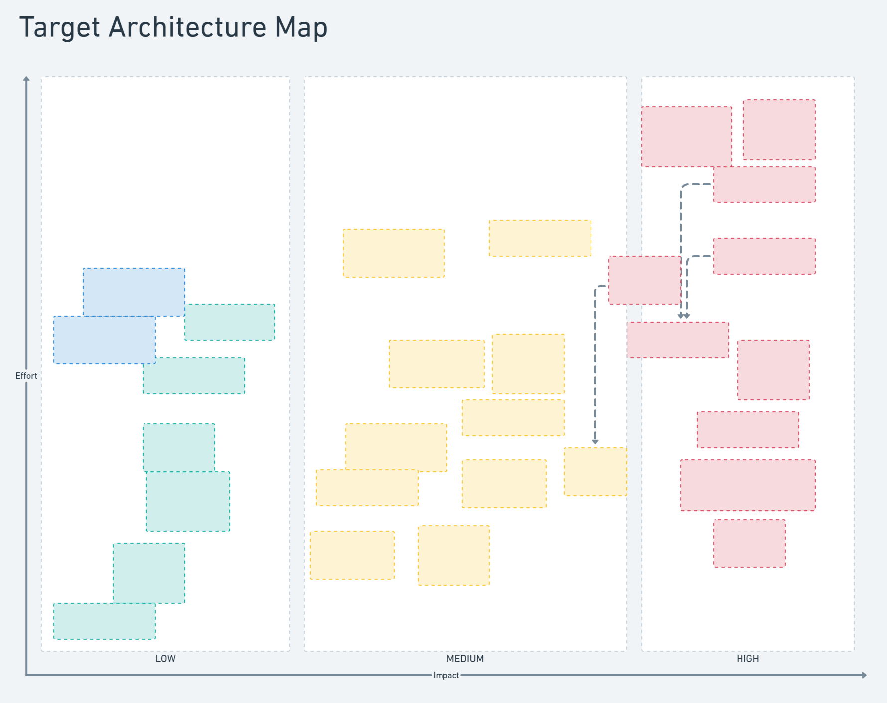

When writing a technical strategy, it's useful to have a clear picture of the technical problems you're facing in your organization.

Ideally, you should be able to make a clear problem diagnosis, knowing which technical problems are going to impact your organization's business strategy, and at what magnitude.

A common state that many engineering organizations end up in is where each team has its own perspective on what _the biggest problems_ are. Often they're the problems that have an outsized impact on that particular team.

Occasionally, you'll find shared problems that all teams can agree on. This is more likely if teams use shared infrastructure or work in a monorepo or monolithic application. Even if the teams agree on the problem, they may have different perspectives on its impact. In particular, how much it impacts the business's strategy.

Without a shared understanding of the problems that exist and their impact on the organization's future success, it can be difficult to form the clear diagnosis that is the cornerstone of a [good technical strategy](https://www.andrew-best.com/posts/good-technical-strategy/).

A target architecture is one tool that can help build clarity and consensus on technical problems.

> Target architecture: A framework that enables the necessary planning and actions required to reach a desired target state.

A target architecture helps us reason through our current state and plan the shifts necessary to meet one or more target states.

It's not _just_ the target state. It's not _just_ the current state. To be a useful tool, it needs to address both.

## Making a start

When we started defining our target architecture for Octopus Server, the first question was common to any complex endeavor: where do we start?

At this stage, any start is likely a good one.

You might choose to begin by digging into your business objectives. If these are unclear, this is where you need to start. I won't explain how you create a good business strategy in this post, but it's important to remember, if you don't know where your destination is, any road will get you there.

Our business objectives were well-defined, so we didn't need to solve this challenge. We already had a strong foundation to work from.

We'd recently done some work defining the information architecture of our system documentation. This was a good start for us - it provided a model that broke down our system into chunks that we could reason about.

We quickly found gaps between our documentation's information architecture and what we cared about from an architectural perspective. We referred to these things as _capabilities_. We started cataloging those capabilities into a rough mud map in Whimsical. Then we worked to group them into categories, where categories were either:

- A physical view (such as hosting)
- A logical slice (such as API)
- A development view (such as monolith)
- A process view (such as scalability)

These emerged naturally for us, but they map neatly to the [4 + 1 architectural view model](https://en.wikipedia.org/wiki/4%2B1_architectural_view_model) concept.

### Boundaries

It's important at this point to stop and talk about boundaries. Octopus Server as a software system is a modular monolith. The architectural boundary we drew for the target architecture is the whole monolith. This includes things like the client libraries we develop for customers to work programmatically with in our product.

If instead you had separate systems that work together in your situation, you'd consider where it was useful to draw your boundaries for your target architecture. If you wanted to address integration challenges between the systems, it might be useful for the architecture to encompass several systems.

For the target architecture not to be anemic, you need enough expert input to map out your architecture and ensure critical capabilities aren't missed. At Octopus, we used the collective knowledge of the Principal Engineers group to cover all necessary capabilities.

## Defining current state

With our architectural mudmap populated, the next step was defining our _current state_. We settled on identifying each capability's current _maturity level_, and color-coded our mud map to suit. 

Green items were very stable and mature - they were already fit-for-purpose and so didn't need additional definition or investment. 

Red items had significant known problems to solve. They needed work to bring them to a desired target state. Some didn't even have a well-defined target state yet. We marked these items as low maturity.

At this point, we weren't deep-diving into each capability. This was an initial pass over the capabilities, based on expert knowledge. We wanted to understand and visualize current state, and identify the areas needing the most time to achieve a good result.

## Exploring target state

The architectural mud map had now fulfilled its purpose. We had a complete picture of the things that mattered in our architecture and an understanding of their current state.

The next step was to start deep-diving into each category and capability. We needed to reason through the problems and form opinions on our desired target state.

My tool of choice for exploring complex spaces is _writing_ (followed closely by diagramming). Writing things down when dealing with complex things is a superpower. It helps:

- Build clarity
- Encourage depth of thought
- Provide context for decisions and rationale
- Prevent re-litigating decisions
- Promote early collaboration

We took the contents of the mud map and used them to scaffold a document structure, with each category and capability becoming a heading. We could then start our written exploration underneath.

### Principles

To align the exploration, we started by agreeing on a set of principles to follow. We used these when reasoning through the problems we were facing and forming opinions on how we would solve them:

- We prefer solving for our known current and future state over building for the unknown
- We prefer working within our constraints over setting unachievable goals
- We're optimizing for high-quality product velocity in our core product
- We're optimizing for a scalable, performant product
- We're not optimizing for building new products independently of our core product

These principles ensured that the problems identified were real and material. They also ensured solutions were realistic, achievable, and optimized for business goals.

These principles helped contributors by providing a frame for their exploration. They also helped future consumers of the target architecture by providing them with the knowledge of that frame, so that they could empathize with how we formed the opinions we authored.

### Focus on what matters

As we dove into individual capabilities, we quickly found that:

- Spending time writing about things that we marked as high maturity felt low value
- Fully exploring areas that we'd marked as low maturity took _a lot of time_

The combination of these 2 insights led to us removing everything marked as _high maturity_ from the document. This let us focus our time and effort on the problems we needed to solve.

:::hint
It's worth highlighting the impact of this choice. Instead of the target architecture painting a full picture of the architecture underpinning our product, it focused on the problems that needed to be solved. This was a good tradeoff. By focusing on the problems that needed solving, we could generate a stronger signal and reduce the noise from communicating the detail of capabilities that were already fit for purpose.
:::

### Impact and effort

After we completed our target state exploration, we had a set of well-defined problems and solution preferences underneath each capability.

At this point it became clear that the documented target state was hard to reason about:

- The document was huge and took a lot of time to consume if you wanted to get "the full picture"
- There was no way to understand which problems we might want to solve first
- There was no way to reason about the cost of the proposed solutions

To solve these problems, we did 2 things: 

- We replaced _maturity_ with _impact_,
- We created a target architecture map that plotted each proposed solution by impact and effort, and linked back to the appropriate section in the document

This map lets anyone reading the architecture understand it at a glance. They can see which items are most important and compare the relative efforts they might take to deliver. It also helps them dive into individual items if they want more detail.

When determining impact, we assessed whether the proposed change: 

- Unblocked a business goal,
- Provided a speed boost to achieving a business goal
- Couldn't be easily attributed to a business goal

When determining effort, experts reasoned about the relative efforts of particular solutions. "This is going to take more effort than that" was an appropriate level of granularity for us.

## Execution

As we've executed our technical strategy, informed by our target architecture, some of our opinions have changed as we've dug deeper into the problems at hand.

> Everyone has a plan until they get punched in the mouth.
>
> - Mike Tyson

This is normal and expected. The value of the target architecture is not that it's perfect. It provides a well-rounded, thorough exploration of the technical problems you need to solve to achieve business goals and some initial expert opinions on how to best solve those problems.

These opinions should be _strong opinions, loosely held_.

It's critical that as you realize your target architecture and solve its problems, you adapt to new information along the way, and update the documented opinions as necessary. This is [last responsible moment](https://blog.codinghorror.com/the-last-responsible-moment/) decision-making at its finest. It helps us make high-quality decisions, with the most information at hand, and helps avoid falling prey to sunk cost fallacy.

### Adapting to new information

We're on a journey to better normalize Octopus's database schema. Doing so will unlock the ability to solve many known performance and concurrency issues.

We initially thought we could achieve a good deal of this normalization using our current ORM, [Nevermore](https://github.com/OctopusDeploy/nevermore/).

As we dug into the problem with a team, we found problems we'd need to solve in Nevermore to use it as the tool to meet our normalization needs. This was particularly an issue for loading and querying data across multiple database tables that might back a single logical model.

The team then evaluated the cost of solving these problems in Nevermore against the cost of migrating to a tool that could already do these things, like Entity Framework.

Moving to Entity Framework was already in our plans, as we want to use commodity tools for most common things. However, we originally thought we could delay the cost of the migration to achieve our more immediate goals sooner.

After we disproved this assumption, we realized moving to Entity Framework sooner was the better option. We updated the target architecture accordingly, and we're now deep into the work of moving ORMs in the core of Octopus.

## Organizational impacts

### Scaling engineering

The biggest impact from creating and distributing our target architecture is that it has effectively democratized it.

Teams often cite the target architecture when making key implementation decisions in Octopus Server. Teams are aware of our stated goals and orient their changes in support of those goals.

I often open the target architecture document and see a collection of user avatars at the top. Engineers and managers use the document as reference material while doing their daily work.

Teams dig deep into the stated intentions in the document. They debate their merits and ideate alternatives. This is valuable, as it either galvanizes the stated opinions or uncovers higher-value alternatives that we can adopt.

The most important aspect of all this is that _the authors do not need to be present for this to happen_.

This is the secret to unlocking scale in engineering. As much as possible, remove any key-role dependencies. Let teams and individuals reason autonomously, using clearly communicated frames and goals.

### Technical education

Beyond empowering technical people with the knowledge of target architectural state, non-technical stakeholders realize similar impacts.

Product, sales, support, marketing - people across the organization can understand what technical challenges need to be solved to achieve business goals.

If you work in an organization that produces a software product, or your business operations are largely powered by software, this understanding is critical. Often technical problems are some of the primary impediments to success. They're hard constraints that limit what the business can achieve.

By aligning the organization on technical problems and their impacts, decision makers can make informed decisions when allocating budget and investing in solving those problems.

### Predictable growth

As your engineering team and software scales, you want the increase in maintenance cost of your software to look logarithmic. You can achieve this when your system has uniform building blocks. Adding a new feature or capability built and designed similarly to the system's other features makes the new feature cheap to maintain. Maintaining 10 similarly shaped things is much cheaper than maintaining 10 snowflakes.

When teams understand the desired target architectural state and consider it when making decisions in their daily work, their additions will be uniform and similar. Your software will evolve predictably. This minimizes technical debt and costly architectural sprawl and keeps the maintenance burden in check.

## Conclusion

A target architecture can help you identify the highest-impact technical problems you need to solve to support your business goals.

It democratizes the knowledge of the desired target architectural state. This removes a key impediment to scaling engineering teams and software systems.

It can also align stakeholders on the highest-impact technical problems to solve to achieve business goals, empowering the organization to make good budgeting decisions.

Happy deployments!