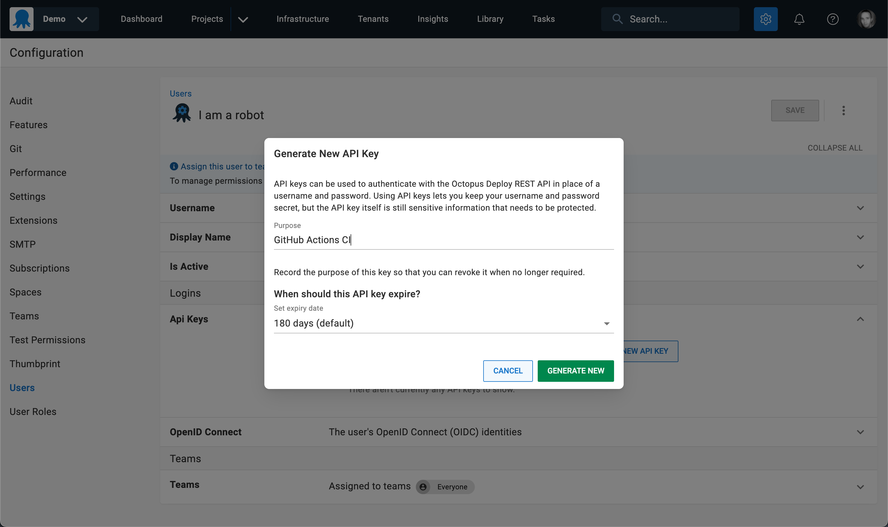
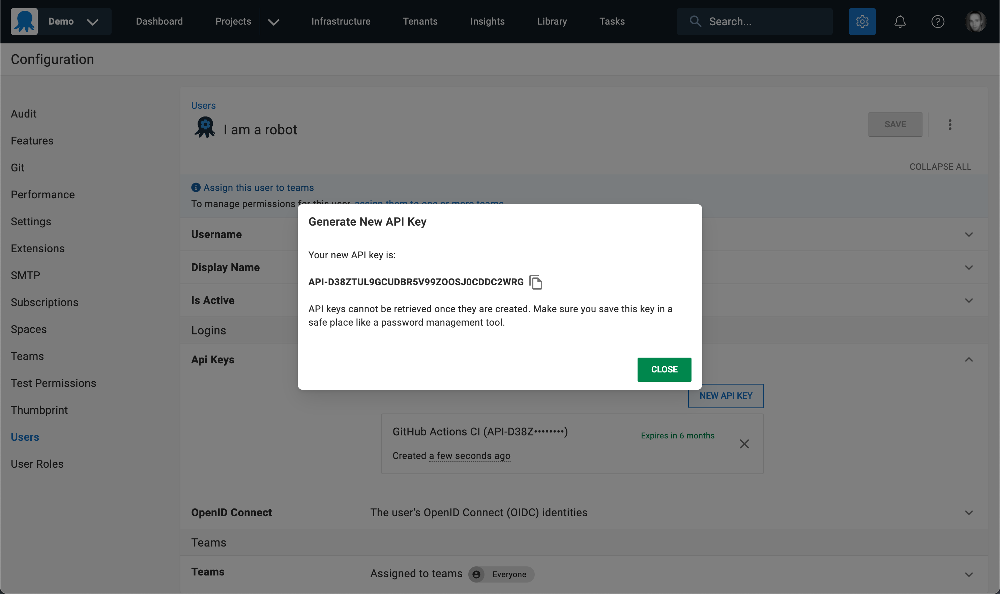
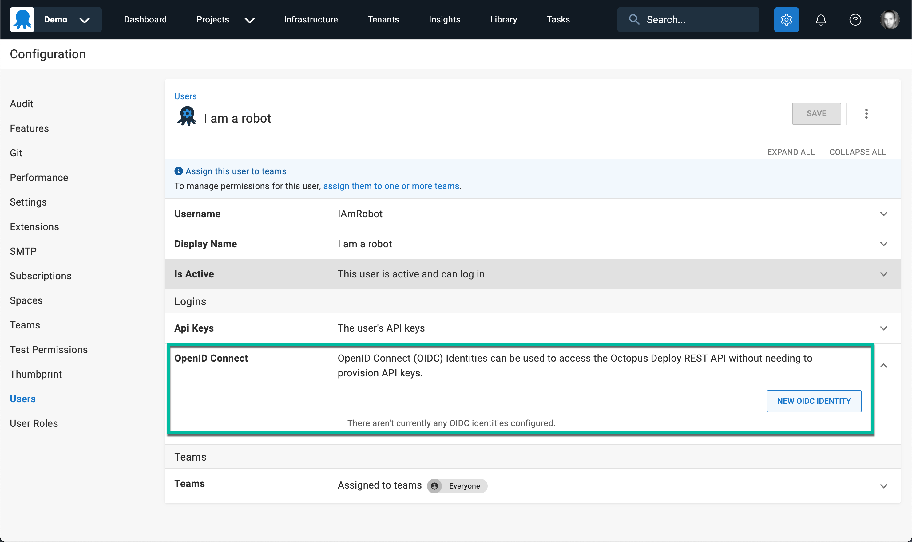

We are introducing two new features to make connecting GitHub and Octopus Deploy even easier and more secure:

- OpenID Connect (OIDC) for GitHub Actions 
- Octopus Deploy GitHub App

## OpenID Connect (OIDC) for GitHub Actions

Historically, allowing tools such as GitHub Actions (or any other product, script, etc) to interact with the Octopus API required creating an [Octopus API key](https://octopus.com/docs/octopus-rest-api/how-to-create-an-api-key) and configuring the tool to authenticate using the API key.  

The downside of API keys is that they have to be carefully managed.  They need to be stored securely, to minimize the risk of leaking, and it is good practice to regularly rotate the keys. It is also good practice to the scope the keys as tightly as possible, which can mean a large number of keys to manage.

OpenID Connect (OIDC) has emerged as an elegant way to allow systems to authenticate without sharing long-lived credentials (e.g. API keys or username/password). 

What does that mean for Octopus Deploy and GitHub Actions?  Let's compare the before and after.

### Without OIDC

Prior to OIDC support, one would create a Service Account user in Octopus, and create an API key attached to the service account.



The API key is then copied.



The copied API key is then be configured in the tool which will hit the Octopus API, the most common example being a CI Server.  In the GitHub Actions example the API key would be stored as a Secret in the GitHub repository, and the [Octopus Deploy login](https://github.com/OctopusDeploy/login) action would use the secret API key to authenticate with Octopus.   

```yaml
- name: Login to Octopus
  uses: OctopusDeploy/login@v1
  with:
      server: https://my.octopus.app
      api_key: ${{ secrets.OCTOPUS_API_KEY }}
```

### With OIDC

Using OIDC, an OIDC identity is configured on the Service Account.  



The provider is then selected. As we envisage GitHub Actions being the most common scenario, we have built a custom interface.  Using the `Other Issuer` option, any tool or product which supports acting as an OIDC Relying Party can be configured. 

The OIDC protocol allows trusting not only a token issuer (e.g. GitHub), but specific subjects within the issuer.  In the example shown below, only workflows run from the `main` branch of the `https://github.com/OctopusSamples/OctoPetShop` repository will match and be authenticated.


Below is an example of the [Octopus Deploy login](https://github.com/OctopusDeploy/login) GitHub Action which authenticates via OIDC.  You'll notice there are no secrets referenced!

```yaml
- name: Login to Octopus
  uses: OctopusDeploy/login@v1
  with:
      server: https://my.octopus.app
      service_account_id: 5be4ac10-2679-4041-a8b0-7b05b445e19e
```

## Octopus Deploy GitHub App

We are also building an Octopus Deploy app, to be published to the GitHub Marketplace.

Where OIDC allows connections from GitHub to Octopus without pre-shared credentials, the Octopus Deploy GitHub app will enable Octopus Deploy to connect to GitHub without configuring GitHub credentials in Octopus. 

The immediate benefit of this will be for Octopus projects using [Config as Code](https://octopus.com/docs/projects/version-control) with repositories hosted by GitHub.

Today, GitHub credentials are configured in Octopus, allowing Octopus to commit changes to the deployment process to the GitHub repository.  With the GitHub

## Summary 


