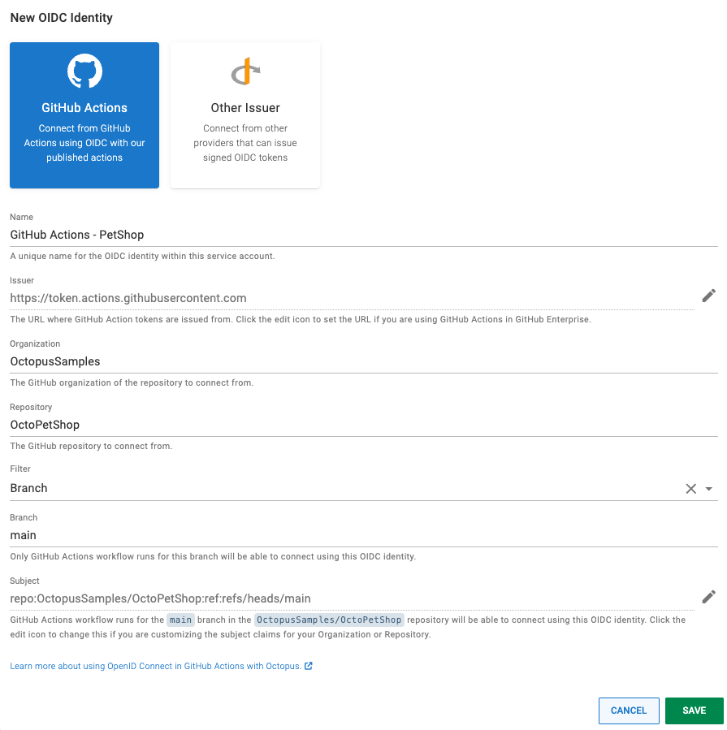

We're introducing 2 new features to make connecting GitHub and Octopus Deploy even easier and more secure:

- OpenID Connect (OIDC) for GitHub Actions 
- Octopus Deploy GitHub App

## OpenID Connect (OIDC) for GitHub Actions

Historically, letting tools like GitHub Actions (or any other product) interact with the Octopus API meant creating an [Octopus API key](https://octopus.com/docs/octopus-rest-api/how-to-create-an-api-key) and configuring the tool to authenticate using the API key.  

The downside of sharing API keys is that they have to be carefully managed. You need to store them securely to minimize the risk of leaking them to third parties, and it's good practice to regularly rotate the keys. It's also good practice to scope the keys as tightly as possible, which can mean a large number of keys to manage.

OpenID Connect (OIDC) has emerged as an elegant way to allow systems to authenticate without sharing long-lived credentials (for example, API keys or username/password). 

What does this mean for Octopus Deploy and GitHub Actions?  Let's compare the before and after.

### Without OIDC

Before OIDC support, you'd create a Service Account user in Octopus, and create an API key attached to the service account.


The API key would then get copied.


The copied API key is then configured in the tool which calls the Octopus API, most commonly a CI Server.  In the GitHub Actions example, the API key is stored in as a secret in the GitHub repository, and the Octopus actions consume the secret API key to authenticate with Octopus. 

```yaml
env:
  OCTOPUS_API_KEY: ${{ secrets.API_KEY  }}
  OCTOPUS_URL: ${{ secrets.OCTOPUS_URL }}
  OCTOPUS_SPACE: 'Octo PetShop'
steps:
  # ...
  - name: Create a release in Octopus Deploy 🐙
    uses: OctopusDeploy/create-release-action@v3
    with:
      project: 'Octo PetShop Web'
```


### With OIDC

Using OIDC, an OIDC identity is configured on the Service Account.  


The issuer is then selected. As we envisage GitHub Actions being the most common scenario, we built a custom interface for configuring GitHub as the issuer.  Using the `Other Issuer` option, you can configure any tool or product which supports acting as an OIDC Relying Party. 

The OIDC protocol allows trusting not only a token issuer (like GitHub), but specific subjects within the issuer.  In the example shown below, only workflows run from the `main` branch of the `https://github.com/OctopusSamples/OctoPetShop` repository will match and be authenticated.



We have introduced an [Octopus Deploy login](https://github.com/OctopusDeploy/login) GitHub Action which can authenticate with Octopus via either OIDC or an API key. Below is an example of the action configured to use OIDC.  You'll notice there are no secrets referenced. The Service Account ID is not a sensitive value, as on its own it cannot be used to authenticate.

```yaml
- name: Login to Octopus
  uses: OctopusDeploy/login@v1
  with:
      server: https://my.octopus.app
      service_account_id: 5be4ac10-2679-4041-a8b0-7b05b445e19e
```

Running the action above will cause the workflow to be authenticated with Octopus, so following actions can run in an authenticated context.   

## Octopus Deploy GitHub App

We're building an Octopus Deploy app, that we'll publish to the GitHub Marketplace.

Where OIDC allows connections from GitHub to Octopus without pre-shared credentials, the Octopus Deploy GitHub app will enable Octopus Deploy to connect to GitHub without configuring GitHub credentials in Octopus. 


The immediate benefit of this will be for Octopus projects using [Config as Code](https://octopus.com/docs/projects/version-control) with repositories hosted by GitHub.

Today, GitHub credentials are configured in Octopus, letting Octopus commit changes to the deployment process to the GitHub repository. With the Octopus Deploy GitHub App installed in your organization, Octopus will be able to access approved repositories without requiring credentials. 

The Octopus Deploy GitHub App will also form the foundation for future features. It will unlock closer integration between Octopus Deploy and GitHub. Octopus will be able to take action based on events in GitHub and see GitHub data like commits, branches, and pull requests. 

## Conclusion

OpenID Connect and the Octopus Deploy GitHub App will make connecting GitHub and Octopus Deploy easier and more secure, as you'll no longer need to share static credentials between the 2 products.

OIDC support is rolling out to Octopus Cloud customers now. If you have an Octopus Cloud instance and would like early access to this feature, please [enter your details](https://octopusdeploy.typeform.com/to/pgtdtd7P) and we'll give you access. 
We expect OIDC support will be available in the 2023.4 release for self-hosted customers.

The Octopus Deploy GitHub App is currently in development. We're aiming for release in Q1 2024. 

Happy deployments!