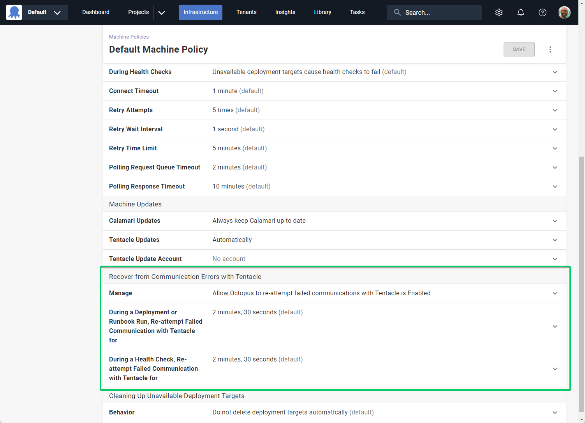

Octopus 2023.4 introduces Tentacle Communication Resiliency, a new feature which increases communication resiliency over unreliable networks to Tentacle by automatically recovering from transient network errors. This allows Octopus to successfully complete deployments and runbook runs which would have otherwise failed.

## What problem does this solve?

Many Octopus setups involve running Tentacle in environments that are on complex or unreliable networks, such as connecting via a corporate firewall, satellite network, or over an intermittent 3G cellular connection. A common scenario is when customers deploy to devices in a physical location using a multi-tenant setup. For example, tablets at retail stores, health devices at clinics/hospitals, physical servers at a branch office, etc.

Today, if Octopus fails to communicate successfully with a Tentacle during a deployment, runbook run, or health check, the entire process will fail. This can be frustrating and time-consuming, as the entire process must be re-attempted due to a relatively minor, and often transient, network error. This problem can account for ~2-3% of failed tenanted deployments for some customers today.

This new feature helps Octopus recover gracefully from such temporary or transient network errors, leading to less failed processes and more happy deployments!

## How does Tentacle Communication Resiliency work?

Octopus Server communicates with Tentacles by making [RPCs (remote procedure calls)](https://en.wikipedia.org/wiki/Remote_procedure_call). Should any RPC fail, the deployment typically fails. The solution to this problem was to retry those RPCs in an [idempotent](https://en.wikipedia.org/wiki/Idempotence) way if they fail due to an intermittent communication error.

The changes are backwards compatible between old and new versions of both Octopus Server and Tentacle, and ensure that a script is not executed more than once.

A common scenario is when Octopus Server has started a deployment process and requested that Tentacle run a script. Tentacle successfully receives the request and begins running the script but due to an unreliable network, Octopus Server never receives confirmation that the script has been started.

Previously, this missed response would mean that the deployment fails, even though Tentacle is running the script and doing the work without issue. Now with Tentacle Communication Resiliency, Octopus Server can retry sending the request, and Tentacle will therefore retry sending the response without restarting the script. Thankfully, in this example the transient network issue has been resolved when the second attempt is made, so Octopus Server can successfully receive the response and the deployment can continue without error.

## Were there any technical challenges to overcome?

There were two main challenges which were critical for this solution to succeed:

1. Ensure RPCs are idempotent
2. Ensure backwards compatibility between Octopus Server and Tentacle

### Idempotent RPCs

Resending a request if there is a communication failure cannot be done safely unless there is a guarantee that the request will not be processed multiple times. Many of the requests being sent to Tentacle will be to run customer scripts, and these scripts often perform operations which must only be run once e.g. run a DB migration, or setup/teardown cloud infrastructure.

Tentacle’s mechanism for running scripts, ScriptService, makes no such guarantees, and will start running the script for each and every request it receives. This process includes generating a ‘script ticket’ ID which is then used in the response to Server to track the progress of each individual request.

To guarantee idempotency, significant changes had to be made to both Octopus Server and Tentacle to update this process. Octopus Server now generates the script ticket ID itself, and includes it in the request to Tentacle. This allows Tentacle to identify if multiple instances of the same request have been received, and behave accordingly.

### Backwards Compatibility

With significant changes made to both Octopus Server and Tentacle, it was critical that old and new versions of Octopus Server could reliably communicate with both old and new versions of Tentacle. We couldn’t have a new Octopus Server send multiple requests to an old Tentacle that would run the script for each request received. We also couldn’t have an old Octopus Server instance send a request to a new Tentacle that behaved differently and returned different results.

This problem was solved by:

1. Introducing a new ScriptService v2 implementation into Tentacle, and not modifying the existing implementation
2. Introducing a new CapabilitiesService to Tentacle, so that Octopus Server can query a Tentacle to discover which services it does or does not support

Octopus Server will now query a Tentacle’s CapabilityService before requesting a script to be run. If the Tentacle doesn’t know what the CapabilityService is, then it does not support retries and Octopus Server will fallback to ScriptService v1. If the Tentacle responds successfully to a CapabilityService request, then Octopus Server will know exactly what the Tentacle supports and can choose the most appropriate type of request to send next.

## Could this cause my deployments to run multiple times?

No. The retries are purely for the communications between Octopus and Tentacle, not for any processes run on Tentacle as part of a deployment, runbook run, or health check.

As part of this new feature, requests made to Tentacle are now idempotent i.e. the request will only be processed once, regardless of how many requests are made.

## My deployment failed for a reason unrelated to communications, can this retry the deployment?

No, this feature is purely for recovering from failed communications, but [Step Retries](https://octopus.com/blog/step-retries) might be able to help here.

When using Step Retries along with Resilient Tentacle Communication, it is worth noting that using multiple types of ‘retries’ has the potential to make some deployments take longer to complete than before. A deployment might take longer to complete if there are communication problems between Octopus Server and Tentacle, as well as execution problems when Tentacle runs the script. We believe that the benefits in these scenarios outweigh the costs.

In the cases where the deployment process ultimately succeeds, the extra time taken is likely to be worthwhile if it means successful completion of a deployment! On the other hand, some deployments which ultimately fail may take longer to fail due to the retry logic.

## How can I use this new feature?

Octopus Cloud customers already have Tentacle Communication Resiliency enabled, and on-premise customers will have it enabled by default starting from Octopus Server 2023.4.

You can configure this new feature via the **Machine Policy** configuration page, found in **Infrastructure -> Machine Policies** from the navigation bar. Each Machine Policy can be configured separately, allowing different kinds of targets to be configured differently.

The duration for which to re-attempt communications with Tentacle can be configured for deployments and runbook runs, as well as health checks. These values include the duration of the initial communication attempt i.e. when using the default value of 2m30s, if the first attempt fails after 15s, Octopus will continue retrying for 2m15s.

The feature can also be disabled, if your setup requires communication attempts to fail immediately rather than retry.

## Conclusion

To help improve the success rate and automation of deployments, improved resiliency has been added to communications with Tentacle. This lets Octopus recover automatically from transient communication errors. The result is more successful deployments and fewer manual interventions when transient communication issues interrupt your deployments.

## Feedback

We'd love to hear [any feedback](https://octopusdeploy.typeform.com/to/UPbg8aAs) to help us improve this feature.

Happy deployments!
