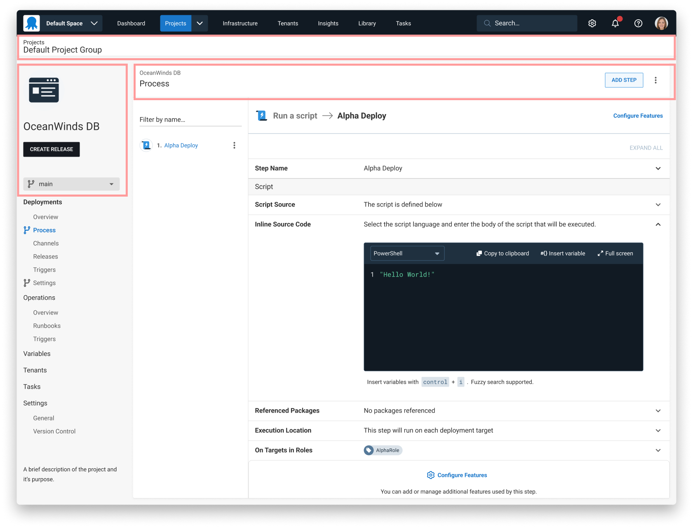
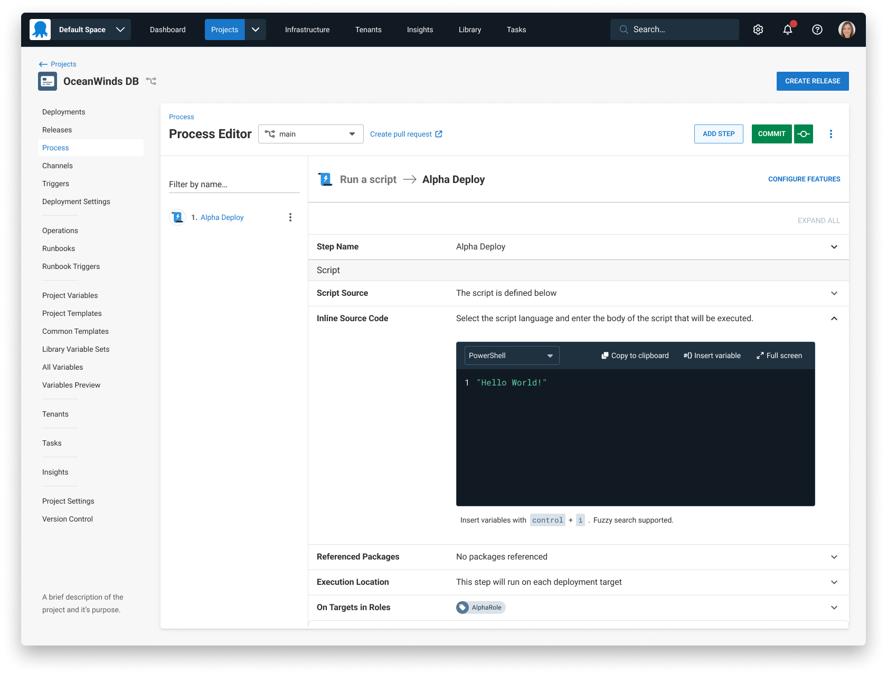

We have been working towards improving our user experience at Octopus Deploy. Specifically addressing feedback about our interface looking “messy” and “hard to navigate”.  Addressing these concerns require a couple of changes. This change focuses on a layout that presents information in an easier-to-read structure.

## Page Layouts
We began by looking at our project page layouts. Here we identified a couple of key elements that needed improving. In the image below the highlighted areas is where we placed our focus. These areas contained our page headings and breadcrumbs. Page headings and breadcrumbs are important for understanding your location in the app. These elements also set the stage for the page layout.

Once we arrived at a design that worked well for projects, we then took this layout across the entire app. See new layout below.

### Benefits of this change
The benefits of this change provides an easier-to-understand Octopus Deploy interface. The headings now have an appropriate size and placement relative to the page content. The breadcrumbs now have appropriate visual treatment and their behaviour is applied consistently. Customers were having trouble remembering the location of the create release button. By placing the button in the top right corner near other page actions the button is now intuitive to find.. 

### A few other notable improvements
- When moving between pages, loading animations have been simplified
- Menu interaction states are clearer
- Simplified project navigation by removing headings and updating labels

image of before after of 

## Continuous Improvement
We continue to make improvements to our user experience at Octopus Deploy. Keen to share your feedback? Or would like a sneak peek of upcoming user experience changes you are most welcome to [book a time with us](https://calendly.com/emily-pearce-1/octopus-deploy-user-experience-research). 

