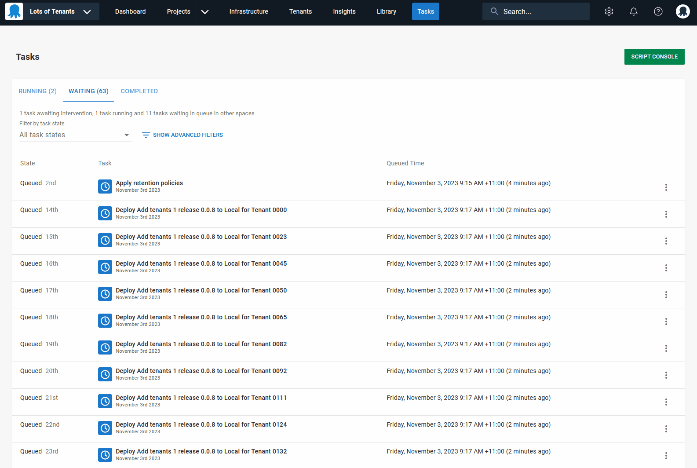
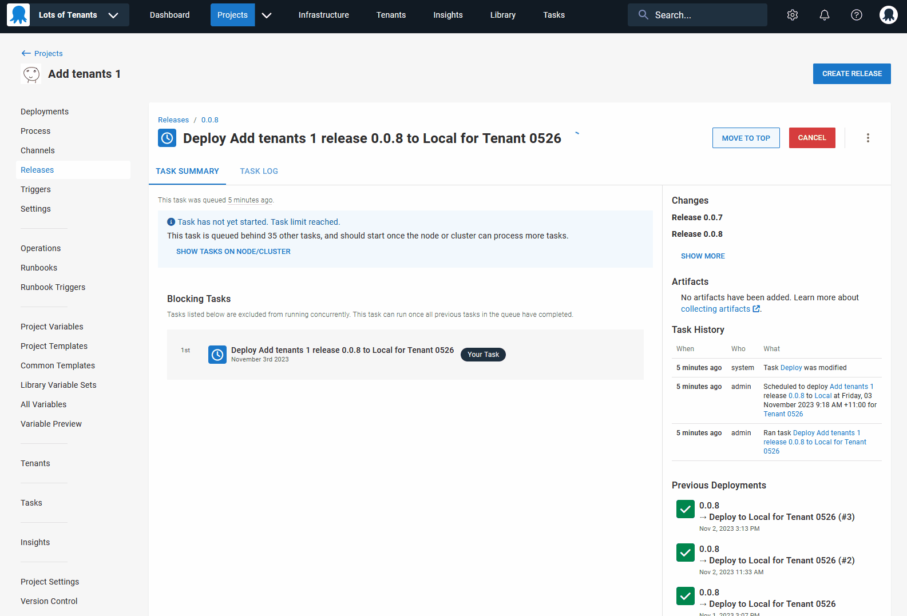

The Octopus task queue operates on a first in, first out basis. There are many types of tasks in Octopus, like deployments, runbooks, and system tasks. The task queue works at the instance level and each task needs to be complete before the next can begin. The task queue and task cap ensure you can view all the tasks running on the instance and know the limit on the number of tasks.

We had feedback that people sometimes need to be able to elevate critical tasks over less important ones. Examples of critical tasks include hotfixes, production deployments, or runbooks that need to start before anything else in the queue.

We addressed this with a new feature that lets you reprioritize tasks on the **Tasks** overview dashboard and the **Deployments** page for a specific release in a project.

In this post, I show you how to reprioritize your task queue at the space level. I explain how to do this on the **Tasks** overview dashboard and the Tasks page for a particular release.

## Moving a queued task to the top from the Tasks overview dashboard

You can reprioritize the task queue on the space-level **Tasks** overview dashboard. 

To move a queued task to run next:

1. Find the queued task you'd like to run next.
1. Select the burger menu on the right of the selected task.
1. Click **Move to top**.

The task will then move to the top of the queue and will run next after the task that's running. This won't affect a task that's already in progress. This only changes the order of tasks not yet started.

## Moving a queued task to the top from the Tasks page for a particular release

You can also reprioritize the task queue on the **Tasks** page for a specific release. 

To move a queued task to run next:

- Find the task in the release for a project that you want to run next.
- Navigate to **Projects** in the top navigation bar.
- Go to **Releases** on the left hand side of the page.
- Click **Move to top** in the top right corner of the screen.

The task will then move to the top of the queue and will run next after the task that's running. This won't affect a task that's already in progress. This only changes the order of tasks not yet started.

## Conclusion

It's now easy to reprioritize the task queue. This gives you flexibility to manage your task queue and run critical tasks first. 

If you're an Octopus Cloud or Server customer, this feature is available from 2023.4.6612 onwards.

If you have any feedback on this feature as we continue to refine it, please leave your comments below.

Happy deployments!