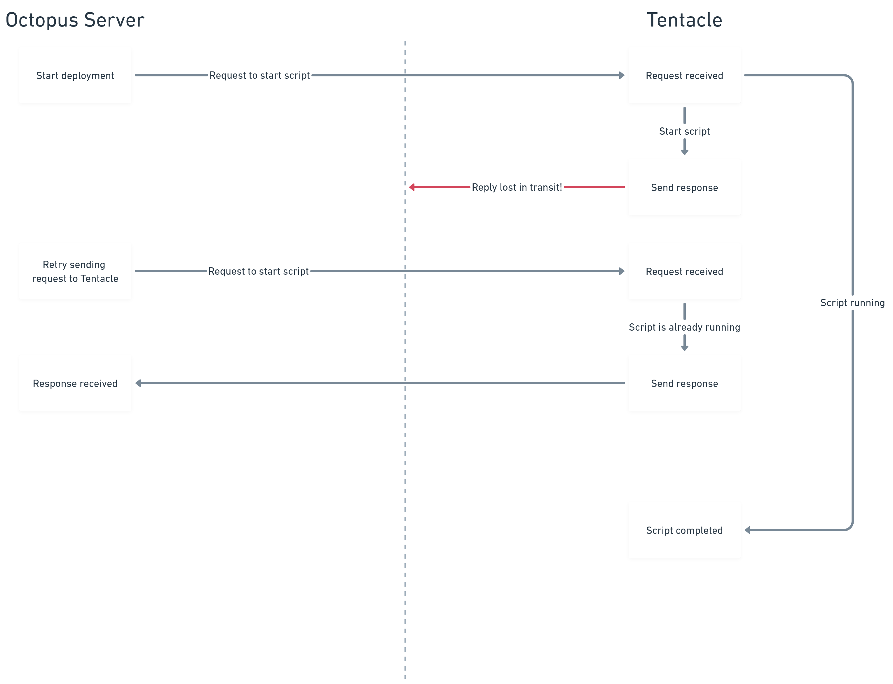
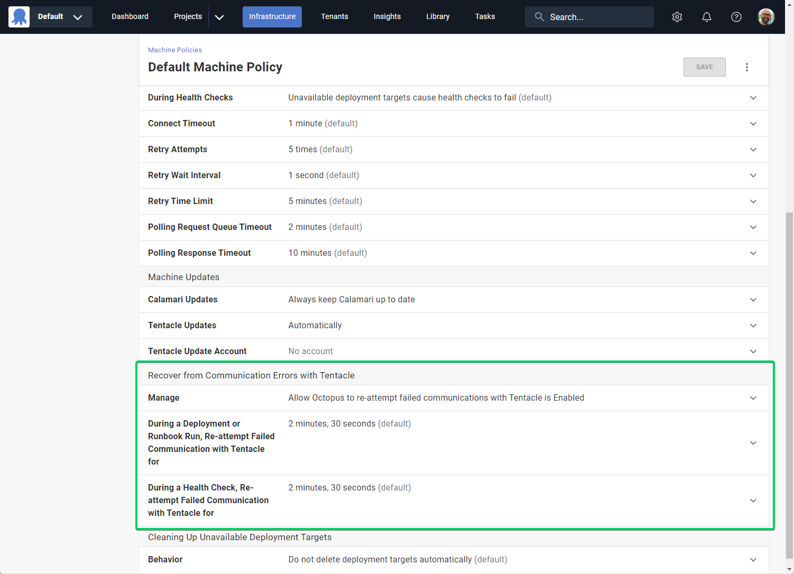

Octopus 2023.4 introduces Tentacle Communication Resiliency. This new feature increases communication resiliency over unreliable networks to Tentacle by automatically recovering from transient network errors. This lets Octopus successfully complete deployments and runbook runs that would have otherwise failed.

## What problem does this solve?

Many Octopus setups involve running Tentacle in environments that are on complex or unreliable networks. For example, connecting via a corporate firewall, satellite network, or over an intermittent 3G cellular connection. It's common for customers to deploy to devices in a physical location using a multi-tenant setup. For example, tablets at retail stores, health devices at clinics/hospitals, or physical servers at a branch office.

If Octopus fails to communicate successfully with a Tentacle during a deployment, runbook run, or health check, the entire process fails. This can be frustrating and time-consuming. The entire process must be re-attempted due to a relatively minor, and often transient, network error. This problem can account for ~2-3% of failed tenanted deployments for some customers.

This new feature helps Octopus recover gracefully from these temporary or transient network errors. This leads to fewer failed processes and more happy deployments!

## How Tentacle Communication Resiliency works

Octopus Server communicates with Tentacles by making [RPCs (remote procedure calls)](https://en.wikipedia.org/wiki/Remote_procedure_call). Should any RPC fail, the deployment typically fails. The solution to this problem was to retry those RPCs in an [idempotent](https://en.wikipedia.org/wiki/Idempotence) way if they failed due to an intermittent communication error.

The changes are backwards compatible between old and new versions of both Octopus Server and Tentacle, and ensure that a script is not executed more than once.

A common scenario is when Octopus Server has started a deployment process and requested that Tentacle run a script. Tentacle successfully receives the request and begins running the script. But, due to an unreliable network, Octopus Server never receives confirmation that the script has started.

Previously, this missed response would mean that the deployment failed. This happened even though Tentacle was running the script and doing the work without issue. Now with Tentacle Communication Resiliency, Octopus Server can retry sending the request. Tentacle will therefore retry sending the response without restarting the script. Thankfully, in this example, the transient network issue has been resolved when the second attempt is made, so Octopus Server can successfully receive the response and the deployment can continue without error.

## Technical challenges

There were 2 main challenges that were critical to overcome, for this solution to succeed:

1. Ensure actions performed by RPCs are idempotent
2. Ensure backwards compatibility between Octopus Server and Tentacle

### Idempotent RPCs

You can't safely resend a request if there's a communication failure unless there's a guarantee  the request won't get processed multiple times. Many of the requests sent to Tentacle are to run customer scripts. These scripts often perform operations that can only run once. For example,  run a database migration or setup/teardown cloud infrastructure.

Tentacle’s mechanism for running scripts, ScriptService, makes no such guarantees. It will start running the script for every request it receives. This includes generating a ‘script ticket’ ID which is then used in the response to Octopus Server to track the progress of each request.

To guarantee idempotency, we had to make significant changes to both Octopus Server and Tentacle to update this process. Octopus Server now generates the script ticket ID itself and includes it in the request to Tentacle. This lets Tentacle identify if it's received multiple instances of the same request and behave accordingly.

### Backwards compatibility

With significant changes made to both Octopus Server and Tentacle, it was critical that old and new versions of Octopus Server could reliably communicate with both old and new versions of Tentacle. We couldn’t have a new Octopus Server send multiple requests to an old Tentacle that would run the script for each request received. We also couldn’t have an old Octopus Server instance send a request to a new Tentacle that behaved differently and returned different results.

We solved this problem by:

1. Introducing a new ScriptService v2 implementation into Tentacle, and not changing the existing implementation.
2. Introducing a new CapabilitiesService to Tentacle so that Octopus Server can query a Tentacle to discover which services it does or does not support.

Octopus Server now queries a Tentacle’s CapabilityService before requesting a script to run. If the Tentacle doesn’t know what the CapabilityService is, then it does not support retries. In that case, Octopus Server will fall back to ScriptService v1. If the Tentacle responds successfully to a CapabilityService request, then Octopus Server will know exactly what the Tentacle supports and can choose the most appropriate type of request to send next.

## Could this cause my deployments to run multiple times?

No. The retries are purely for the communications between Octopus and Tentacle. They're not for any processes run on Tentacle as part of a deployment, runbook run, or health check.

As part of this new feature, requests made to Tentacle are now idempotent. That is, the request only gets processed once, regardless of how many requests are made.

## My deployment failed for a reason unrelated to communications, can this retry the deployment?

No, this feature is purely for recovering from failed communications, but [Step Retries](https://octopus.com/blog/step-retries) might be able to help here.

When using Step Retries along with Resilient Tentacle Communication, it's worth noting that using multiple types of 'retries' could make some deployments take longer to complete than before. A deployment might take longer to complete if there are communication problems between Octopus Server and Tentacle and execution problems when Tentacle runs the script. We believe the benefits in these scenarios outweigh the costs.

When the deployment process ultimately succeeds, the extra time taken is likely worthwhile if it means successful completion of a deployment. On the other hand, some deployments which ultimately fail may take longer to fail due to the retry logic.

## How can I use this new feature?

Tentacle Communication Resiliency affects the communication channel between Octopus Server and Tentacle. So, you need to update both applications to versions that support this feature to gain its benefits.

Octopus Cloud customers already have Tentacle Communication Resiliency enabled. Self-hosted customers will have it enabled by default starting from Octopus Server 2023.4. You need to update Tentacles to v7 or above.

You can configure this new feature via the **Machine Policy** configuration page. You'll find this in **Infrastructure -> Machine Policies** from the navigation bar. You can configure each Machine Policy separately, so that you can configure different targets differently.

You can set the duration to re-attempt communications with Tentacle for deployments, runbook runs, and health checks. These values include the duration of the initial communication attempt. For example, when using the default value of 2m30s, if the first attempt fails after 15s, Octopus will continue retrying for 2m15s.

You can also turn off the feature if your setup requires communication attempts to fail immediately rather than retry.

## Conclusion

To help improve the success rate and automation of deployments, we improved resiliency to communications with Tentacle. This lets Octopus recover automatically from transient communication errors. The result is more successful deployments and fewer manual interventions when transient communication issues interrupt your deployments.

## Feedback

We'd love to hear [any feedback](https://octopusdeploy.typeform.com/to/UPbg8aAs) to help us improve this feature.

Happy deployments!