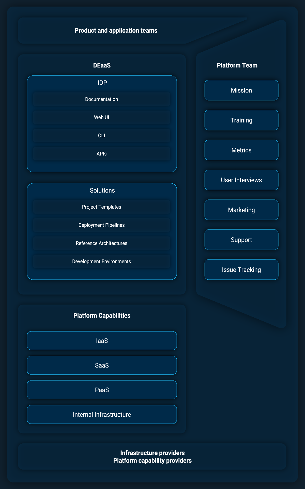
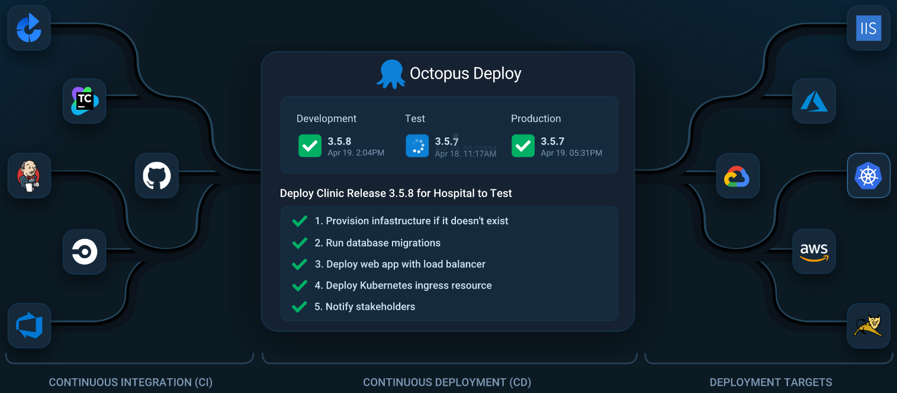

Platform engineering is an emerging paradigm that aims to address some of the gaps found large and complex DevOps teams have found in their workflows. We ran into many of these issues ourselves in the solutions engineering team as we sought to grow our capabilities. As a result, we invested heavily in platform engineering to help us address the needs of our customers and partners, who themselves are increasingly looking to solve ever more complex problems as they deploy and operate their own software.

In this post I'll cover the successes and failures of our approach in 2023, and look forward to 2024.

## What is platform engineering?

So what is platform engineering? This deceptively simple question has many different answers, not least because the words "platform" and "engineering" are quite broad on their own and don't bring much clarity when combined.

We spent quite some time in our team thinking about what platform engineering actually means. We eventually settled on the term "DevEx as a Service" (DEaaS) as a way to describe our implementation of platform engineering.

DEaaS has the advantage of clearly articulating our goal (improving DevEx) and the method of delivery (an internal service). Everyone these days has direct experience with implementations of Infrastructure as a Service (IaaS) and Platform as a Service (PaaS), whose goals are to allow Devops teams to provision supported, monitored, and opinionated implementations of Virtual Machines (VMs), networks, file hosting, and higher level platforms like Kubernetes clusters. In the same way, DEaaS seeks to provide supported and opinionated solutions that directly improve the DevEx of DevOps teams.

Focusing on DevEx also allows us to lean on [established research](https://queue.acm.org/detail.cfm?id=3595878) for objective measurements and definitions.

The "service" part of DEaaS is then implemented with an Internal Developer Platform (IDP). An IDP is simply the interface that DevOps teams use to access the services provided by the platform team. It could be as simple as a wiki page, or as complex as a developer portal. Regardless of how the IDP is implemented, it must provide three capabilities:

1. Maintain a central repository of architectural decisions
2. Provide the ability to implement the decisions at scale
3. Have feedback loops to allow the decisions to be updated

I personally found this definition of architecture from [Objects, Components, and Frameworks
With UML: The Catalysis Approach](https://oc.to/sjdtWf) to be very helpful when thinking about DEaaS:

> The set of design decisions about any system (or smaller component) that keeps its implementors and
maintainers from exercising needless creativity.

With these definitions, we can then summarise DEaaS as:

* Why: Improving the DevEx of DevOps teams
* Who: Platform teams are the service provider, DevOps teams are the service consumer
* What: Platform engineering describing the work done by platform teams
* How: An IDP providing the interface between DevOps teams and platform teams

## Defining the mission

One of the most important steps when implementing a DEaaS strategy is to define which architectural decisions provide the most value.

Solutions engineering has a unique set of challenges, but the most glaring is the incredible complexity of the ecosystem we have to work in. Solutions engineers often have to build convincing demos, usually in days or weeks, integrating any number of platforms like CI systems, cloud platforms, operating systems, security requirements, and container orchestration platforms. You only need to look at the simplified diagram from the Octopus home page to understand how many combinations of technologies and given demo could integrate:

It is simply not feasible to create these demos from scratch every time. We needed a solution to bootstrap a demo environment with the common 80% of requirements to let solutions engineers customize the last 20% for each customer.

It also became increasingly clear that it was not enough to be able to create these demos on our own private Octopus instances: our partners needed the ability to implement and customize these demo environments for customers, and customers themselves wanted the ability to recreate these environments to then iterate on them for their own needs.

