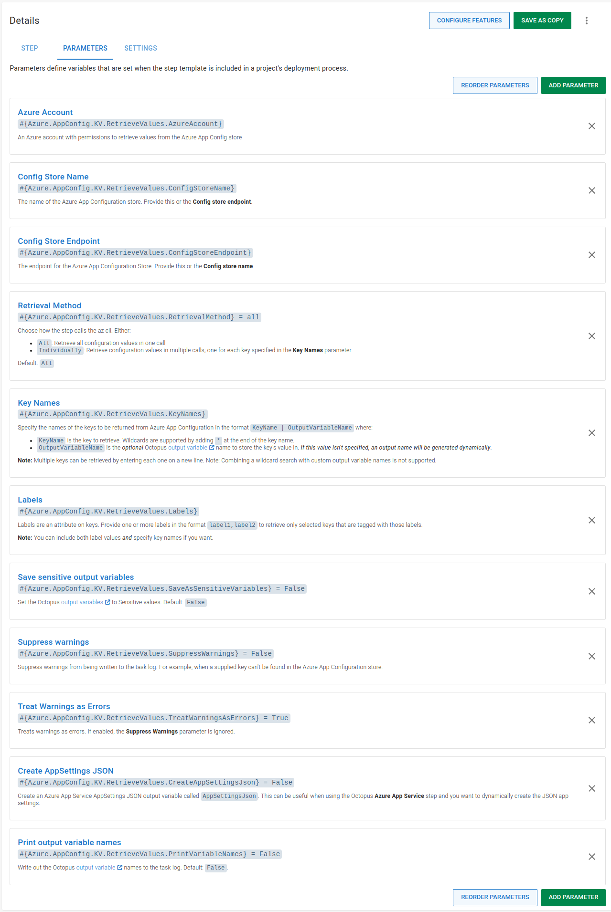
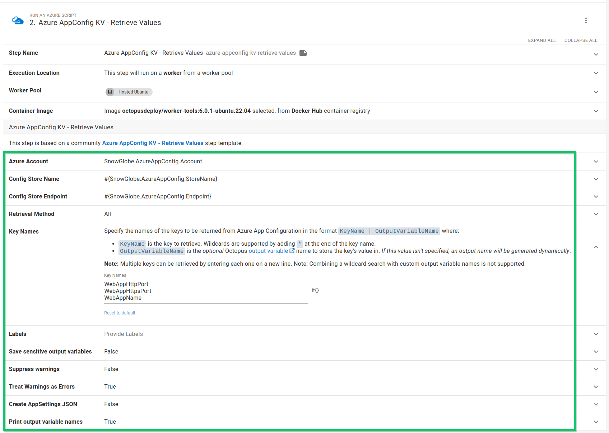
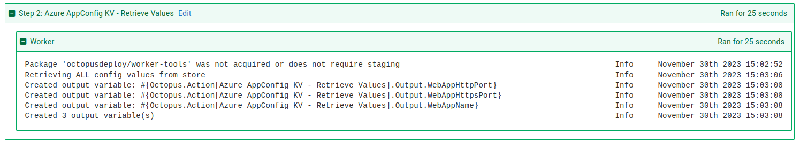
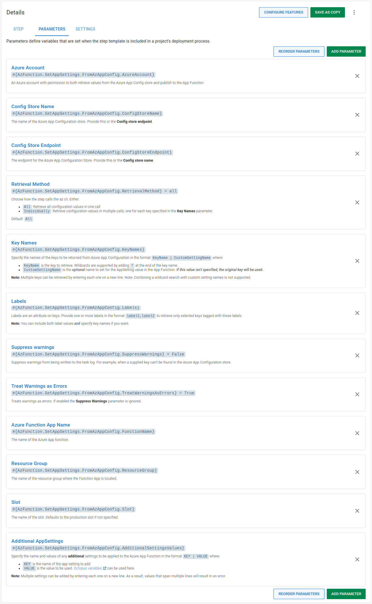
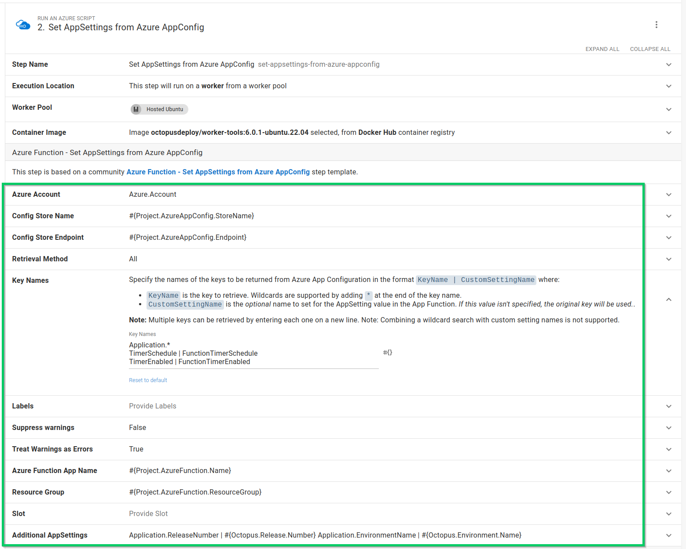
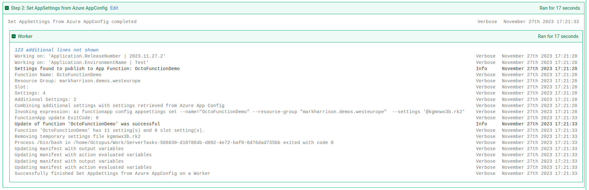

I've written previously about extending the functionality of Octopus to integrate with Cloud-based services such as [Azure Key Vault](https://octopus.com/blog/using-azure-key-vault-with-octopus) and [AWS Secrets Manager](https://octopus.com/blog/using-aws-secrets-manager-with-octopus) using step templates. We're committed to providing more ways for our customers to succeed with Octopus, so we're always creating more step templates that integrate with other Cloud-based services.

In this post, I walk through two new [Azure App Configuration step templates](https://library.octopus.com/listing/azure%20app%20config) we introduced:

1. The [Azure AppConfig KV - Retrieve Values](https://library.octopus.com/step-templates/5c4fbed9-dbba-4139-8440-d8e27318772e/actiontemplate-azure-appconfig-kv-retrieve-values) step that is designed to retrieve values from an Azure App Configuration instance that can then be used in your deployments or runbooks.
2. The [Azure Function - Set AppSettings from Azure AppConfig](https://library.octopus.com/step-templates/67fcc93c-509c-4c13-bc24-645eff53c5c2/actiontemplate-azure-function-set-appsettings-from-azure-appconfig) step that is designed to retrieve values from an Azure App Configuration instance and add them to an Azure Function's AppSettings.

## Introduction

This post assumes some familiarity with [custom step templates](https://octopus.com/docs/projects/custom-step-templates) and the Octopus [Community Library](https://octopus.com/docs/projects/community-step-templates). 

In addition, this post doesn't go into great detail about Azure App Configuration concepts or how to set it up. You can learn more by reading the [Azure App Configuration overview](https://learn.microsoft.com/en-us/azure/azure-app-configuration/overview) from Microsoft.

The step templates in this post retrieve values from an [Azure App Configuration instance](https://azure.microsoft.com/en-us/products/app-configuration/) using the [Azure Command Line Interface (CLI)](https://learn.microsoft.com/en-us/cli/azure/) known as `az`. The CLI must be downloaded and installed on the deployment target or worker before the steps can execute successfully. Both step templates have been tested on both Windows and Linux (with `PowerShell Core` installed).

## Authentication {#authentication}

Before you can retrieve values from an Azure App Configuration instance, you must authenticate with Azure. In their [security concepts documentation](https://learn.microsoft.com/en-us/azure/azure-app-configuration/howto-disable-access-key-authentication?tabs=portal), Microsoft note:

> By default, requests can be authenticated with either Microsoft Entra credentials, or by using an access key. Of these two types of authentication schemes, Microsoft Entra ID provides superior security and ease of use over access keys, and is recommended by Microsoft. 

In Octopus, authentication with an Azure App Configuration instance can be achieved with an [Azure Account](https://octopus.com/docs/infrastructure/accounts/azure), using a service principal. 

:::hint
In addition to accessing resources in Azure, your service principal may need further permissions configured to access and retrieve values stored in Azure App Configuration. To learn more, read the [Enable access using Microsoft Entra ID guide](https://learn.microsoft.com/en-us/azure/azure-app-configuration/concept-enable-rbac) on how to provide access to an App Configuration instance.
:::

## Retrieving Values {#retrieving-values}

The [Azure AppConfig KV - Retrieve Values](https://library.octopus.com/step-templates/5c4fbed9-dbba-4139-8440-d8e27318772e/actiontemplate-azure-appconfig-kv-retrieve-values) step template retrieves one or more key/values from an Azure App Configuration instance and creates output variables for each one retrieved.

For each key/value, you can optionally choose to provide a custom output variable name.

Retrieving a single key/value requires:

- An Azure account with permission to retrieve key/values from the Azure App Config v.
- The name of the Azure App Config instance to retrieve the key/value from.
- The name of the key to retrieve.

An advanced feature of the step template offers support for retrieving multiple keys at once. This requires entering each key name on a new line. A wildcard search is also supported using the `*` notation in the **Key Names** parameter. 

:::warning
Note: Combining a wildcard search with custom output variable names is not supported.
:::

For each key/value retrieved, an [output variable](https://octopus.com/docs/projects/variables/output-variables) is created for use in subsequent steps. By default, only a count of the number of variables created will be shown in the task log. To see the names of the variables in the task log, change the **Print output variable names** parameter to `True`.

### Retrieve Values step template parameters {#retrieve-values-parameters}

The step template uses the following parameters:

- `Azure Account`: An Azure account with permissions to retrieve key/values from the Azure App Config instance.
- `Config Store Name`: The name of the Azure App Config instance. Provide this or the **Config Store Endpoint**.
- `Config Store Endpoint`: The endpoint for the Azure App Config instance. Provide this or the **Config Store Name**.
- `Retrieval Method`: Choose between retrieving all configuration values or each entry individually. Retrieving all values from the App Config instance is usually more efficient, but could result in a larger payload being returned.
- `Key Names`: Specify the names of the keys to be returned from Azure App Configuration, in the format: `KeyName | OutputVariableName` where:
    - `KeyName` is the key to retrieve. Wildcards are supported by adding `*` at the end of the key name.
    - `OutputVariableName` is the _optional_ Octopus output variable name to store the key's value in. *If this value isn't specified, an output name will be generated dynamically based on the matching key name*.

    **Note:** Multiple keys can be retrieved by entering each one on a new line.
- `Labels (optional)`: Labels are an attribute of keys. Provide one or more labels in the format `label1,label2` to retrieve only selected keys that are tagged with those labels.

  **Note:** You can include both label values and specify key names.
- `Save sensitive output variables`: Set the Octopus output variables to sensitive values. Default: `False`.
- `Suppress warnings`: Suppress warnings from being written to the task log. For example, when a supplied key can't be found in the Azure App Config instance. Default: `False`.
- `Treat Warnings as Errors`: Treats warnings as errors. If enabled, the **Suppress Warnings** parameter is ignored. Default: `True`.
- `Create AppSettings JSON`: Create an Azure App Service AppSettings JSON output variable called **AppSettingsJson**. This can be useful when using the Octopus [Azure App Service step](https://octopus.com/blog/deploy-an-azure-app-service-step) and you want to dynamically create the JSON app settings for the step. Default: `False`.
- `Print output variable names`: Write out the Octopus output variable names to the task log. Default: `False`.

### Using the Retrieve Values step {#using-the-retrieve-values-step}

The **Azure AppConfig KV - Retrieve Values** step is added to deployment and runbook processes in the [same way as other steps](https://octopus.com/docs/projects/steps#adding-steps-to-your-deployment-processes).

After you've added the step to your process, fill out the parameters in the step:

After you've filled in the parameters, you can execute the step in a runbook or deployment process. On successful execution, any matching key/values will be stored as output variables. If you've configured your step to print the variable names, they'll appear in the task log:

In subsequent steps, output variables created from matching key/values can be used in your deployment or runbook.

:::hint
**Tip:** Remember to replace `Azure AppConfig KV - Retrieve Values` with the name of your step for any output variable names.
:::

## Set Function Application settings {#set-azurefunction-appsettings}

The [Azure Function - Set AppSettings from Azure AppConfig](https://library.octopus.com/step-templates/67fcc93c-509c-4c13-bc24-645eff53c5c2/actiontemplate-azure-function-set-appsettings-from-azure-appconfig) step template retrieves one or more key/values from an Azure App Configuration instance and adds them to an Azure Function's Application settings for each one retrieved.

For each key/value, you can optionally choose to provide a custom name to be used in the Function's settings.

Retrieving and setting a single key/value requires:

- An Azure account with permission to both retrieve key/values from the Azure App Config instance and publish the settings to an Azure App Function.
- The name of the Azure App Config instance to retrieve the key/value from.
- The name of the key to retrieve.
- The Azure Function
  - Name
  - Resource group name

An advanced feature of the step template offers support for retrieving multiple keys at once. This requires entering each key name on a new line. A wildcard search is also supported using the `*` notation in the **Key Names** parameter. You can also combine retrieved values with additional parameters supplied to the step using the **Additional AppSettings** parameter.

:::warning
Note: Combining a wildcard search with custom setting names is not supported.
:::

### Set Function Application settings parameters {#set-azurefunction-appsettings-parameters}

The step template uses the following parameters:

- `Azure Account`: An Azure account with permission to both retrieve values from the Azure App Config instance and publish to the App Function
- `Config Store Name`: The name of the Azure App Config instance. Provide this or the **Config Store Endpoint**.
- `Config Store Endpoint`: The endpoint for the Azure App Config instance. Provide this or the **Config Store Name**.
- `Retrieval Method`: Choose between retrieving all configuration values or each entry individually. Retrieving all values from the App Config instance is usually more efficient, but could result in a larger payload being returned.
- `Key Names`: Specify the names of the keys to be returned from Azure App Configuration, in the format: `KeyName | CustomSettingName` where:

    - `KeyName` is the key to retrieve. Wildcards are supported by adding `*` at the end of the key name.
    - `CustomSettingName` is the _optional_ name to set for the AppSetting value in the App Function. *If this value isn't specified, the original key will be used*.

    **Note:** Multiple keys can be retrieved by entering each one on a new line.
- `Labels (optional)`: Labels are an attribute of keys. Provide one or more labels in the format `label1,label2` to retrieve only selected keys that are tagged with those labels.

  **Note:** You can include both label values and specify key names.
- `Suppress warnings`: Suppress warnings from being written to the task log. For example, when a supplied key can't be found in the Azure App Config instance. Default: `False`.
- `Treat Warnings as Errors`: Treats warnings as errors. If enabled, the **Suppress Warnings** parameter is ignored. Default: `True`.
- `Azure Function App Name`: The name of the Azure App Function.
- `Resource Group`: The name of the resource group where the Function App is located.
- `Slot (optional)`: The name of the slot for the Azure App Function. Defaults to the production slot if not specified.
- `Additional AppSettings`: Specify the name and values of any **additional** settings to be applied to the Azure App Function in the format: `KEY | VALUE` where:

    - `KEY` is the name of the app setting to add.
    - `VALUE` is the value to be used. [Octopus variables](https://octopus.com/docs/projects/variables) can be used here. 

    **Note:** Note: Multiple settings can be added by entering each one on a new line. As a result, any value for a key that spans multiple lines will result in an error.

### Using the Setting Function Application settings step {#using-the-set-azurefunction-appsettings-step}

The **Azure Function - Set AppSettings from Azure AppConfig** step is added to deployment and runbook processes in the [same way as other steps](https://octopus.com/docs/projects/steps#adding-steps-to-your-deployment-processes).

After you've added the step to your process, fill out the parameters in the step:

After you've filled in the parameters, you can execute the step in a runbook or deployment process. On successful execution, any matching key/values from the Azure App Config instance will be published to the specified Azure App Function, and details will appear in the task log:

## Conclusion

The step templates covered in this post demonstrates that it's easy to integrate with Azure App Configuration to retrieve the key/values stored there, either to use in subsequent steps in your Octopus deployments or runbooks, or to publish those values directly as Application settings to an Azure App Function.

Happy deployments!
