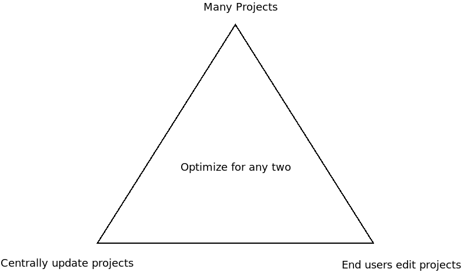

In the [previous post](/blog/2023-06/managed-space-pattern/index.md) we learned how to configure the management space, serialize template projects to Terraform modules, fork Git repositories for CaC enabled projects, and apply the Terraform modules to a managed space. This effectively allowed us to push template projects into managed spaces with a few clicks.

This is a great start, but there are many subtleties to maintaining template projects over their full lifecycle. In this post we'll look at:

* The practical constraints that limit how template projects are managed.
* How to support common scenarios faced by platform engineering teams.

## The enterprise patterns triad

There are many paradigms targeted at software engineering teams that result in an explosion of build and deployment pipelines. 

Microservices encourage teams to build and release small, independent applications, each requiring their own deployment pipeline. While there are many definitions of microservices, the attribute they all have in common is the ability to be deployed independently, as noted by this [quote from Martin Fowler](https://martinfowler.com/articles/microservices.html):

> These services are built around business capabilities and independently deployable by fully automated deployment machinery.

Infrastructure as Code (IaC) encourages the underlying infrastructure supporting applications to be deployed by an automated process, often requiring separate deployment pipelines. Meanwhile, the ever expanding DevOps evolutionary tree including practices, like DevSecOps and DevTestOps, all encourage automation of specialized steps in an application's lifecycle.

Platform engineering teams then need to capture business knowledge and best practice to support all of these concerns in template projects that can be handed to DevOps teams.

This leads to three competing concerns, captured in the enterprise patterns triad:

1. The need to have many deployment projects.
2. The need to centrally update existing deployment projects.
3. The need to have end users modify their deployment projects.

In practice you can optimize any two concerns of the enterprise patterns triad:

* You can have many projects and update those projects over time. But the ability of end users to modify those projects will be limited.
* You can have many projects and allow end users to modify those projects. But you will be limited in your ability to centrally update those projects.
* You can centrally update projects and have end users modify them. But you won't be able to support many projects.



Keep these limitations in mind as you design your own enterprise patterns implementation.

## Levels of control in downstream projects

The degree to which end users can modify downstream projects is broadly defined by a the following categories.

### Unmanaged downstream projects

Once unmanaged downstream projects are created, complete ownership of the project is handed to the downstream DevOps teams. Think of unmanaged downstream projects as being like copying a template document to a new directory and then editing it; there is no connection to the original document, no ability to be notified of changes to the original template document, and any synchronization between the original document and the copy is done manually.

This style of project is the easiest to implement and places the least burden on the central platform engineering team as they hand off all responsibility once a downstream project is created.

This style of project is suitable when:

* End users are happy to assume complete ownership of their projects after they are created.
* Platform engineering teams don't need to keep track of downstream projects once they are created.
 
In practice, unmanaged downstream projects are created by Terraform and then simply abandoning the Terraform state, usually by using the default local backend and then having Octopus delete the state file as the working directory for a deployment process is deleted.

Unmanaged downstream projects can either be database-backed or CaC enabled projects.

### Fully managed downstream projects

Fully managed downstream projects are typically read-only projects where the end users only create and deploy release, or execute runbooks. But they do not modify the deployment process or runbook steps, nor do they modify the project variables or other settings.

This style of project is suitable when:

* Progressing projects from a Development instance to a Test/Production instance, as the projects should only be modified on the Development instance, and read-only once they are promoted.
* Sharing runbook only projects that have a selection of well defined support and management runbooks performing routine tasks like database backups, service restarts, downloading logs etc.
* Sharing deployment projects where the process is well tested and end users have little reason to modify the steps.

This style of project is not suitable when DevOps teams are accustomed to owning their deployment processes, as locking down the projects will often lead to frustrations for teams that demand the ability to iterate and innovate within their CI/CD pipelines.

Fully managed downstream projects gain very little from being CaC enabled, and so are typically implemented as database-backed projects.

:::hint
We've talked to customers who have attempted to mandate read-only or highly restricted deployment processes with limited success due to push back from their downstream DevOps teams. This style of project is something all affected parties must agree to before it is implemented.
:::

### Variable configured downstream projects

Variable configured downstream projects allow the end user to modify the project variables associated with a project, but treat the deployment or runbook steps as read-only.

This style of project is a natural extension of the [step templates](https://octopus.com/docs/projects/custom-step-templates) already available in Octopus. Step templates hide the configuration of a step and expose a number of fields that customize the underlying step configuration. This works well in Octopus because the fields exposed by steps can almost always be configured to reference a variable.

Variable configured downstream projects take the same idea implemented by step templates and apply it to the entire project. Every customizable field in every step is exposed as a project variable, and end users have the ability to define the value of project variables.

Standard Octopus RBAC security rules then grant the ability to edit project variables and not grant the ability to edit deployment steps.

Behind the scenes Octopus variable resources use the Terraform `lifecycle` meta-argument and the `ignore_changes` feature to create Octopus variables if they do not exist, but ignore changes made by end users. The `-ignoreProjectVariableChanges` argument passed to `octoterra` creates variable resources like this, with the `lifecycle.ignore_changes` property set to `all`:

```hcl
variable "hello_world_hello_target_1" {
  type        = string
  nullable    = false
  sensitive   = false
  description = "The value associated with the variable Hello.Target"
  default     = "World"
}

resource "octopusdeploy_variable" "hello_world_hello_target_1" {
  owner_id     = "${octopusdeploy_project.project_hello_world.id}"
  value        = "${var.hello_world_hello_target_1}"
  name         = "Hello.Target"
  type         = "String"
  description  = ""
  is_sensitive = false
  depends_on   = []
  lifecycle {
    ignore_changes = all
  }
}

```

This style of project is suitable when end users need the ability to customize their projects, but only within the bounds of the variables exposed by the project. Because almost every field in every Octopus step can be set to the value of a variable, variable configured downstream projects have the potential to offer a great degree of flexibility. But end users can not add or remove steps, ensuring the projects remain largely consistent among managed spaces. This means incremental changes to the upstream project can be pushed to downstream projects with a reasonably high degree of confidence that the updates won't break existing configurations.

Variable configured downstream projects gain little from being CaC enabled, and so are typically implemented as database-backed projects.

### Shared downstream projects

Shared downstream projects allow end users to edit most or all aspects of the project, while also allowing the changes to the upstream project to be propagated to downstream projects.

This style of project relies on Git based merging workflows and CaC enabled projects. It works by ensuring the upstream and downstream projects share a common Git history, and then performs a Git merge between the Octopus Configuration Language (OCL) files persisted by Octopus in the CaC project Git repositories. The Git three way merge is usually capable of successfully merging non-conflicting changes and identifying when upstream and downstream changes require manual conflict resolution.

That said, it is entirely possible that downstream projects diverge so much from the upstream project that automatic merging no longer makes sense. This is why the enterprise patterns triad calls out that you can allow downstream users to edit managed projects while also synchronizing changes to the upstream project, but this won't scale to a large number of projects as eventually the burden of resolving merge conflicts becomes unmanageable.

This style of project is suitable when end users need to retain full control of their projects while platform engineering teams need to retain the ability to push out incremental changes. However, the cost of resolving merge conflicts means this style does not scale up to large numbers of projects.

## Conclusion

Downstream projects are typically configured as one of the following:

* Fully managed 
* Unmanaged
* Variable configured
* Shared

Each style of project offers end users and platform engineering teams varying levels of ongoing customization. Generally speaking, the more control the end user has over downstream projects, the less ability platform engineering teams have to synchronize incremental changes to upstream projects. DevOps teams must decide what combination of trade offs works best for them.

An additional control mechanism is available for teams that use CaC enabled projects where a custom validation script is run against pull requests for changes to deployment processes made in feature branches. In the [next blog](/blog/2023-06/validating-projects/index.md) post we'll review a practical example of validating pull requests.

We are currently refining our approach to these enterprise patterns, so if you have any suggestions or feedback about the approach described here, please leave a comment on [this GitHub issue](https://github.com/OctopusSolutionsEngineering/EnterprisePatternsReferenceImplementation/issues/1).