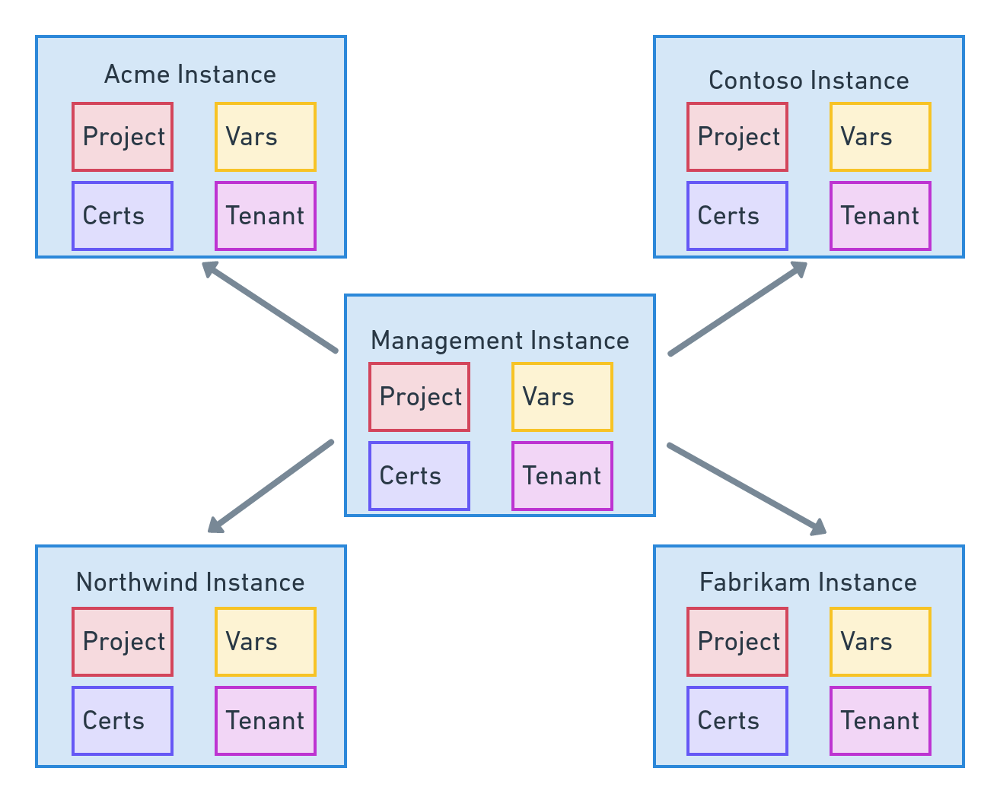
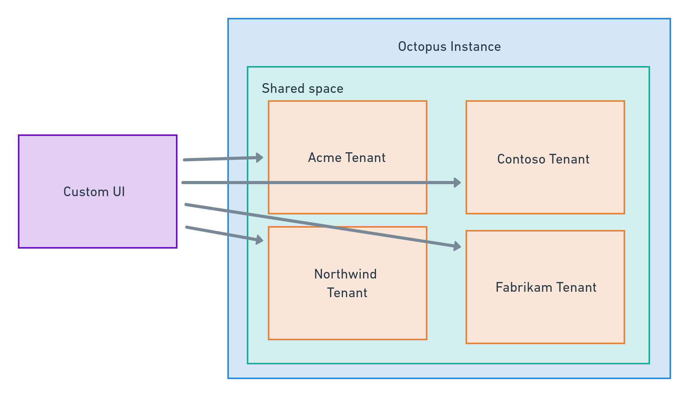
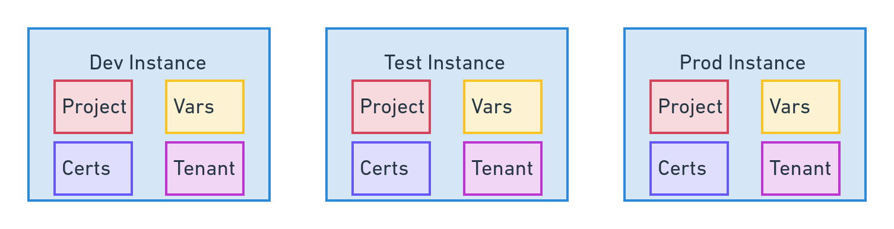

Supporting software deployments and maintaining applications in large enterprise environments isn't as simple as configuring a single, shared Octopus instance that everyone can use. There are common, practical constraints that require multiple Octopus spaces and instances. These include:

- Network latency between geographically distributed teams
- The desire for business units to control their own infrastructure and processes
- Business acquisitions that bring established DevOps system
- Compliance with standards like PCI 

Over time, we've seen common patterns emerge with Octopus installations as enterprise environments address these concerns.

In this post, we'll break these patterns down and describe how you can use them to address common scenarios in enterprise environments.

## Independent space per business unit/application

The most common pattern is to partition a single Octopus installation into [separate spaces](https://octopus.com/blog/best-practices-spaces). Octopus is fairly agnostic about what individual spaces represent, but it's common to provide a space for business units or application stacks. If the space represents a stable context for the projects it holds (meaning Octopus projects are unlikely to move between spaces, even as people move between teams or security requirements change), spaces are a convenient way to split projects and define security boundaries.

This pattern is very easy to implement, as it often involves little more than creating a new space and assigning security permissions. We expect most Octopus users to naturally adopt spaces as their use of the platform grows.

However, spaces do have some limitations. Because spaces belong to a single Octopus installation, and Octopus installations need a low latency connection to the database, spaces do not let you co-locate Octopus with geographically dispersed teams. Plus, all tasks initiated by spaces use a shared task queue. When projects in a space queue many tasks, other spaces have to wait for their deployments to be processed. This is commonly known as the "noisy neighbor" problem.

| Feature  | Solves  |
|---|---|
| Independent projects, runbooks, dashboards etc  | ✓ | 
| Task execution guarantees for business unit/application | ✕ |
| Shared authentication settings | ✓ |
| Synchronized projects, runbooks, dashboards etc | ✕ |
| Supports geographically disperse business units | ✕ |
| Robust RBAC support | ✓ |

## Independent instance per business unit/region

Independent instances let geographically dispersed teams deploy a local Octopus instance. This provides better performance and greater reliability due to the reduced networking distance. Independent instances also grant each business unit an isolated task queue so deployments and management tasks aren't held up by other teams.

Enterprises may also choose to deploy independent Octopus instances in the scope of PCI or other security regulations to perform deployments to secure environments. This frees teams from locking down their regular Octopus instance to meet specialized security requirements.

Like the independent space pattern, the independent instance pattern is easy to implement. It only requires the deployment of another Octopus instance. However, due to the lack of centralized management of independent instances, you must configure common settings on each instance. These include: 

- Authentication
- SMTP servers
- Subscriptions
- Audit log streaming
- And more

| Feature  | Solves  |
|---|---|
| Independent projects, runbooks, dashboards etc  | ✓ | 
| Task execution guarantees for team/customer | ✓ |
| Shared authentication settings | ✕ |
| Synchronized projects, runbooks, dashboards etc | ✕ |
| Supports geographically disperse teams/customers | ✓ |
| Robust RBAC support | ✓ |

## Tenant per customer

Octopus has long supported partitioning deployment processes across multiple tenants, allowing each tenant to progress their own deployments independently. You can scope the RBAC rules in Octopus to tenants. This allows fine-grained access to resources like targets, accounts, and certificates.

Tenants are a natural solution for teams that need to independently deploy applications to multiple downstream customers. You can also use tenants to represent concepts such as regions, release rings, or teams.

However, the RBAC controls around tenants are not expressive enough to isolate customers if they log into the Octopus installation and you grant them permissions to see a single tenant. For example, you can't scope channels, tasks, and audit logs to a tenant.

You can find more information about [tenants in our documentation](https://octopus.com/docs/tenants).

| Feature  | Solves  |
|---|---|
| Independent projects, runbooks, dashboards etc  | ✕ | 
| Task execution guarantees for team/customer | ✕ |
| Shared authentication settings |  ✓|
| Synchronized projects, runbooks, dashboards etc |✓  |
| Supports geographically disperse teams/customers | ✕ |
| Robust RBAC support |✕ |

## Managed space per business unit/application

This solution represents a typical "hub and spoke", or [platform engineering](https://octopus.com/devops/platform-engineering/), approach. Each application stack or business unit has its own space, and some or all of the space configuration is centrally managed.

A tenant represents each space in the management space. And deployment projects or runbooks configure the managed spaces. You can use the Terraform provider or raw API scripting to push configuration for shared resources, like template projects, to the managed spaces.

| Feature  | Solves  |
|---|---|
| Independent projects, runbooks, dashboards etc  | ✓ | 
| Task execution guarantees for team/customer | ✕ |
| Shared authentication settings |  ✓|
| Synchronized projects, runbooks, dashboards etc |✓  |
| Supports geographically disperse teams/customers | ✕ |
| Robust RBAC support |✓ |

## Managed instance per business unit/region

Like the "managed space per business unit/application" pattern, this represents a typical "hub and spoke", or [platform engineering](https://octopus.com/devops/platform-engineering/), approach. However, each business unit or region gets its own Octopus installation.

A tenant represents each managed Octopus instance in the management space. And deployment projects or runbooks configure the managed Octopus instances. You can use the Terraform provider or raw API scripting to push configuration for shared resources, like template projects, to the managed instances.

| Feature  | Solves  |
|---|---|
| Independent projects, runbooks, dashboards etc  | ✓ | 
| Task execution guarantees for team/customer | ✓ |
| Shared authentication settings |  ✓|
| Synchronized projects, runbooks, dashboards etc |✓  |
| Supports geographically disperse teams/customers | ✓ |
| Robust RBAC support |✓ |

## Facade space per customer

This pattern provides each customer with their own space. Each customer space has deployment projects or runbooks with a single step to call the associated project in the management space. These projects, therefore, act as a facade over the projects in the management space.

This approach has the benefit of only requiring you to create very simple projects in each managed space. A tenant represents each customer in the management space, taking advantage of the built-in features of tenants. Customers log into their own space, providing a high degree of security.

| Feature  | Solves  |
|---|---|
| Independent projects, runbooks, dashboards etc  | not required| 
| Task execution guarantees for team/customer | ✕ |
| Shared authentication settings |  ✓|
| Synchronized projects, runbooks, dashboards etc | not required |
| Supports geographically disperse teams/customers | ✕ |
| Robust RBAC support |✓ |

## Custom UI over Octopus Installation

This is the most advanced pattern of all. It requires the development of a custom web user interface to orchestrate deployments with a back-end Octopus installation.

The custom UI provides an almost unlimited ability to control and customize the end user's experience.

This solution also allows orchestrating deployments across multiple Octopus installations from a single shared UI.

You can find more information about the [Octopus REST API in our documentation](https://octopus.com/docs/octopus-rest-api).

| Feature  | Solves  |
|---|---|
| Independent projects, runbooks, dashboards etc  | ✓| 
| Task execution guarantees for team/customer | ✓ |
| Shared authentication settings |  ✓|
| Synchronized projects, runbooks, dashboards etc | not required |
| Supports geographically disperse teams/customers | ✓ |
| Robust RBAC support |✓ |

## Managed instance per environment

This solution creates Octopus installations in each environment. It treats Octopus upgrades and other maintenance tasks in the same manner as a regular application deployment by promoting the changes through environments like development, test, and production.

You need to synchronize the Octopus installations to ensure their configuration is as similar to one another as possible.

Unlike the previous patterns, this pattern is less concerned with providing the ability for teams and customers to log into Octopus installations. Rather, DevOps teams use non-production Octopus installations to test upgrades and validate project changes.

| Feature  | Solves  |
|---|---|
| Independent projects, runbooks, dashboards etc  | N/A | 
| Task execution guarantees for team/customer | N/A |
| Shared authentication settings | N/A|
| Synchronized projects, runbooks, dashboards etc | ✓ |
| Supports geographically disperse teams/customers | N/A |
| Robust RBAC support | N/A |

## Conclusion

The patterns described here cover most implementations we expect enterprise customers will adopt as they scale their use of Octopus to support business units and customers.

Some of these patterns require little effort to deploy or are deeply embedded into Octopus. These include: 

- Independent space per business unit/application
- Independent instance per business unit/region
- Tenant per customer

We won't cover these patterns in any more detail, as our docs cover them.

The "custom UI over Octopus installation" is an advanced pattern that requires a dedicated development team to build a web application that consumes the Octopus REST API. This blog series won't go into any additional detail on how to write such a custom UI, but you can refer to the [API documentation](https://octopus.com/docs/octopus-rest-api) for more information if you're interested in this pattern.

We cover the remaining patterns in subsequent posts:

- Managed space per business unit/application
- Managed instance per business unit/region
- Facade space per customer
- Managed instance per environment

We also provide a reference implementation in the form of a Docker Compose stack that provisions a preconfigured Octopus instance with sample projects. These projects demonstrate the deployment and synchronization of Octopus projects between spaces and instances. We describe the reference implementation in more detail in the [next post](https://octopus.com/blog/reference-implementation).

We're currently refining our approach to these enterprise patterns, so if you have any suggestions or feedback about the approach described here, please leave a comment on [this GitHub issue](https://github.com/OctopusSolutionsEngineering/EnterprisePatternsReferenceImplementation/issues/1).

Happy deployments!