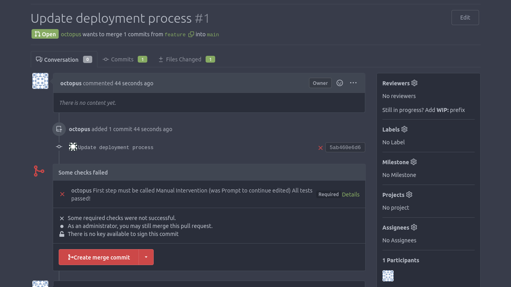

We noted in the [previous post](https://octopus.com/blog/synchronizing-projects) that there's a trade-off between granting end users control over their downstream projects and the ability to push incremental changes made to the upstream projects; the more control end users have, the harder it is to push updates to many projects.

One way to control how people modify downstream Config as Code projects is to rely on Git based workflows that protect the default branch from direct modification. This requires your team to make all changes in feature branches, and adds checks to the pull request opened against the default branch.

In this post, we look at a practical example of an automated check so our Config as Code project always meets some minimum requirements.

## Parsing the OCL language

The Octopus Configuration Language (OCL) is a subset of Hashicorp's HCL language. Octopus automatically converts a Config as Code project to OCL when it persists it in Git.

The [TypeScript Library for OCL](https://github.com/OctopusDeploy/ocl.ts) parses the OCL, which is also available from [NPM](https://www.npmjs.com/package/@octopusdeploy/ocl).

By parsing the OCL of a feature branch and validating that it meets some minimum requirements, you can build an automated workflow allowing end users to edit a Config as Code project but only allow the default branch to be updated if those changes satisfy your checks.

## The sample OCL validation project

Your OCL validation script is a small JavaScript application that's intended to be run by the CI environment supported by most major Git platforms. These include GitHub Actions, GitLab Pipelines, and BitBucket Pipelines.

Start by creating the `package.json` file, which defines your Node.js project. This file lists the OCL parser as a dependency, and also includes the Jest test framework:

<script src="https://emgithub.com/embed-v2.js?target=https%3A%2F%2Fgithub.com%2FOctopusSolutionsEngineering%2FEnterprisePatternsReferenceImplementation%2Fblob%2Fmain%2Fpr_ocl_check%2Fpackage.json&style=default&type=code&showBorder=on&showLineNumbers=on&showFileMeta=on&showFullPath=on&showCopy=on"></script>

The validation logic is defined in the `check.js` file. In this example, you define a function called `checkPr` that requires the deployment process to have at least one step, for the first step to be called `Manual Intervention`, and for it to be of type `Octopus.Manual`. The script then defines supporting functions to assist with extracting values from the parsed OCL:

<script src="https://emgithub.com/embed-v2.js?target=https%3A%2F%2Fgithub.com%2FOctopusSolutionsEngineering%2FEnterprisePatternsReferenceImplementation%2Fblob%2Fmain%2Fpr_ocl_check%2Fcheck.js&style=default&type=code&showBorder=on&showLineNumbers=on&showFileMeta=on&showFullPath=on&showCopy=on"></script>

To verify that this code works as expected, you define unit tests in a file called `check.test.js`:

<script src="https://emgithub.com/embed-v2.js?target=https%3A%2F%2Fgithub.com%2FOctopusSolutionsEngineering%2FEnterprisePatternsReferenceImplementation%2Fblob%2Fmain%2Fpr_ocl_check%2Fcheck.test.js&style=default&type=code&showBorder=on&showLineNumbers=on&showFileMeta=on&showFullPath=on&showCopy=on"></script>

The test cases reference an example OCL file that passes the required checks:

<script src="https://emgithub.com/embed-v2.js?target=https%3A%2F%2Fgithub.com%2FOctopusSolutionsEngineering%2FEnterprisePatternsReferenceImplementation%2Fblob%2Fmain%2Fpr_ocl_check%2Ftest_deployment_processes%2Fcorrect_name.ocl&style=default&type=code&showBorder=on&showLineNumbers=on&showFileMeta=on&showFullPath=on&showCopy=on"></script>

A second test case references an OCL file with a correctly named step but that is of the wrong type:

<script src="https://emgithub.com/embed-v2.js?target=https%3A%2F%2Fgithub.com%2FOctopusSolutionsEngineering%2FEnterprisePatternsReferenceImplementation%2Fblob%2Fmain%2Fpr_ocl_check%2Ftest_deployment_processes%2Fcorrect_name_wrong_type.ocl&style=default&type=code&showBorder=on&showLineNumbers=on&showFileMeta=on&showFullPath=on&showCopy=on"></script>

And the remaining test references an OCL file that includes a step with the incorrect name:

<script src="https://emgithub.com/embed-v2.js?target=https%3A%2F%2Fgithub.com%2FOctopusSolutionsEngineering%2FEnterprisePatternsReferenceImplementation%2Fblob%2Fmain%2Fpr_ocl_check%2Ftest_deployment_processes%2Fwrong_name.ocl&style=default&type=code&showBorder=on&showLineNumbers=on&showFileMeta=on&showFullPath=on&showCopy=on"></script>

To test the validation script, ensure you have Node.js installed and then run the following commands:

```bash
npm install
npm run test
```

## Automating pull request validation

Now you have an automated script to validate your deployment process, the next step is executing this script as part of a pull request.

To make the script available to Git based CI platforms, it's easiest to check the `package.json` and `check.js` files into the Config as Code Git repository.

As an example, the following GitHub Actions workflow downloads the script dependencies and executes the `check.js` file in response to a pull request being opened or updated:

```yaml
name: OCL PR Validation
on:
  pull_request:
    types: [opened, reopened, synchronize]
jobs:
  build:
    runs-on: ubuntu-latest
    steps:
      - uses: actions/checkout@v3
        with:
          fetch-depth: '0'
      - uses: actions/setup-node@v3
      - name: Get Dependencies
        run: npm install
        shell: bash
      - name: Validate OCL
        run: node check.js .octopus/project
        shell: bash
```

This workflow, in conjunction with [protected branches and branch protection rules](https://docs.github.com/en/repositories/configuring-branches-and-merges-in-your-repository/managing-protected-branches/about-protected-branches), ensures that pull requests are blocked unless the OCL validation script passes successfully.

Most commercial Git platforms operate in much the same way, by executing the Node.js script in response to a pull/merge request and using the result to block or allow the merge to continue.

The [reference implementation](https://github.com/OctopusSolutionsEngineering/EnterprisePatternsReferenceImplementation/tree/main) uses Gitea to host Config as Code projects. Gitea does not provide an execution environment to run scripts like our OCL validator, but it does let you set status checks on pull requests and trigger external services via webhooks when a PR is created. So the reference implementation has a small [proxy server](https://github.com/OctopusSolutionsEngineering/EnterprisePatternsReferenceImplementation/blob/main/gitea_proxy/main.py) that responds to Gitea webhooks and triggers an Octopus runbook. The runbook then [runs the OCL validation script](https://github.com/OctopusSolutionsEngineering/EnterprisePatternsReferenceImplementation/blob/main/management_instance/projects/scripts/check_pr.py) and passes the result back to the Gitea pull request via the Gitea REST API:




## Conclusion

By parsing and validating the OCL backing a Config as Code enabled project during a pull request, DevOps teams can proactively ensure Octopus projects meet very granular requirements before merging changes into the default branch. This lets DevOps teams enforce requirements like ensuring certain steps are always defined, configuring steps with particular values, or making sure steps appear in a specific order.

This post describes a simple OCL validation script written for Node.js including a number of useful supporting functions for extracting data from the parsed file. Although the example script only implemented a few simple rules, it's easy to extend this example to define any requirements that DevOps teams may wish to enforce with their deployment processes.

We're currently refining our approach to these enterprise patterns, so if you have any suggestions or feedback about the approach described here, please leave a comment on [this GitHub issue](https://github.com/OctopusSolutionsEngineering/EnterprisePatternsReferenceImplementation/issues/1).

Happy deployments!
