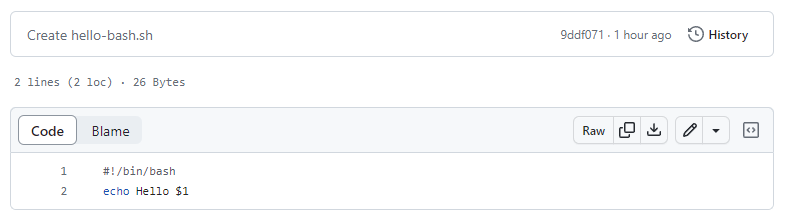
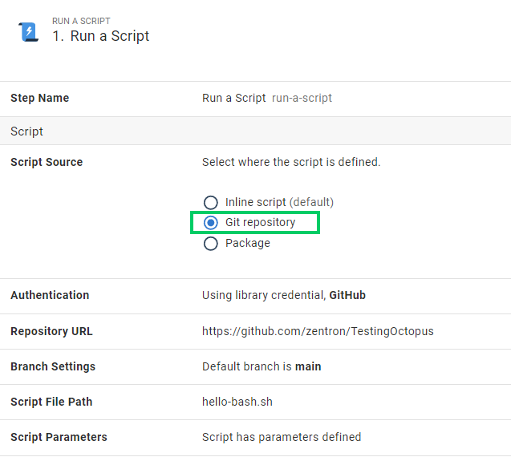

Deployment processes often require artifacts that don’t require any sort of processing as part of a build process. Scripts that can be sourced directly from a repository without some intermediate compilation are the norm. In modern systems this can also be extended to entire declarative configuration files, such as kubernetes manifests or terraform templates. 

Historically, Octopus previously required users to bundle these resources up into some artifact such as a zip archive. These would exist just so that it could be referenced by Octopus in a step to be extracted and utilized during a deployment. This artificial requirement felt unnatural and added additional steps to what should otherwise be a simple process. The file is just there in my repository, why can’t I use it in my deployment directly?

With recent additions to Octopus Deploy, we have revolutionized the ways in which users can source these dependencies through a direct reference to the repository itself in a deployment process.

There are two scenarios we now support, files that exist in the same git repository that the version controlled Octopus project is stored, and files that exist in some other external git repository. Let’s explore the differences between these two options and how we might use them.

## External Git references
The recently released [Kustomize support for kubernetes deployments](https://octopus.com/blog/manifests-from-git) provided a sneak peek at a new way of sourcing dependencies for your deployments. In this step we included the ability to source the kustomize manifest files directly from a Git repository. 

Through this feature, your various Octopus projects could reference the same kustomize templates directly from their source repositories without requiring them to be bundled up into an intermediate archive nor relying on GitHub specific releases. 

We have now enabled this functionality across the board to all steps that support sourcing artifacts from packages. This makes sourcing your scripts from your git repositories easier than ever and provides a mechanism for the centralization of these shared dependencies across multiple Octopus projects. 

### Externally sourced script example

In the following example we have a simple bash script committed to our repository

We can now reference this script directly, without needing it to be packaged by selecting the new Git Repository option on our Run a Script step in Octopus.

Providing the default branch on the step itself means that we can easily provide backwards compatibility with tooling that might not yet know that this feature exists. At the time of release creation, the tip of the branch will be automatically used to source the script contents. 

The commit selected at the time of release creation will be snapshotted, and at deployment time that specific commit will be checked out and its contents used for the deployment. This does mean that just like with external packages, that commit needs to be available during the deployment. If the repository is deleted for example, then future release referencing it may fail to be executed.

### Limitations
We have some work items in our backlog to support selecting the branch at release creation however at the time of writing this, neither the branch nor commit cannot be changed at the time that the release is created.  The tip of the provided Default Branch will always be snapshotted at release creation.

Since we need to resolve a specific commit at release creation time, the Repository Url and Branch properties only support the use of unscoped variables. The Path and Parameters options can use any scope since these are resolved and utilized during a deployment itself. 

A full clone of the relevant project repository into the Octopus Server takes place during deployment so that the relevant files and commits can be extracted. In addition, since Octopus Server cannot know which files will ultimately be required from deep within customer’s dynamic scripts, the entire repository contents are transferred across to the target during a deployment. In future we may support cloning on the target or performing shallow clones, however in this initial release you should expect some time spent on the initial clone for each repository used.

## Config As Code Project References

When writing scripts to run during an Octopus Deploy process, it’s pretty standard to want to run it locally when initially developing it. Inline scripts make this a little difficult

If you have been using Config as Code functionality for your projects, you probably want to also version control the scripts themselves as well. 

Scripts that are sourced from the same git repository that the project process itself is stored in means that you don’t need to provide the branch and commit information when creating the release since we already have those details. The same commit that is checked-out for the deployment process will be used to source the script itself. This makes it really simple and convenient to iterate on a script alongside the deployment process that uses it. 

This approach bypasses the current limitation with external git references mentioned above which constrains the commit that the files are sourced from since it will automatically use whatever branch and commit that the process itself is using.

## Why would I want to use this?

**Development Iteration**
When creating or updating scripts or configurations for use in a deployment, you probably want to run them locally to validate the changes that you make. When making these changes rather than cutting and pasting files between Octopus and your local filesystem, its much safer and reliable to be able to adit the scripts

**Dependencies**
Often the dependencies are made up of more than just 1 file. A Kustomze deployment will typically be made up of multiple configuration files in various folder locations. Complex scripts might be composed of several sub scripts or rely on small tools. Since we clone the entire repository all of these pieces will be available at deploy time for use.

**Shared Resources**

## Summary
