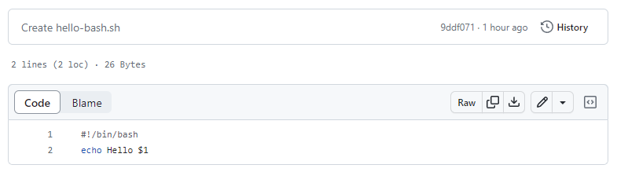
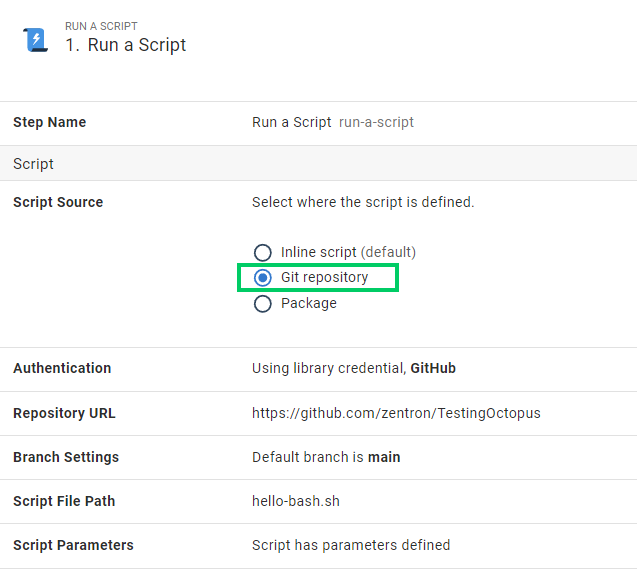
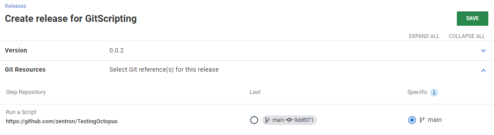
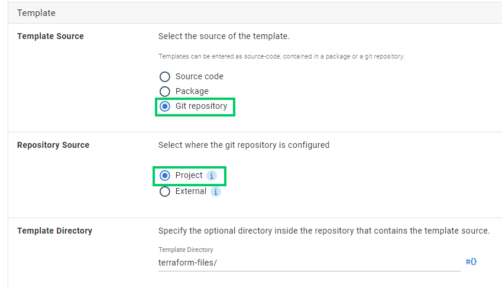
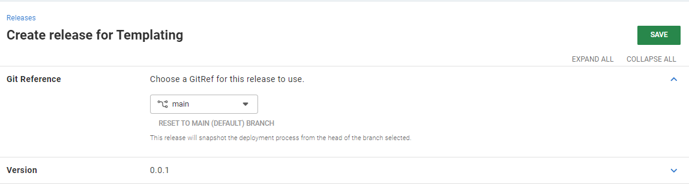

Deployments often rely on artifacts that don’t need processing during a Continuous Integration (CI) build. Scripts you can source directly from a repository without intermediate compilation are the norm. In some systems, this includes entire declarative configuration files, like Kubernetes manifests or Terraform templates. 

You previously needed to bundle these resources into an artifact, like a zip archive, for Octopus. These build outputs existed just so Octopus could reference them later, to extract and use during a deployment. This felt unnatural and added steps to an otherwise simple process. If the file is in your repository, you should be able to use it in your deployment directly.

Updates to Octopus will make it possible to source these dependencies from your Git repository in a deployment process.

## The benefits of sourcing from Git

### Improved development experience

When creating or updating scripts or configurations for a deployment, you probably want to run them locally to validate your changes. Rather than cutting and pasting files between the Octopus portal and your local file system, it's safer and more reliable to edit the scripts directly from files sourced from a repository. This provides all the benefits of using source control:

- Versioning
- Auditability
- Change control

### Accessing dependencies

Often the dependencies include more than just one file. A Kustomize deployment is typically made up of multiple configuration files in various folder locations. Several sub-scripts might make up complex scripts, or they might rely on small tools. Since we clone the entire repository, all these pieces will be available at deployment time.

### Managing centralized scripts and resources

Storing scripts in a Git repository rather than in the process itself offers another way to share processes across projects and Octopus instances. Perhaps your platform team has provided a managed Kubernetes manifest for multiple teams to deploy their application. Each team only needs to configure their different application images and variables injected into the manifest at runtime. You might also have maintenance scripts to use in runbooks across different spaces. When you update the process, you want all new releases to use the latest version without consumers having to think about it. All sorts of new, simpler templating and sharing options become available.

### Simpler build pipelines

Retrieving dependencies directly from a Git repository removes the intermediate packaging process to bundle them into a consumable artifact for Octopus. After you commit changes, they're available for deployment. This may eliminate the need to manage complex build processes, compress files, or store keys and passwords to access the feeds where you store these artifacts. Future improvements might result in these commits being automatically pushed to a release.

## Two new Git-sourced options

There are 2 new scenarios we  support: 

- Files that exist in the same Git repository where you store your version-controlled Octopus project
- Files that exist in some other external Git repository. 

Let’s explore these 2 options and how you might use them.

### External Git references

We recently added support for [YAML manifests from Git](https://octopus.com/blog/manifests-from-git) in the **Deploy raw Kubernetes YAML** step. This provided an early look at a new way of sourcing dependencies for your deployments. We streamlined bringing entire Kubernetes manifests directly into a deployment without any intermediate packaging or build steps outside Octopus.

This functionality will soon be available to all steps that support scripts and configuration manifests. This makes sourcing scripts from your Git repositories easier than ever and can centralize these shared dependencies across multiple Octopus projects. 

#### Externally-sourced script example

In the following example, we have a simple Bash script committed to our repository.

We can now reference this script directly, without packaging it. You do this by selecting the new Git Repository option in our **Run a Script** step in Octopus. This works for [Configuration as Code (Config as Code) projects](https://octopus.com/docs/projects/version-control) and standard database-backed projects.

Providing the default branch on the step itself means you can easily provide backward compatibility with tooling that might not yet know this feature exists. At the time of release creation, the tip of this branch will source the script contents.

The commit selected during release creation gets recorded. At deployment time, that specific commit gets checked out and used during the execution. This means that, just like with standard packages, the commit needs to be available during the deployment. If the repository gets deleted, for example, future releases referencing it may fail to run.

#### Limitations

- We have some work items in our backlog to support selecting the branch at release creation. However, at the time of writing, neither the branch nor the commit has changed during release creation. The tip of the defined default branch will always get recorded at release creation.

- To resolve a specific commit at release creation time, the `Repository Url` and `Branch` properties only support using unscoped variables. Conversely, the `Path` and `Parameters` options can use any scope since they get resolved and used during a deployment itself. Using a variable with an unsupported scope will result in an error at release creation.

- A full clone of the relevant project repository on the Octopus Server machine takes place during deployment to extract relevant files. Octopus Server can't know which files to use from deep within a customer’s potentially dynamic scripts. As such, the entire repository contents get transferred across to the target or Worker during a deployment. In the future, we may support cloning on the target or performing shallow clones. In this release, though, you should expect some time spent on the initial clone for each repository used.

- Sourcing files from submodules are not supported. If your repository is detected to contain submodules, these files will not be available during deployment and a warning will be displayed in the deployments logs.

### Config as Code project references

If you're using Config as Code in Octopus, you'll soon be able to use files stored in the same repository as Octopus's deployment process files. Like the externally sourced scripts above, this will let you write and commit your files directly into a Git repository and use them in your project. 

By sourcing the scripts from the same repository as your project configuration, there's much less information to provide to Octopus to source the relevant files. The same repository and commit checked out for the deployment process get used to source the script itself. 

This also makes it simpler and more convenient to iterate on a script alongside the deployment process that uses it. Regardless of the branch or commit you're deploying, the right dependencies will automatically get included in the deployment. You can work on your scripts and processes simultaneously in a feature branch, testing them together before merging the changes in a single commit into your release branch.

This also bypasses the limits with external Git references mentioned above that constrain the source of branch files. Since the release will automatically use whatever commit the process is using, this could be any branch, tag, or pull request.

#### Config as Code project sourced script example

When configuring the sample Terraform step in a Config as Code-enabled project, the **Git repository** option shows a second option for **Repository Source**.  By selecting **Project** you use the repository associated with the relevant Config as Code project. By selecting **External**, you expose the options noted above for external Git references.

The **Repository Source** option only shows in Config as Code projects. It's otherwise implied for non-Config as Code projects with **Git repository** sourced files using an external repository.

After you configure your deployment process and go to create the release, you only need to select the branch that defines the Config as Code project process. The same commit selected for the release itself gets used for sourcing the relevant files.

:::hint
If your Kubernetes or Helm manifests reference _other_ repositories, these still get retrieved by the relevant tool (like kubectl or helm) at deployment time, as is standard for those commands.
:::

## Conclusion

Although we've offered [GitHub Feeds](https://octopus.com/docs/packaging-applications/package-repositories/github-feeds) for some time, this brought with it CI complexities. It also led to unnecessary overheads in today's world of GitOps.

To open up new ways to structure your deployments, features will roll out to cloud instances in the next few weeks, so you can source your deployment dependencies from:

- The Git repository used for your Config as Code project 
- A separate external repository

We're excited to see how you use these features. Please let us know in the comments section below what new capabilities this does (or doesn't) open up for your release pipelines.

Happy deployments!
