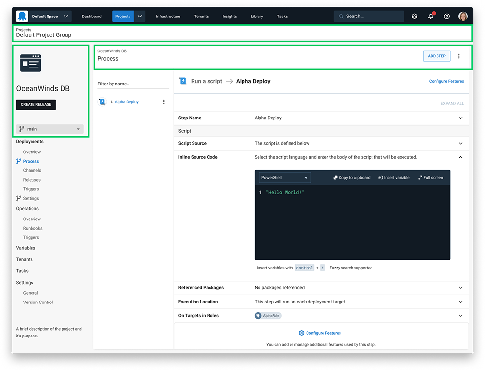
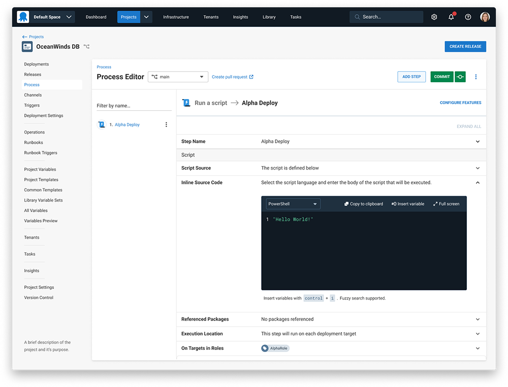

We're always working on improving the user experience (UX) at Octopus Deploy. Most recently, we've been addressing feedback about our interface looking “messy” and “hard to navigate”. Addressing these concerns required a couple of changes. We focused on a layout that presents information in an easier-to-read structure.

In this post, I walk you through the updates we made.

## Page layouts

We began by looking at our project page layouts. Here we identified a couple of key elements that needed improving. 

We focused on our page headings and breadcrumbs. These are important for understanding your location in the app. These elements also set the stage for the page layout.

*This image highlights the areas where we placed our focus*

After we arrived at a design that worked well for projects, we took this layout across the entire app. You can see the new layout below.

*This image shows the new layout*

### Benefits of these changes

These changes make the Octopus Deploy interface easier to understand. The headings are an appropriate size and in a better place relative to the page content. The breadcrumbs now have appropriate visual treatment and we've applied their behavior consistently. 

Customers were having trouble remembering the location of the **CREATE RELEASE** button. By placing the button in the top right corner near other page actions, the button is now easier to find.

### A few other notable improvements

We made some other improvements:

- When moving between pages, we simplified loading animations
- Menu interaction states are clearer
- We simplified project navigation by removing headings and updating labels to match the page content

## Conclusion

We continually work to make improvements to your experience when using Octopus. 

If you're keen to share your feedback or want a sneak peek of upcoming UX changes, please [book a time with us](https://calendly.com/emily-pearce-1/octopus-deploy-user-experience-research). 

Happy deployments!