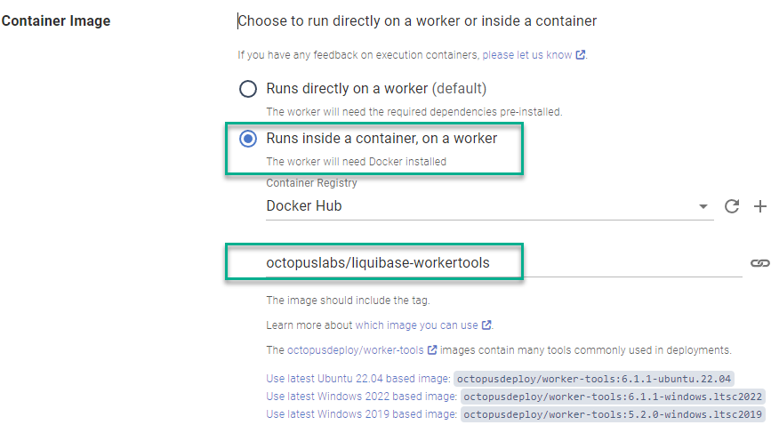

Until now, you had to do one of 2 things to deploy database updates using Octopus and the [Liquibase](https://liquibase.com) product. The first option was installing the Liquibase CLI on the machine performing the updates. The other option was ticking the box **Download Liquibase?** on the **[Liquibase - Run Command](https://library.octopus.com/step-templates/36df3e84-8501-4f2a-85cc-bd9eb22030d1/actiontemplate-liquibase-run-command)** community step template to dynamically download Liquibase and any dependencies at deploy time.  

In this post, I introduce a publicly available container image you can use with the [Execution Containers](https://octopus.com/docs/projects/steps/execution-containers-for-workers) feature to execute Liquibase.

## Using the Liquibase container image

The [octopuslabs/liquibase-workertools](https://hub.docker.com/r/octopuslabs/liquibase-workertools) container image comes with most of the components to perform a deployment, including:

- Liquibase
- Java
- PowerShell
- AWS CLI (to support AWS IAM authentication)

If you're selecting a database type that Liquibase doesn't ship with, like Cassandra or MongoDB, the **Liquibase - Run Command** template automatically detects if it's running in a container and downloads any missing dependencies.

## Updating your process

If you're using the **Liquibase - Run Command**, the only change you need to make is updating the **Container Image** section. 

1. Change **Runs directly on a worker** to **Runs inside a container, on a worker**.
2. Specify the image as `octopuslabs\liquibase-workertools`. 

:::hint
If you don't have an [External Feed](https://octopus.com/docs/packaging-applications/package-repositories/docker-registries) for Docker Hub, you'll need that as well.
:::

## Conclusion

We strive to make using Octopus Deploy as easy as possible. The `octopuslabs\liquibase-workertools` image makes integrating the Liquibase product into your deployment process much easier, especially when coupled with Octopus Cloud [Dynamic Workers](https://octopus.com/docs/infrastructure/workers/dynamic-worker-pools).

Happy deployments!