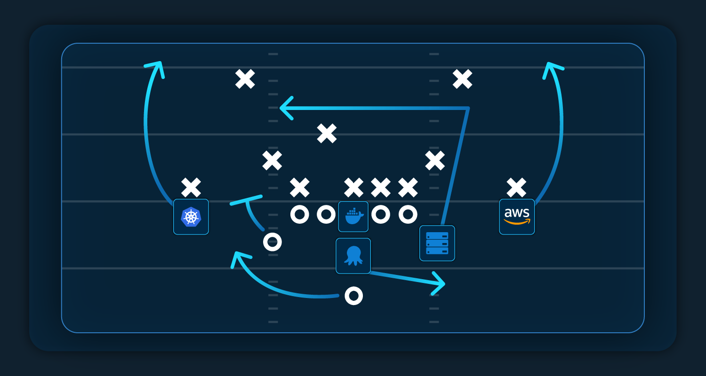

I *love* analogies as a learning tool. Applying daunting new concepts to simple ideas you already know makes learning about new things so much easier.

Thanks to the Super Bowl taking place this weekend, I thought about using sport as a way to explain software development practices.

I wondered if there were any connections between gridiron's unique phases and the methodologies software teams adopt. Besides the loose idea that both software and gridiron teams try to 'gain yards' to put themselves in the best position to achieve goals, there wasn't much to work with.

Until I realized that the deployment pipeline itself is a *team* of sorts.

## The deployment pipeline as a gridiron team

Like American football team players, each tool in a deployment pipeline has a specialist focus independent of the others. Yet, working together, all tools combine to serve the overall purpose - to get your software to production (the software equivalent of scoring a touchdown.)

I looked at a typical American Football offensive line-up. By considering the ball as software (commentators sometimes even refer to the ball as 'the package', funnily enough), it became easy to make parallels between player positions and deployment pipeline tooling.

The coach is the DevOps engineer and their playbook is the deployment process. Both coach and DevOps engineer know how they want things to work during each phase. Both decide how the team should best deliver 'the package'. Both decide on the team's structure and how it'll operate. Both always look for improvements and make changes when needed.

The center is the player that snaps the ball back to the quarterback to start each offensive play. This could be either build service or package repository, depending on the pipeline you're comparing to. After all, both tools hand off packaged software to the deployment tool.

That, naturally, makes the deployment tool the pipeline's quarterback.

## Why Octopus is the quarterback

I know, I know. It might seem a little arrogant to relate our tool to the most important position in an American football team (and in an analogy I made up). There are definite similarities, though.

For every offensive play in an NFL game, where the goal is to move the ball from one end of the field to the other, the quarterback is the team's *master of distribution*. The moment they receive the ball from their center, they look to deliver it to a willing target predetermined by the play they're running.

Like the mighty quarterback, Octopus is also a delivery specialist. Octopus takes packages from a build service or package repository and promptly delivers them to the intended target with a predefined, well-practiced deployment process.

What's more, the quarterback can deliver the ball to a variety of targets. They could throw long to running backs as the team tries a classic 'Hail Mary', or pass short to a close receiver. Octopus also has variety in its passing game and can deliver software to any type and combination of deployment target. Octopus has the range, whether it's Kubernetes, cloud service, physical hardware, or hybrid environments.

Lastly, quarterbacks can also act as an on-field coach of sorts. They remind everyone of their roles in the next phase, the shape they should take, and make situational tweaks when needs arise. Likewise, Octopus helps organize the other troops in your pipeline with its [Runbooks feature](https://octopus.com/docs/runbooks), so you can be sure your other tools are ready to support your software.

## "v22.35, set, hut!"

So, there you have it! That's how a deployment pipeline is just like an American football team and Octopus its quarterback.

If you're looking to sign a star quarterback to improve results for your team of DevOps tooling, why not [see how we perform in tryouts](https://octopus.com/start?location=nav-bar)?

Happy deployments!