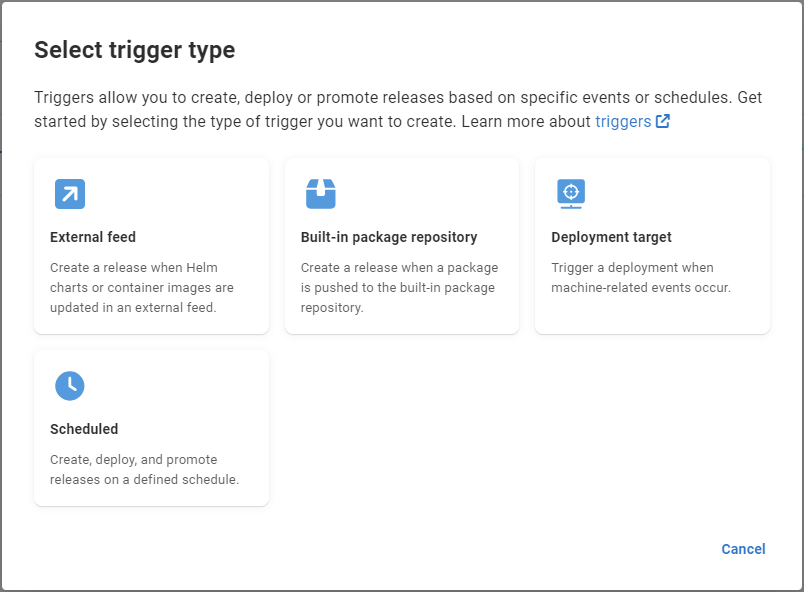
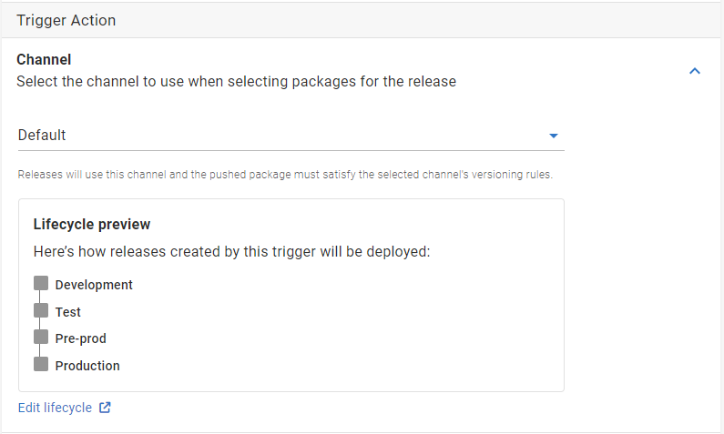
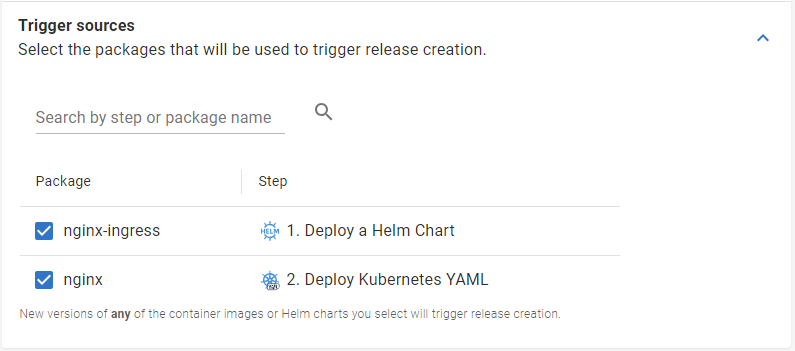

Octopus Deploy is adding support for triggering releases as a result of new container images or helm charts being pushed to their respective repositories. This new pull baseed semantic will allow you to better automate GitOps flows in your continuous delivery pipelines.

## GitOps approach to continous delivery

The core principals of [GitOps](https://opengitops.dev/) focus on providing a set of guidelines that leverage a declarative definition of your desired application which is to brought into alignment with the actual state out in your infrastructure.

Traditionally, continuous delivery workflows have followed a ‘one and done’ approach to deploying a given application: an artifact is built through a continous integration (CI) pipeline which is then pushed to a continuous deployment (CD) service that performs the deployment. The CD server is passive in this process, it sits and waits until explicitly notified by the build server to perform a release, and with what application dependencies.

Using a GitOps approach to continuous delivery results in the desired state instead being ‘pulled’ from the source. The CD server is actively comparing the actual system state in the target (typically Kubernetes clusters) with the desired state described by the declarative manifests in the source repository (typically Git). 

This decoupling creates a release process that more naturally supports a continuous reconcilliation cycle; where the changes to the desired state are automatically applied to the actual state, and drifts in the actual state are readjusted to bring them back into line with what is expected.

<Reconcilliation Loop Image Here>

### A pull paradigm for containerized applications

When working with containerized applications, there’s a few ways to approach this.  

As explained in [this CodeFresh article](https://codefresh.io/learn/gitops/gitops-workflow-vs-traditional-workflow-what-is-the-difference/), one approach is to configure a deployment automator to identify any changes to an image repository, which then updates a YAML file in the configuration repository.  This change is then identified by a GitOps agent which pulls that change and updates the cluster to match.

Alternatively, by using Octopus Deploy to manage your deployments, you can template your manifests such that the container image being used is injected at release creation time.Our support for [Kustomize Steps](https://octopus.com/docs/deployments/kubernetes/kustomize) provides one such example of this pattern. This process puts the control for managing your containers _and_ environment configuration outside your manifest repository which reduces the various drift, merge-conflict and security risks present in attempting to use Git for environmental progression, something that it was never built for. 

By configuring your Octopus Project with container dependencies, you can now create triggers that will watch those repositories for new packages that are pushed by your build system. If an image appears which, based on its tag and any relevant [version rules](https://octopus.com/docs/releases/channels#version-rules), is later than the image which was used in your previous release, Octopus will then automatically create a new release with all the latest container image or helm chart dependencies. 

Your existing lifecycle will then promote that release through your environments or tenants, just like it does currently. If your lifecycle uses automatic release progression, then you have just set up a continuous delivery pipeline without having to explicitly let Octopus know about your application changes! 

The details of these container images and helm charts are already known within Octopus Deploy; this means we are able to use the registry locations, image names, chart names, and the required credentials to do this monitoring, without the need to add or maintain this information anywhere else.

It all just works.

### Using external feed triggers

As part of this feature, we have improved and consolidated trigger type selection into a single pop-up:
```
*The new trigger selection pop-up*
```
After selecting "External feed", add the name and description for the the external feed trigger, then click next.

External feeds triggers support release creation in channels, using any 
```

```

```

```


## Conclusion
Using the newly available release triggers from Octopus will allow you to cut down the amount of configuration required in your build pipeline by providing a GitOps style pull mechanism. As you are likely making more frequent changes to your application than your infrastructure manifests, having Octopus observe and react to changes in your artifact repositories will reduce the risk that would be otherwise present in updating those manifest repositories directly. In addition, relase triggers will allow to you still benifit from these capabilities, even if you aren't deploying to kubernetes.

Let your CI system concern itself with building and testing artifacts and let your CD systems focus on deployments and environments.

We hope that release triggers will improve your ability to ship your application changes to your environments in a faster and safer yet simpler way than ever before.

Happy Deployments!