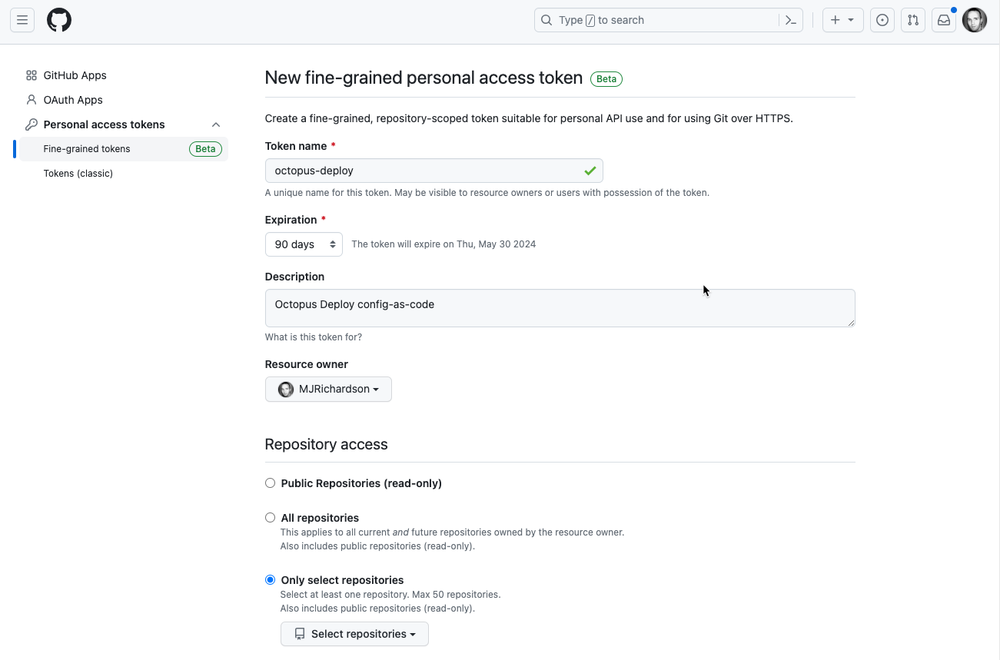
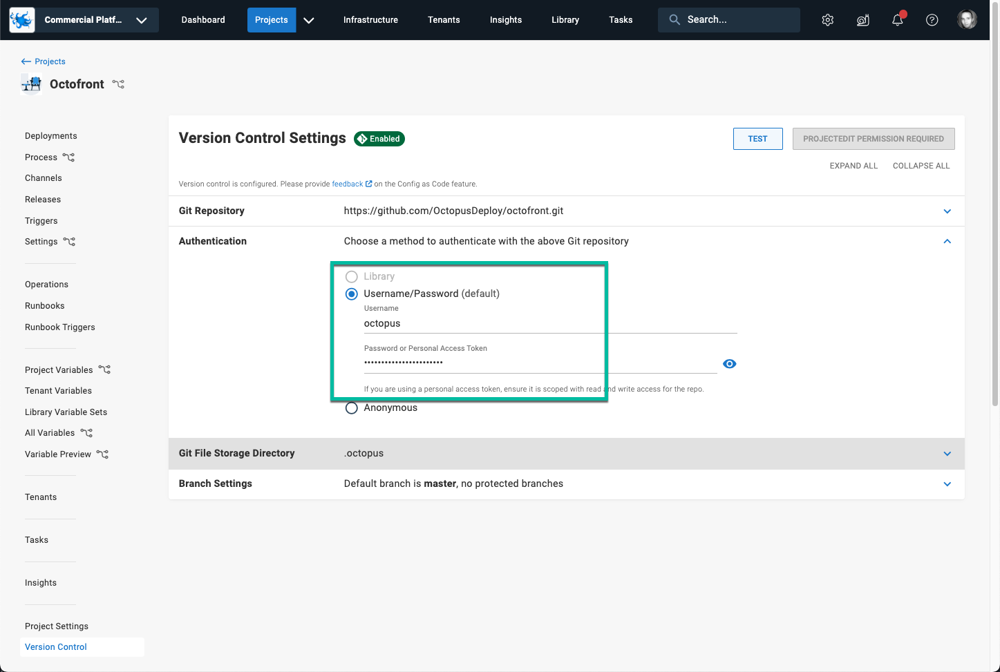
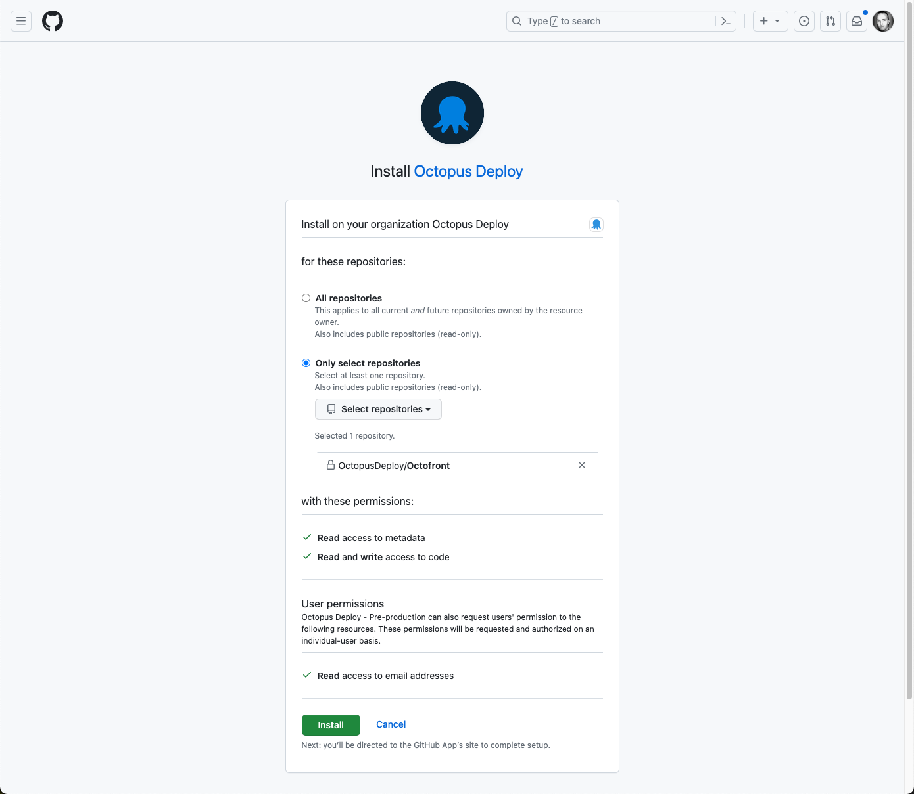
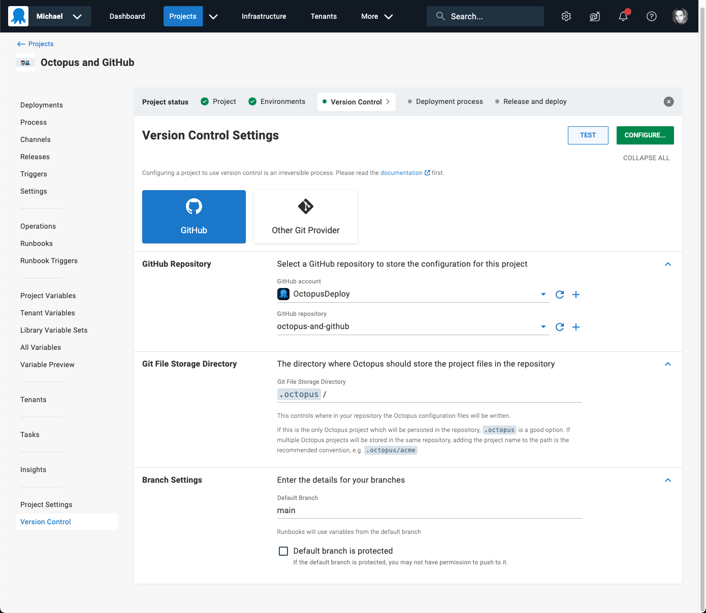

We are excited to announce we are launching an Octopus Deploy App for GitHub, available now for Octopus Cloud customers.
TODO: add link

Many Octopus customers use GitHub and Octopus together, and we are focused on ensuring the integration is seamless.  The Octopus Deploy GitHub App is a major step on this journey.

Last year we shipped support for OpenID Connect between GitHub Actions and Octopus, removing the need for Octopus credentials to be managed in GitHub.  You can think of the Octopus Deploy GitHub App as providing secure integration in the opposite direction: Octopus to GitHub, removing the need for GitHub credentials to be managed in Octopus. The combination of OpenID Connect and the Octopus Deploy GitHub App means that no shared credentials are now required for integrating GitHub and Octopus Deploy. This made our SecOps team very happy, and we hope it does the same for yours.

An immediate benefit is for Octopus projects using Config as Code with GitHub as the repository. Creating Octopus projects version-controlled in GitHub is now easier and more secure. 

### Without the Octopus Deploy GitHub App 
Previously, connecting Octopus to your Config as Code GitHub repository required creating an account in GitHub to represent Octopus Deploy, adding a Personal Access Token, and configuring the access token as credentials in Octopus.

### With the Octopus Deploy GitHub App 

Using the Octopus GitHub App, the app is installed into your GitHub organization, and is granted access to selected repositories.

Octopus is then configured to use the app for GitHub integration.  No credentials required!

We are intent on making GitHub and Octopus Deploy the world's most powerful combination for Continuous Delivery. The Octopus Deploy GitHub App lays a foundation for deeper integration between GitHub and Octopus Deploy.  

The Octopus Deploy GitHub App is available now, for Octopus Cloud customers. 

A note for our self-hosted Octopus Server customers: we developed this as a cloud-first feature as supporting self-hosted instances introduces additional complexity.  If you are an Octopus Server customer, and you would benefit from the Octopus Deploy GitHub App, please talk to your Account Manager or add your voice to the feature card.  We're listening.  

TODO: add link to feature card.

