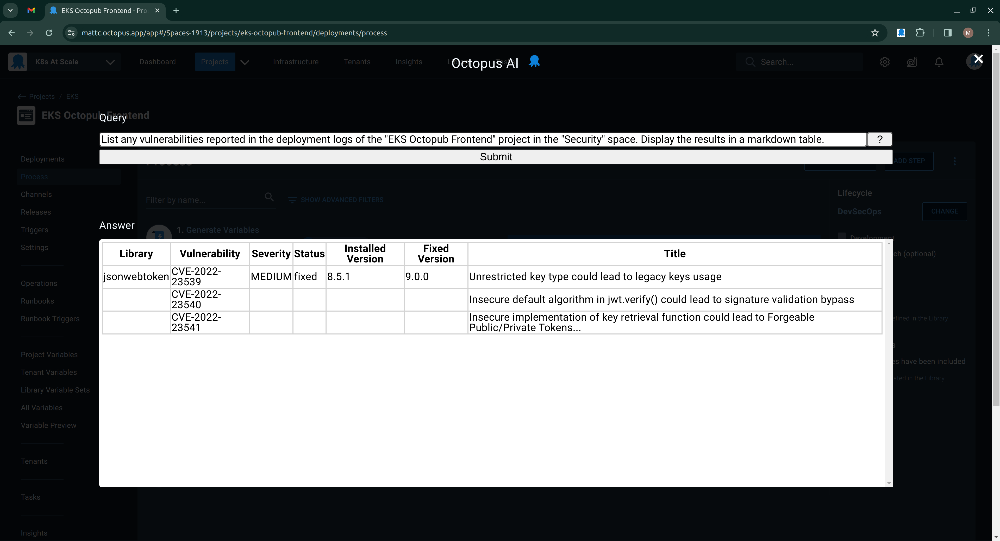
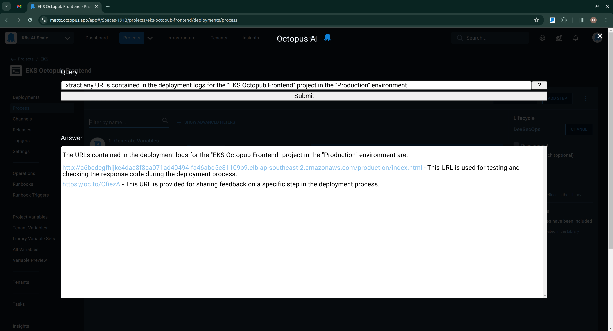
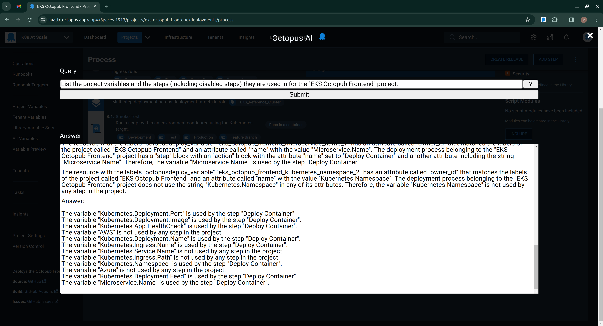
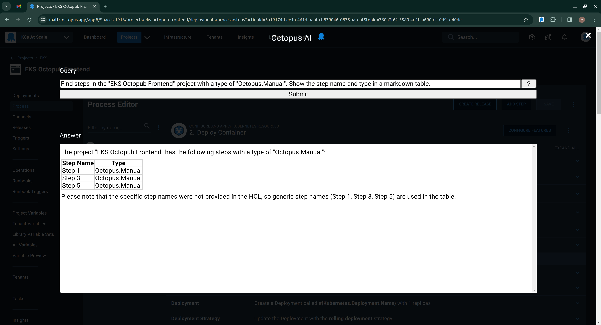

Large Language Models (LLMs) have generated a lot of attention for their ability to draw life-like images and videos, write fluent text, and even generate code. They also have a remarkable ability to query structured data with plain English prompts. This lets anyone extract meaningful information from complex systems without having to learn SQL or write scripts to consume data from APIs.

Traditionally, to extract information from Octopus that wasn't directly exposed via the web-based UI, you had to query the Octopus REST API to read and link the desired information. This is certainly achievable, but requires familiarity with scripting languages and an understanding of the Octopus domain model.

[Octopus AI](https://chromewebstore.google.com/detail/octopus-ai-experiment/lpeediihgpakkfdiliphohbglloghlmi) is a time-limited experiment we're running. We want to understand if exposing the resources that make up an Octopus space to an LLM can help solve meaningful problems and extract useful information without resorting to custom scripting.

It's a plugin for Chrome that displays an overlay exposing a prompt for entering plain text queries and a field displaying the answer. If you've ever used a service like ChatGPT, the interface should look familiar.

## How the plugin works

The prompt is parsed to identify the various resources that were mentioned, like a project, feed, account, etc. The resources get queried via the API using the credentials of the logged-in user. The prompt and the supporting context are then sent to an LLM to answer the question.

The nice thing about LLMs is that you can ask them to interpret the supplied context and display the results in a number of useful ways. 

Here, I've asked the LLM to summarize the vulnerabilities reported in the deployment logs as a table:

Here, I've asked the LLM to extract any links from the deployment logs:

Here, I've asked the LLM to list which steps the project variables are used in:

The results aren't always useful. Here, I ask if the project has any manual intervention steps. The results were nowhere close to correct (the answer is none of the steps were manual interventions):

But there's a good chance queries like this could work by massaging the instructions and context provided to the LLM. And this is where you can help.

By using the plugin, we can see the kinds of questions people would like to ask in their Octopus space. This will help us better understand how to optimize the data sent to an LLM to make the responses more useful and accurate.

## How you can take part

If you'd like to participate, all you need is an Octopus Cloud instance (sorry, on-premises instances won't work), install the [extension](https://chromewebstore.google.com/detail/octopus-ai-experiment/lpeediihgpakkfdiliphohbglloghlmi), click the Octopus icon, and start typing.

We do collect information from the users of this extension. Sensitive variables (like secret variables, feed passwords, and account passwords) are not collected. We don't prompt for an API key, and personally identifiable information or anything that looks like a password is also filtered out. We will, however, collect the query, answer, and context (i.e., the configuration of the space being queried) to help us refine the tool.

The [Octopus AI](https://chromewebstore.google.com/detail/octopus-ai-experiment/lpeediihgpakkfdiliphohbglloghlmi) page has FAQs with more information about this project. We'll keep the extension updated for the duration of the experiment, so you can automatically get the latest changes.

The [prompt engineering](https://github.com/OctopusSolutionsEngineering/OctopusCopilot/wiki/Prompt-Engineering-with-Octopus) documentation provides tips on how to write queries for the Octopus AI tool. There are some requirements for formatting a useful query with Octopus AI, so please take a moment to review the documentation.

Happy deployments!