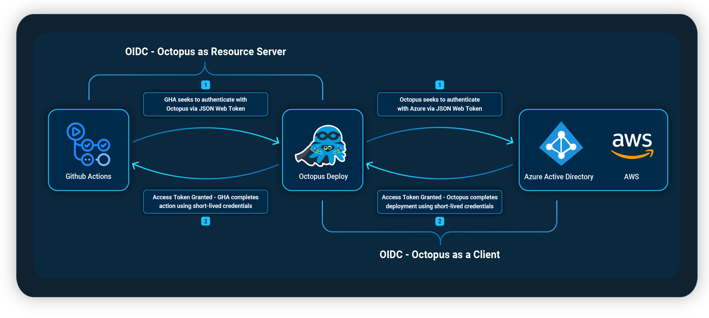
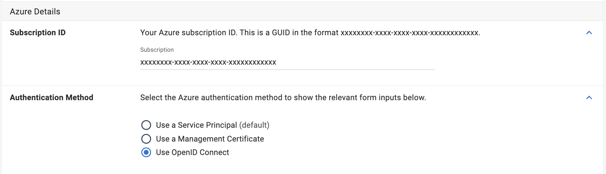
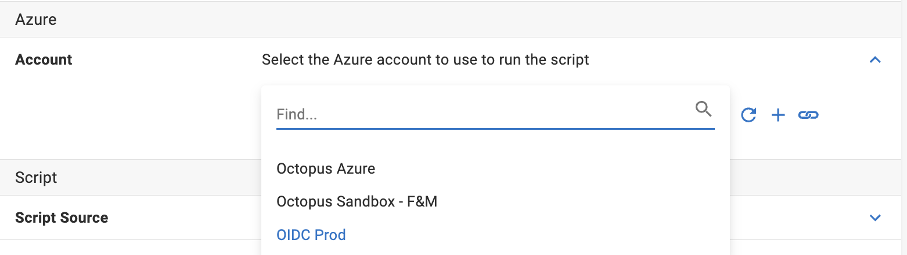
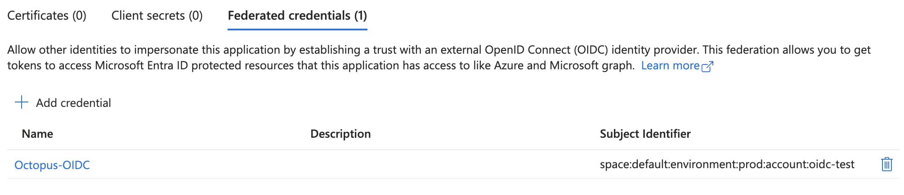

Octopus Deploy is a critical part of the deployment process for our users, resulting in a need to store credentials for various providers within Octopus Deploy.  OpenID Connect (OIDC) provides an opportunity for our customers to reduce how many credentials are stored within Octopus Deploy and negate the need to rotate credentials. By moving away from the use of credentials and having improved control over the granularity of permissions, OIDC has the added bonus of improving your company's security posture.

We have recently implemented OIDC within Octopus in two different forms;

1. **Octopus as a Client**  
During a deployment, users can authenticate Octopus with Azure and AWS using OIDC  
2. **Octopus as a Resource Server**  
Octopus becomes an OIDC provider, allowing clients such as GitHub Actions to authenticate to Octopus as trusted providers

 

## Octopus as a Client 

When adding an Azure or AWS Subscription to your Accounts within Octopus Deploy, you now have the option to use OIDC as the Authentication Method for passwordless deployments.  

The OIDC trust relationship will need to be set up and managed through Microsoft Entra ID or IAM in AWS. Our docs can help guide you through this process if you are unfamiliar with it.  
[Set up instructions for Azure](https://octopus.com/docs/infrastructure/accounts/azure#create-a-federated-credential-for-an-azure-service-principal)  
[Set up instructions for AWS](https://octopus.com/docs/infrastructure/accounts/aws#openid-connect)

Once you have added your new account with OIDC Authentication to your Octopus Instance, you will be able to authenticate with OIDC for any Azure/AWS steps within Octopus.  

### Why choose OIDC over other authentication methods
As well as removing the need for storing and rotating secrets, OIDC provides the ability to control access for Octopus from within Azure. Using the `subject identifier`, you can enforce each authentication account to include spaces, environments, tenants, projects and/or runbooks in the subject claim.  
This would be particularly useful if you want to separate out your permissions for production and other environments. Your Azure/AWS administrator can implement these subject claims, restricting access by a specific environment.  
*An example of an Azure OIDC account with access to prod deployments only*

### How Octopus Users are Utilising OIDC
The below feedback is from a customer using OIDC for both Github and Azure. 

*Our GitHub WebApp app now builds and deploys with **just one** secret, which is for DockerHub.  
GitHub Actions makes use of OIDC to communicate with Octopus Deploy. Octopus Deploy then uses Federated Credentials in Azure to connect to that without needing stored passwords or access tokens. The GitHubWeb App communicates with backend services (DB, KeyVault) using Managed Identities, so we don't need to store credentials for those services either.*

Our post about [OpenID Connect (OIDC) for GitHub Actions](https://octopus.com/blog/github-seamless-integration) provides more information on how to configure OIDC for Github.

## Conclusion
OIDC as the authentication method has removed the need for storing secrets within Octopus or rotating tokens.  This makes your process easier to maintain and improves your security posture.  

## Learn more
- [Octopus OIDC Documentation](https://octopus.com/docs/infrastructure/accounts/openid-connect)

Happy deployments!
