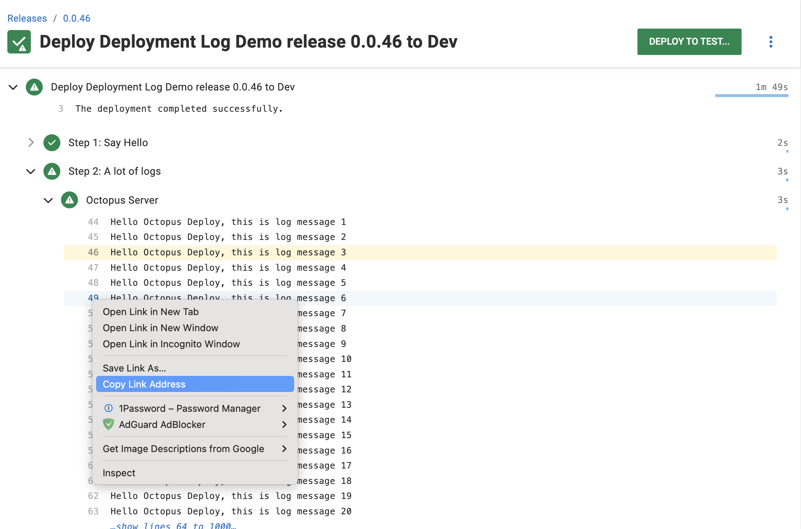
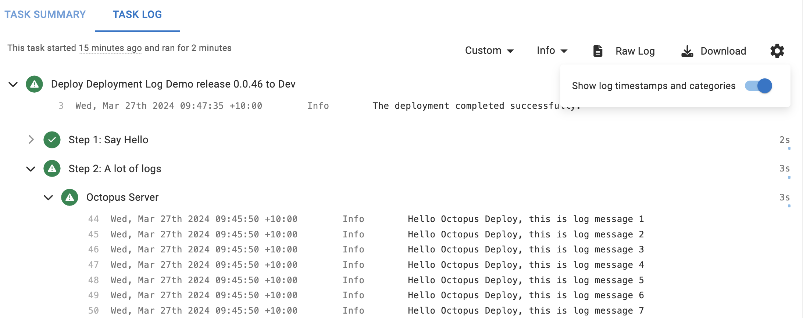
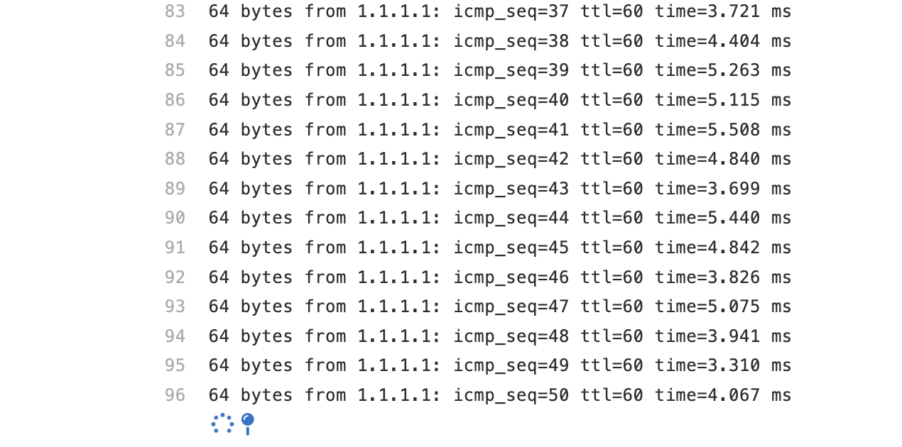

This week we shipped a number of improvements and enhancements to the deployment log. The changes are rolling out to Octopus Cloud this week, and will be available in the next LTS release of Octopus Server. 

The main features are:

- A fresh & modern visual design that makes it delightful to read logs
- Performance improvements - handles huge logs (with millions of lines) with ease without freezing
- Intelligent Log Rendering™️ brings the most important events to your attention, even in huge logs

And many smaller improvements:

- Line numbering
- Ability to select and link to log lines, and share the link with others
- Clean Copy & Paste™️ without line numbers and other things polluting
- Visual indication of the time different steps took
- Defaulting to showing the task log if a deployment is running
- Better progress indicators so you know what's happening

# A fresh visual design

The deployment log is used as often as any other page in Octopus. People come to the deployment log many times a day, whether it's to try to work out why a deployment failed, or even just to check if it was successful. Yet the look and feel of the log hadn't changed in many years, and it was looking very dated. 

Here's a short video showing the new log in action in light/dark mode:

<video autoplay="autoplay" loop="loop" controls="controls" muted="muted" alt="A video showing the new task log viewer in light mode and dark mode" width="1400">
  <source src="quick-tour.mp4" type="video/mp4" />
  Your browser does not support the video tag.
</video>

# Performance for big logs

We don't recommend it, but deployment logs can get **very big**. Octopus runs steps in parallel across many targets, and some deployments are very complex, so sometimes large deployment logs are unavoidable. 

The old task log would typically start by showing a preview - the most recent 20 lines for each node in the log tree, with a "show all" link above it. Even for big logs, that was pretty fast. 

The problem was what happened when you clicked that show all link. The UI would then fetch the entire log and attempt to render it locally. As logs got large - tens of thousands of lines or more - the old UI simply froze and became unusable. 

The new log is designed to support _very_ large logs, including logs with hundreds of thousands of lines or hundreds of MB or more in log output. We use Intelligent Log Rendering to show you the parts of the log we think you'll be most interested in, and then you can click around to reveal specific sections of the log, which load quickly. 

<video autoplay="autoplay" loop="loop" controls="controls" muted="muted" alt="A video showing the new task log viewer with a very large log" width="1400">
  <source src="big-logs.mp4" type="video/mp4" />
  Your browser does not support the video tag.
</video>

# Intelligent Log Rendering™️

To make it easy to navigate even large logs, Octopus uses what we call Intelligent Log Rendering. 

Most CI/CD products either attempt to render the whole log (and freeze), or render the most recent log messages, meaning important events that happened earlier in the process are lost. Or they simply make you download and look through the full file yourself. None of these approaches actively help customers debug CI/CD problems.

Intelligent Log Rendering in Octopus solves this. 

When you first open a log, we always show:

- The first 20 lines
- The last 50 lines

In between, logs are hidden, but users can click to load chunks of those logs. Octopus looks for "interesting" events, like warnings or errors, and also renders those with context around them - typically 50 lines before the warning/error, and 20 lines after. This all happens on the server, limiting the data transferred to the client.

In the video above, a warning appeared half way through a 100,000 line log file. Octopus shows:

- The first 50 lines
- "Show more" placeholders
- 50 lines before the error
- The error/warning
- 20 lines after the error
- More "show more" placeholders
- The last 50 lines

This means the user immediately sees what the error was and all the context around it, without needing to download and search a big log file. And it keeps the UI snappy and transfers the minimum data needed to the client to help the user find and fix the error.

# Smaller improvements

We took the opportunity to make a number of other improvements. 

Logs now include line numbering:

You can click to "select" a line, which changes the URL in the browser. You can copy and paste the URL and send it to someone else and they will see that same line selected. Or, right click a line number and copy the address. 

Dates and log levels are hidden by default, but you can click the gear button to reveal them, and the preference will be remembered. 

For most CI/CD tools, Copy & Paste of multiple lines from the log can be messy. This is due to the nature of how logs are rendered (typically as block-level HTML elements for alignment) and the quirks of how selection and copy work in HTML. 

We spent a lot of time making sure the Copy & Paste behavior worked as expected so you can spend more time finding and fixing issues and less time hand-editing copied logs. 

Here is how Copy & Paste works when timestamps are not shown. Line numbers are effectively hidden from selection, so they aren't copied, and you get nice, neat log output. 

<video autoplay="autoplay" loop="loop" controls="controls" muted="muted" alt="A video showing copy and paste behavior in the new task log"  width="1400">
  <source src="copy-paste.mp4" type="video/mp4" />
  Your browser does not support the video tag.
</video>

During deployments, every minute counts. To help give you a sense of how long different parts of the deployment took, we now show indicators for how long each part of the log took. 

We also changed the default page you see when you click a task. Previously, Octopus always showed the Task Summary tab, but most people just wanted to go to the Task Log most of the time, so it was always an extra click. Now, when you open a running deployment, you'll go immediately to the task log. 

Lastly, when a task is running, we also now show a spinning indicator under the currently active tree node in the log. You can click this to "pin" your browser to that part of the log - as new log messages appear, the browser will automatically scroll and keep the pin visible. 

# Coming to an Octopus near you

With intelligent log rendering, performance for large files, and lots of new usability enhancements, we hope these improvements will make it easier to find and fix deployment problems. 

Happy deployments!
