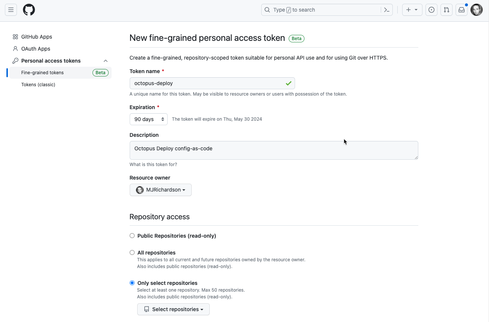
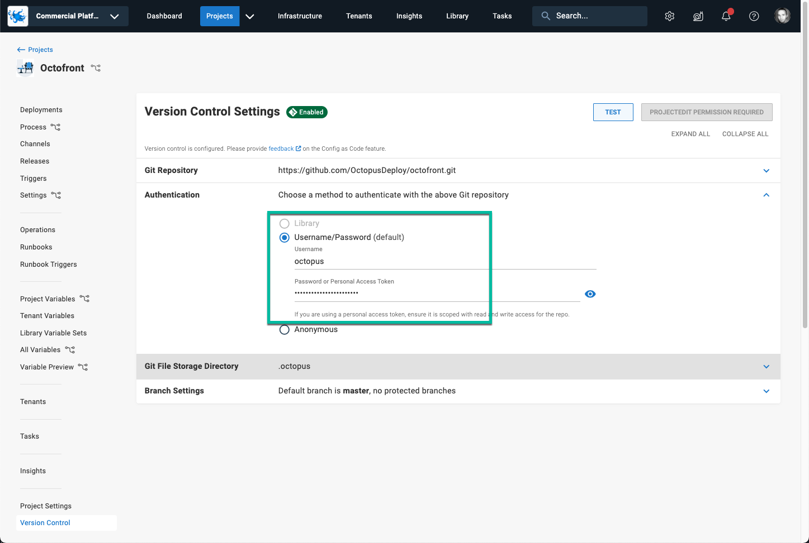
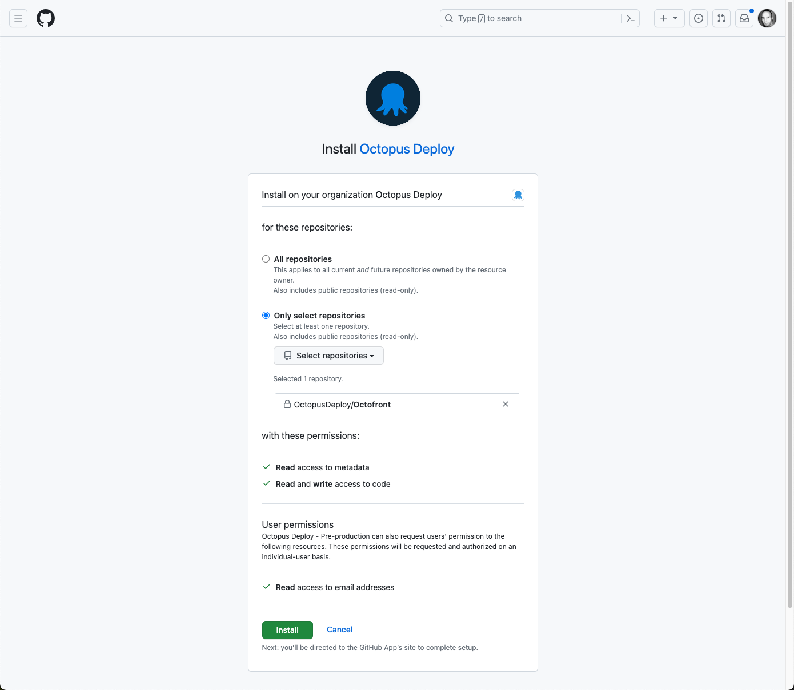
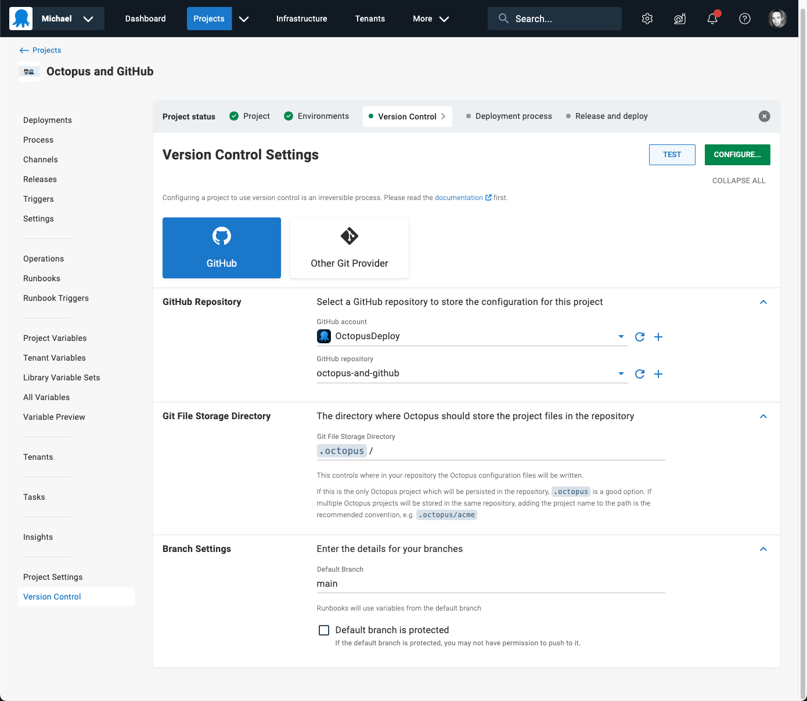

We've launched an [Octopus Deploy App for GitHub](https://github.com/marketplace/octopus-deploy), available now for Octopus Cloud customers.

Many Octopus customers use GitHub and Octopus together, and we're focused on ensuring the integration is seamless. The Octopus Deploy GitHub App is a major step on this journey.

Last year, we shipped support for [OpenID Connect between GitHub Actions and Octopus](https://roadmap.octopus.com/c/70-openid-connect-oidc-for-github-actions). This removed the need to manage Octopus credentials in GitHub. The Octopus Deploy GitHub App offers this benefit in the opposite direction, removing the need to manage GitHub credentials in Octopus. 

With the combination of OpenID Connect and the Octopus Deploy GitHub App, you no longer need shared credentials when integrating GitHub and Octopus. This made our SecOps team very happy, and we hope it does the same for yours.

An immediate benefit is for Octopus projects using Config as Code with GitHub as the repository. Creating Octopus projects version-controlled in GitHub is now easier and more secure. 

## Before - Without the Octopus Deploy GitHub App 

Previously, to connect Octopus to your Config as Code GitHub repository, you had to:

- Create an account in GitHub to represent Octopus Deploy
- Add a personal access token
- Configure the access token as a credential in Octopus

## After - With the Octopus Deploy GitHub App 

Using the Octopus GitHub App, the app gets installed in your GitHub organization. Then it's granted access to selected repositories.

You then configure Octopus to use the app for GitHub integration. No credentials needed! You can share the Octopus GitHub App across all Octopus projects, which means:

- Setup is easier
- You don't need  to manage access tokens
- There's no risk of inadvertently leaking tokens

## Conclusion 

We're intent on making GitHub and Octopus Deploy the world's most powerful combination for Continuous Delivery. The Octopus Deploy GitHub App lays the foundation for deeper integration between GitHub and Octopus.  

The [Octopus Deploy GitHub App](https://github.com/marketplace/octopus-deploy) is available now for Octopus Cloud customers. 

:::hint
A note for our self-hosted Octopus Server customers: We developed this as a cloud-first feature as supporting self-hosted instances introduces additional complexity.  If you're an Octopus Server customer, and you'd benefit from the Octopus Deploy GitHub App, please talk to your account manager or add your voice to the [roadmap feature card](https://roadmap.octopus.com/c/107-github-app-for-server-customers). We're listening. 
:::

Happy deployments!