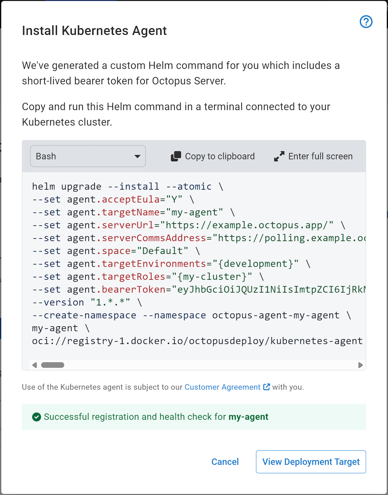

Kubernetes is rapidly becoming the dominant platform for hosting and running applications. At Octopus, we want to provide the best experience for deploying to Kubernetes.

To make your deployments to Kubernetes simpler, faster, and safer, we introduced a new deployment target called the Kubernetes agent.

The Kubernetes agent is a small, lightweight application you install into your Kubernetes cluster. After it's installed, it registers itself with Octopus Server as a new deployment target. This lets you deploy your applications and manifests into that cluster, without the need for Workers, external credentials, or custom tooling.

The Kubernetes agent is available now as an early access preview in Octopus Cloud.

## Why we built the Kubernetes agent

Octopus can already deploy to Kubernetes clusters via the Kubernetes API deployment target. This target connects to the target cluster, executing authenticated kubectl commands against the cluster.

We heard from customers that there are some limitations with the Kubernetes API target. 

### Workers

To run a deployment to a Kubernetes API target, you need an Octopus Worker with all the correct tooling. 

In Octopus Cloud, we provide the Octopus Cloud Dynamic Workers. But, when self-hosting Octopus Deploy, you need to either execute work on the Octopus Server machine or create and manage an [Octopus Tentacle](https://octopus.com/docs/infrastructure/deployment-targets/tentacle) installation running as an Octopus Worker.

### Tooling

As the Kubernetes API target uses kubectl to perform its deployments, it needs the correct tooling. This includes authentication plugins for cloud providers and other tools such as Helm. This becomes difficult to manage as versions change or when deploying to different clusters with different versions.

### Authentication

The Kubernetes API target requires authentication with the cluster to deploy. This authentication can be very complicated depending on the target cluster or hosting platform. You must add these authentication credentials to Octopus, making security and automation difficult.

## Benefits of using the Kubernetes agent

The Kubernetes agent solves the limitations mentioned above in 3 key ways:

### Polling communications

The Kubernetes agent uses the same polling communication protocol as Octopus Tentacle. It lets the agent connect from the cluster to Octopus Server, solving network access issues.

### In-cluster application

As the agent is already running inside the target cluster, it no longer needs authentication credentials to the cluster to perform deployments. It can use the in-cluster authentication support of Kubernetes to run deployments using Kubernetes Service Accounts and Kubernetes RBAC local to the cluster.

### Cluster-aware tooling

As the agent is running in the cluster, it can retrieve the cluster's version and correctly use tooling that's specific to that version. You also need a lot less tooling as there are no longer any requirements for custom authentication plugins.

## How the agent works

The Kubernetes agent builds on top of Octopus Tentacle, letting deployment scripts run from Octopus Server. Whereas Octopus Tentacle executes scripts in local shells (via PowerShell or Bash), the Kubernetes agent can use the Kubernetes cluster to run deployment scripts inside of short-lived Kubernetes pods. This lets the agent scale its workloads independently of the main agent pod.

### Installing a new agent

The Kubernetes agent gets packaged and installed via a Helm chart. This makes installing and managing the agent very simple and makes automated installation easy.

To install a Kubernetes agent, go to Infrastructure > Deployment Targets > Add Deployment Target > Kubernetes

*Adding a new Kubernetes agent*

This launches the Kubernetes agent installation wizard. Here you can name the agent, select the environments that it can deploy to, and the target tags/roles.

*Kubernetes agent configuration options*

The Kubernetes agent needs a shared filesystem. You have the option of providing an existing storage class or using a default Network File System (NFS) storage pod. The NFS storage pod is an easy, low-configuration storage option that doesn’t need extra volumes or storage classes to be configured in the cluster first. To use NFS storage, you must install an extra Helm chart.

*You need to install the NFS driver first*

At the end of the wizard, Octopus generates a Helm command that you copy and paste into a terminal connected to the target cluster. After it's executed, Helm installs all the required resources and starts the agent.

*Executing this Helm command installs the agent into your cluster*

If left open, the installation dialog waits for the agent to establish a connection and run a health check. Once successful, the Kubernetes agent target is ready for use!

*Successfully installed and ready for use*

### Swapping from Kubernetes API target to Kubernetes agent target

Swapping from an existing Kubernetes API target to the new Kubernetes agent is simple. No deployment process configuration needs to change. If the Kubernetes agent target has the same target tag and environment as the Kubernetes API target, you only need to disable the API target to use the agent on the next deployment.

You can read more detailed information in [our Kubernetes agent documentation](https://octopus.com/docs/infrastructure/deployment-targets/kubernetes/kubernetes-agent).

## When can I use it?

The Kubernetes agent is available now as an early access preview in Octopus Cloud.

We'd love to hear any [feedback on this new way to deploy to Kubernetes](https://oc.to/f6Vp3d).

Happy deployments!