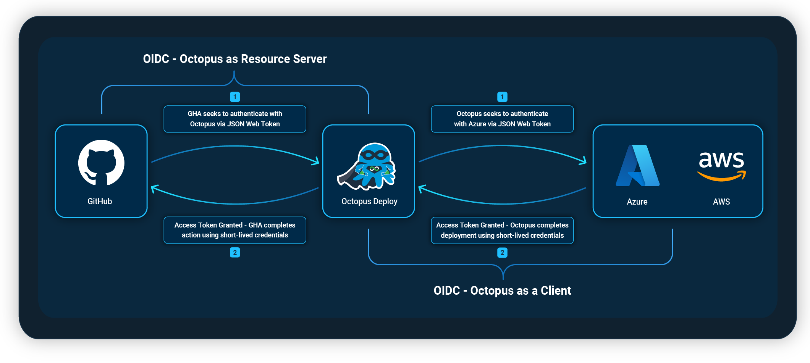
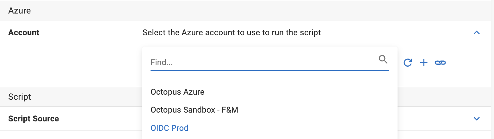
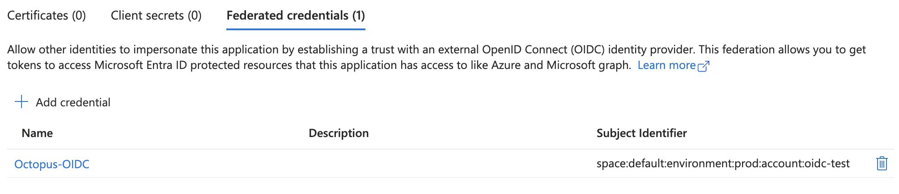

Octopus Deploy is a critical part of our customers' deployment process. This results in a need to store credentials for other providers in Octopus Deploy. OpenID Connect (OIDC) lets our customers reduce the number of credentials stored in Octopus. It also removes the need to rotate credentials. By moving away from credentials and improving control over the granularity of permissions, OIDC also improves your organization's security posture.

We recently implemented OIDC in Octopus in 2 forms:

1. **Octopus as a Client** – During a deployment, you can authenticate Octopus with Azure and AWS using OIDC.  
2. **Octopus as a Resource Server**  – Octopus becomes an OIDC provider, letting clients, like GitHub Actions, authenticate with Octopus as trusted providers.

 

## Octopus as a Client 

When adding an Azure or AWS subscription to your accounts in Octopus, you can use OIDC as the authentication method for passwordless deployments.  

The OIDC trust relationship needs to be set up and managed through Microsoft Entra ID or IAM in AWS. 

Our docs can help guide you through this process if you're unfamiliar with it:

- [Set up instructions for Azure](https://octopus.com/docs/infrastructure/accounts/azure#create-a-federated-credential-for-an-azure-service-principal)  
- [Set up instructions for AWS](https://octopus.com/docs/infrastructure/accounts/aws#openid-connect)

After you add your new account with OIDC authentication to your Octopus instance, you can authenticate with OIDC for any Azure or AWS steps in Octopus.

### Why choose OIDC over other authentication methods?

OIDC removes the need to store and rotate secrets, and lets you control access to Octopus from within Azure. Using the subject identifier, you can enforce each authentication account to include spaces, environments, tenants, projects, and runbooks in the subject claim. 

This is particularly useful if you want to separate your permissions for production and other environments. Your Azure or AWS administrator can implement these subject claims, restricting access by a specific environment. 
 
*An example of an Azure OIDC account with access to prod deployments only*

### Octopus customer feedback about using OIDC

The below feedback is from a customer using OIDC for both GitHub and Azure. 

> Our GitHub web app now builds and deploys with **just one** secret, which is for Docker Hub.  
> 
> GitHub Actions makes use of OIDC to communicate with Octopus Deploy. Octopus then uses federated credentials in Azure to connect to that without needing stored passwords or access tokens. The GitHub web app communicates with back-end services (DB and KeyVault) using managed identities, so we don't need to store credentials for those services either.

## Conclusion

OIDC as the authentication method has removed the need for storing secrets in Octopus or rotating tokens. This makes your process easier to maintain and improves your security posture.  

Our post about [OpenID Connect (OIDC) for GitHub Actions](https://octopus.com/blog/github-seamless-integration) provides more information on how to configure OIDC for GitHub.

## Learn more
- [Octopus OIDC documentation](https://octopus.com/docs/infrastructure/accounts/openid-connect)

Happy deployments!