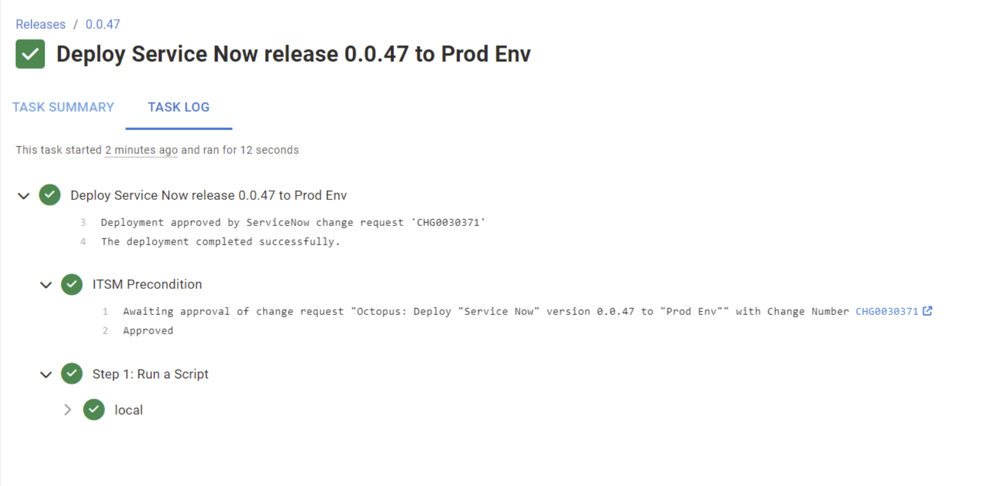
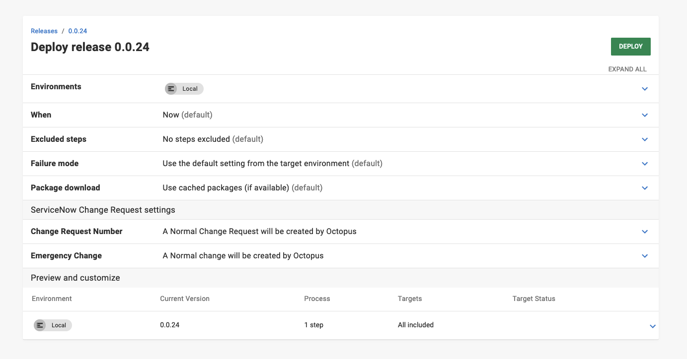

Octopus added support for IT Service Management (ITSM) in 2022.3, integrating with ServiceNow and Jira Service Management. Since then, we received feedback about some points of friction and areas for improvement. We revisited this feature, adding new functionality and some quality-of-life changes. These changes are available from 2024.2.6455 on.

## Task log

Previously, ITSM precondition checks only showed details on the **Task Summary** tab. We've now added logging to the process that creates the change request (CR). If the creation is successful this surfaces the CR number and a link to it. If unsuccessful, errors relating to the CR creation are now logged. 

These logging changes enhance visibility and troubleshooting during CR creation, particularly for permission and configuration issues.

## Emergency changes

Octopus now supports creating emergency changes. To create an emergency change request, you can select the **Emergency Change** setting on the deployment creation page. 

Emergency changes are for scenarios like resolving a major incident or implementing a security patch.

## Transition to closed

For a deployment that creates its own change request (CR), a project option, **Auto Transition**, will attempt to move the CR it created to the desired state when the deployment has successfully completed. We extended this option to allow moving a CR directly to closed.

## Populating change request fields through Octopus

To control the content of the change requests (CRs) the variable `Octopus.ServiceNow.Field[snow_field]` can be set at the project level. These get contributed to the create CR body as a dictionary, letting any field be set.

For example, to set the **Assigned To** or **Short Description** fields you can use the following:

| Field | Variable | Example Value|
|--|--|--|
|Assigned To|Octopus.ServiceNow.Field[assigned_to]|beth.anglin|
|Short Description|Octopus.ServiceNow.Field[short_description]|Custom Short Description with #{SomeVariable} #{Octopus.Deployment.Id}|

:::hint
Setting a **Short Description** overrides the auto-generated Octopus description. Description matching means this will automatically progress the deployment, unless the resolved description is unique. You can do this by including variables like the deployment or environment ID.
:::

:::hint
The expected ServiceNow value doesn't always align with the displayed value. In the case of **Assigned To**, the value displayed is `Beth Anglin`, but the expected value is the `User ID`, in this case `beth.anglin`.
:::

For a full list of available [fields](https://docs.servicenow.com/bundle/washingtondc-platform-administration/page/administer/localization/reference/r_FieldLabelTable.html) and values, please refer to the [ServiceNow docs](https://developer.servicenow.com/dev.do#!/reference/api/utah/rest/change-management-api).

## ITSM providers menu 

We also moved the ITSM providers from **Project Settings** into their own seperate menu under the project links.

## Conclusion

Octopus continues to refine its ITSM capabilities based on your feedback. Please continue to share your thoughts with us – you can do so in the comments below. 

ServiceNow and Jira ITSM integrations are available to all [Enterprise customers](https://octopus.com/pricing/overview). 

## Learn more

- [ServiceNow documentation](https://octopus.com/docs/approvals/servicenow)

Happy deployments!
