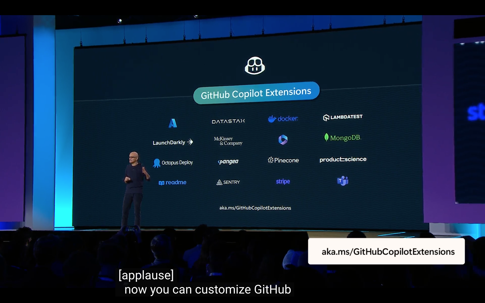
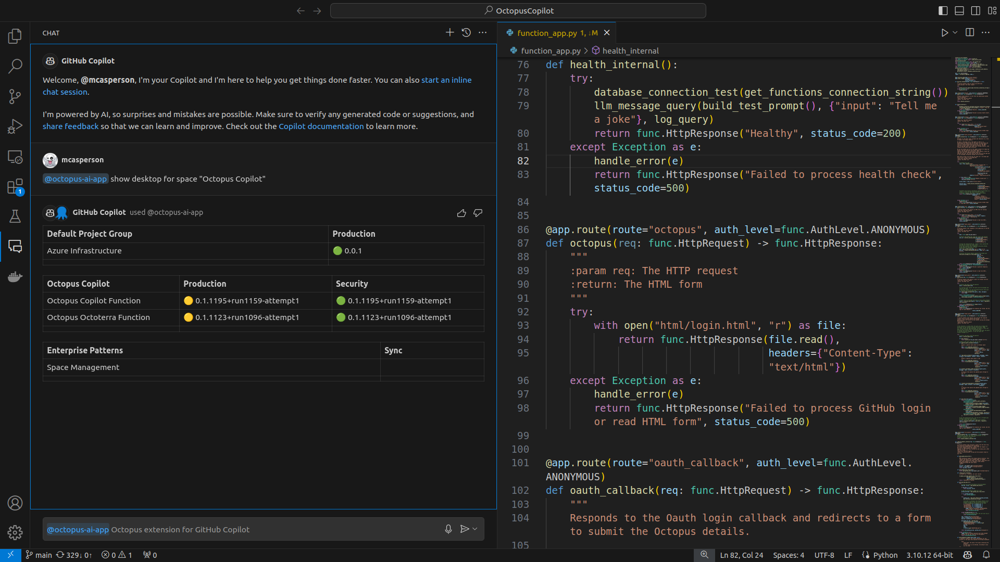
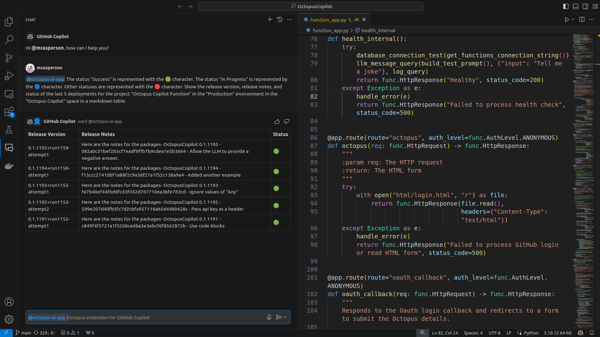
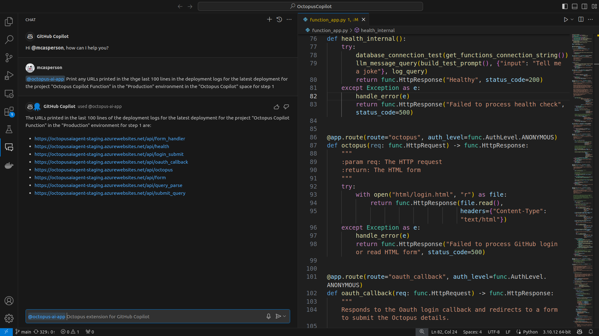
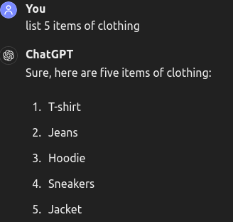

Much attention has been paid to the generative aspect of GPT. It is easy to be impressed by the ability to create eye-catching images and videos or write sensible sounding text from a few simple prompts. It is also easy to understand how AI would augment the workflows of writing or drawing tools.

But how does AI provide any benefit to more traditional business processes? The answer to this is perhaps less exciting than being able to generate a highly detailed drawing of a kitten in a space suit eating rainbows from little more than that very description, but it is these business-as-usual workflows where AI can have a significant impact.

I had the privilege of exploring this very question in partnership with GitHub to develop the [Octopus Extension for GitHub Copilot](https://octopus.com/docs/administration/copilot). Copilot extensions were [announced by Satya Nadella at this year's Build conference](https://youtu.be/8OviTSFqucI?t=2334) with Octopus being 1 of 16 extensions for the initial launch:

In this post I'll take you behind the scenes of building a Copilot extension.

## The value of a Copilot extension

The sentiment behind the phrase "Code is written once but read many times" holds true for Octopus deployments and runbooks. Once your Octopus space is configured, most of your interaction is through initiating deployments, running runbooks, and viewing the results.

Most DevOps team members won't spend their days in Octopus. For example, developers will spend most of their day in their IDE writing and testing new features. Octopus is a critical component of that workflow as it is responsible for deploying changes to various environments for internal teams and external customers to access. But often developers only need to know where their changes have been deployed or extract some useful entries from the deployment logs.

Here we see the result of the prompt `@octopus-ai-app Show dashboard space "<space name>"`, which is a markdown version of the Octopus dashboard:

This shows how the Octopus extension keeps you in the flow by removing the need to switch between applications to access the information you need. With a simple prompt you can review the state of your deployments in the same chat window you use as part of your development workflow.

We can dig a little deeper with a prompt like `@octopus-ai-app The status "Success" is represented with the 🟢 character. The status "In Progress" is represented by the 🔵 character. Other statuses are represented with the 🔴 character. Show the release version, release notes, and status of the last 5 deployments for the project "<project name>" in the "<environment name>" environment in the "<space name>" space in a markdown table.`:

The cool thing about this prompt is that there is no special logic in the extension for mapping statuses to UTF characters or generating markdown tables. The ability to understand these instructions and generate the required output is inherent to the Large Language Machine (LLM) that backs the Octopus extension.

This prompt also highlights how an AI agent improves on more traditional chatbots. The prompt is written in plain text rather than the fixed and often robotic instructions you have to formulate for a chatbot. This also means the Octopus extension has the ability to generate results far beyond the limited set of interactions that have to be hard coded into a traditional chatbot.

The prompt `@octopus-ai-app Print any URLs printed in the the last 100 lines in the deployment logs for the latest deployment for the project "<project name>" in the "<environment name>" environment in the "<space name>" space for step 1` is another example leveraging the ability of an LLM to understand instructions:

We rely on the ability of an LLM to understand what a URL is, to find URLs in the deployment logs, and to present the result in a useful format. Again, there is no special logic in the extension for extracting URLs. This ability is inherited from the underlying LLM.

The benefit of the extension is that it brings Octopus to the tools you already use, keeping you in the flow by removing the need to jump between windows and tools. It also allows you to leverage the ability of LLMs to comprehend plain text requests to generate custom reports or extract useful information.

## Real-time AI

A challenge with AI systems is that they don't inherently have access to real-time information. LLMs are essentially frozen in time and only know the state of the world at the point when they were trained. For example, GPT 3.5 was trained in 2021, and so knows nothing about the world after that date.

Retrieval Augmented Generation (RAG) is a process that can overcome this limitation. It works by combining custom knowledge with a user's prompt to generate more accurate answers or to answer questions about custom data.

For example, you may combine the contents of a recent news article with your question in the LLM prompt. The context and question is placed in the LLM's context window, which allows the LLM to consider content it was not trained against to provide an answer.

The challenge for an extension interacting with Octopus is that the data we want to inspect is generated in real-time. To solve this, the extension must query the Octopus API for the current state of a space to ensure any prompts are answered with live information.

This challenge is two-fold: understanding what is being requested, and serializing the requested information. 

LLM context windows are increasing with each new LLM version, but today you still have to be selective about the information you provide with a query. For example, the GPT 3.5 turbo model provided by Azure AI has a context window of 16K tokens. A token roughly equals 4 characters, although in practice it appears structured data like JSON fits even fewer characters into a token. I found I could budget for 40K characters of context with any query without triggering token length errors. It is not possible to naively dump the configuration of an entire Octopus space into this buffer, so only the relevant information can be included.

To understand what a query is referencing, we make use of the zero-shot capabilities of LLMs to extract entities from a query. For example, in the query `Print any URLs printed in the the last 100 lines in the deployment logs for the latest deployment for the project "Octopus Copilot Function" in the "Production" environment in the "Octopus Copilot" space for step 1`, the LLM will extract the following entities:

* The project - "Octopus Copilot Function"
* The environment - "Production"
* The space - "Octopus Copilot"
* The number of lines - 100
* The steps - 1

The term "zero-shot" simply means we can ask the LLM to extract these entities without having to provide any examples or specifically train the LLM to identify the entities in the prompt.

The entities are then passed to API requests. In the example above, the latest deployment for the project to the environment in the space are is found, the logs are extracted and filtered to return only the last 100 lines for step 1. 

Extracting entities and calling a function are all handled by Open AI [function calling](https://platform.openai.com/docs/guides/function-calling).

Log files are easy to handle with LLMs because they can be considered a stream of unstructured text and LLMs are good at consuming blobs of text. However, questions about the configuration of a space require us to serialize and present the state of the space in a format that the LLM can reason about.

There are many formats for defining the configuration of a platform like Octopus as text including JSON, XML, YAML, TOML, HCL, OCL (used by Octopus Config-as-Code) and more.

There are some requirements for the selection of a format:

* It must support compound documents. This is important because we want to mix and match the resources that are placed into the context window without having to invent new parent container objects. YAML uses three dashes to separate documents, while HCL and OCL allow resources to be added or removed from documents as needed. JSON, XML, and TOML typically requires all related data to be placed in one structure.
* It must have an unambiguous method for relating resources. HCL really excels here with its expression syntax allowing one resource to reference a property of another resource, typically linking up IDs.
* It needs to be able to serialize all resources exposed by an Octopus space. Again, HCL does a good job here as the Octopus Terraform provider already defines structures for Octopus resources. OCL is limited to describing projects and variables, making it unsuitable for this task. JSON is another strong contented here given all Octopus resources have a JSON representation in the API.
* Ideally LLMs should have been given a chance to train on public examples of these structures. HCL is the clear winner here with dozens of examples in the tests for the Octopus Terraform provider. It is likely that the LLM has seen JSON representations of Octopus resources, although examples tend to be scattered out in the wild.

Given these requirements, it was clear that serializing Octopus spaces to HCL was the best choice. So queries relating to the configuration of an Octopus space work by identifying the entities being requested, converting those entities into HCL, placing the HCL in the context, and having the LLM answer the question based on the context.

This results in a process that:

* Avoids the need for secondary storage and indexing of Octopus data because everything is queried from the Octopus API directly
* Respects the existing RBAC controls enforced by the Octopus API because all requests include the Octopus API key of the chat user
* Ensures prompts are answered with live data because all data is obtained as needed
* Does not require any additional capabilities be built into the main Octopus platform

I suspect this "smart AI, dumb search" approach is something we'll see more of in the coming years. Enterprise tools have not done a great job of implementing search capabilities and there is no reason to think that the situation is going to improve. But having an LLM identify the phrases to search for, interact with an API on your behalf, and then provide an answer based on the search results means existing tools can continue to provide rudimentary search capabilities and LLM based agents can sift through broad search results. Ever expanding LLM context windows only make this approach easier (if potentially less efficient) to implement.

I'd even go so far as to argue this approach rivals solutions like vector databases. At the end of the day, a vector database simply colocates items with similar attributes. For example, pants and socks would be colocated because they are both items of clothing while cars and bikes would be colocated because they are both vehicles. But there is no reason an LLM can't convert the prompt "Find me red clothes" into 5 API calls returning results for t-shorts, jeans, hoodies, sneakers, and jackets, thus relying on the capability of LLMs to generate high quality zero-shot answers to common categorization tasks rather than having to build custom search capabilities: 

Overall, this approach has worked well. It resulted in a lean architecture involving two Azure functions (one to receive chat requests and query the Octopus API directly, and one to serialize Octopus resources to HCL) that is easy to manage and scale as needed without the burden of maintaining a custom data source.

## Rethinking testing

Traditional automated testing is all about proving your code works. Test Driven Development may encourage a small number of failing tests, but the expectations is still that future work focuses on making tests pass. So failing tests are a sign of a bug or unimplemented features.

Working with LLMs requires rethinking this approach. LLMs are non-deterministic by design, which means you can not be sure you'll get the same result even with exactly the same inputs. This manifests itself most visibly with LLMs using different phrases to convey the same answer. But the more serious concern for developers is that LLMs will sometimes provide incorrect results even when it previously provided correct results with the same inputs.

This means developers need to rethink the assumption underpinning automated tests that valid input and valid code results in valid output. Even common workarounds to intermittent events like retries assume that valid inputs and valid code will eventually produce valid output, with retries used to express the belief that a failure must be due to some uncontrollable, but detectable, external factor.

Working with LLMs means assuming some of the tests fail all of the time. This is not an intermittent external factor or a condition that can be easily detected, but instead an inherent property of the system.

In reality, retrying tests is still good enough to work around non-deterministic LLMs for most tests. But it doesn't quite capture the end user's experience, which will inevitably be that some answers are incorrect, even if the LLM would eventually produce the right answer if asked enough times.

In order to use tests to more accurately capture the end user's experience, tests need to be run multiple times to generate a useful sample set, with the test's pass or failure being determined by how often the LLM provided the correct answer. It is a subtle, but significant, switch in mindset that embraces the reality that LLMs bring uncertainty to any interaction, and it is our role as developers to be confident what we mean by "uncertain".

I couldn't find an out-of-the-box solution for this kind of experimentation, but the [tenacity](https://tenacity.readthedocs.io/en/latest/) library was flexible enough to be extended to provide this capability. Tenacity allows a custom function to be called with each retry. This provides a hook to count the success or failure of each test and allow a fixed number of tests to run rather than exiting on the first successful result. [This is an example of such a function](https://github.com/OctopusSolutionsEngineering/OctopusCopilot/blob/v0.1.1195/tests/experiments/static_deployment_experiments.py#L14) that alters the behavior of the retry functionality to run a fixed number of experiments rather than runs tests until the first successful execution and then judge the success or failure of the test based on a custom threshold.

This new style of testing means developers can be assured that their example prompts reach a minimum threshold. It also embraces the reality that the threshold can't be 100% and that retying until success is not representative of the end user experience.

## Dealing with hallucinations

LLMs are eager to please. They will almost always have an answer, but sometimes those answers are not of the highest quality. When LLMs confidently provide incorrect or dubious answers, they are said to be hallucinating.

Hallucinating manifested themselves as weird and unexpected arguments passed to variables from the Open AI function calling feature. Most of the time things work as expected, but you must always assume that some of the functions invocations will have some unexpected or inaccurate arguments passed in. These hallucinations will bite you at every point in your code. 

Python has two styles of development:

* Easier to Ask for Forgiveness than Permission - EAFP
* Look Before You Leap - LBYL

EAFP is nice as a developer as you can focus on the golden path and offer catch all style error handling. However, I found I had to lean more towards LBYL, where inputs are validated and errors are addressed as early as possible, simply because LLMs were essentially performing a kind fuzz testing where you could not expect sensible values to be passed to your functions.

The functions in [this file](https://github.com/OctopusSolutionsEngineering/OctopusCopilot/blob/v0.1.1195/domain/sanitizers/sanitized_list.py) give you an idea of the kind of weird arguments the LLM would provide. It would offer catch all regexes like `.*`, words like `Any`, `All`, or `None`, or "helpful" placeholders like `My Project`. None of these strings exist in the context or the prompt, meaning the LLM hallucinated them and passed them to the function.

## Providing safety

A big requirement for Copilot extensions is to provide a safe environment for your users. Everyone has heard stories now about LLMs providing biased, insulting, silly, or dangerous answers to questions.

This is an unsolved problem with LLMs generally. The New Scientist article [Why curbing chatbots' worst exploits is a game of whack-a-mole](https://www.newscientist.com/article/mg26234881-200-why-curbing-chatbots-worst-exploits-is-a-game-of-whack-a-mole) highlights some of the limitations:

> But these firms aren’t claiming that any model is perfectly safe, because they can’t. In just the past month, we have been told about three major new ways to jailbreak some of the largest chatbot models, including GPT-4 and Claude 3.
> 
> The constant back and forth between finding new ways to manipulate the models and fixes for them is a bit like a game of whack-a-mole.

That said, our extension still needed to pass testing to ensure it wasn't generating content it obviously shouldn't. As part of the testing to be accepted for the Copilot private beta, the GitHub team prompted our extension with queries that resembled the titles of the least reputable online forums you can think of.

The good news is that building an extension that uses the Open AI function calling feature meant that our extension only responded to a small number of queries that were specifically related to the Octopus platform. When prompted to generate text for unrelated topics, none of our functions matched, and we displayed a generic apology. When combined with the built-in filters provided by the Azure OpenAI platform, this strategy allowed us to pass the saftey testing, and so proved to be an effective way to prevent extensions from being used to generate undesirable content.

## Practical guidelines

AI is one of those topics that everyone has an opinion on. Like LLMs themselves, a lot of these opinions aren't rooted in experience or reputable sources. In addition, much of the advice you can find online appears to have been written by LLMs in that they repeat ideas without adding much context.

I did find the paper [Principled Instructions Are All You Need for Questioning LLaMA-1/2, GPT-3.5/4](https://arxiv.org/pdf/2312.16171) useful though. It offers 26 principals for improving the quality of your prompts with evidence of their impact. Some are counterintuitive, like offering an LLM money for finding a better solution. I found others principals, like instructing a LLM that it will be penalized instead of telling it what not to do, providing few-shot examples, and using chain-of-thought prompts, to be very helpful.

The [Open AI best practices](https://help.openai.com/en/articles/6654000-best-practices-for-prompt-engineering-with-the-openai-api) page also has a number of useful tips. They tend to be high level guidelines, but they are practical and easy to implement.

## Extending for interactivity

The initial release of our extension provided read-only access to an Octopus instance. The tight deadlines to be part of the initial beta meant we had to focus on a subset of the functionality that users would eventually want. It would be nice to allow releases to be created and deployments to be executed from the extension though.

GitHub Copilot recently provided the ability for extensions to confirm actions, which removes the biggest hurdle performing operations that alter a target system. By presenting the details of the action to be taken and allowing the user to confirm it, any misunderstandings by the extension can be addressed before they lead to permanent changes.

We're currently exploring what the next version of the extension will offer and offering the ability to perform tasks like deploying releases or running runbooks is definitely something we will consider.

## Conclusion

I'm excited for the future of chat based interfaces. Previously, each chatbot forced you to learn an arcane syntax that limited their usefulness. The ability to interact with complex systems through natural language now means DevOps teams can treat their IDE as a single portal to their broader ecosystem. There is still a lot of work to do to ensure the reliability of LLM based extensions and to better understand the kind of questions and actions DevOps teams want their extensions to perform. But natural language chat extensions provide the ability to quickly iterate and adapt to new requirement in a way that is almost impossible to do with traditional web or mobile interfaces.

The source code for our Copilot extension can be found on [GitHub](https://github.com/OctopusSolutionsEngineering/OctopusCopilot).

Happy deployments!