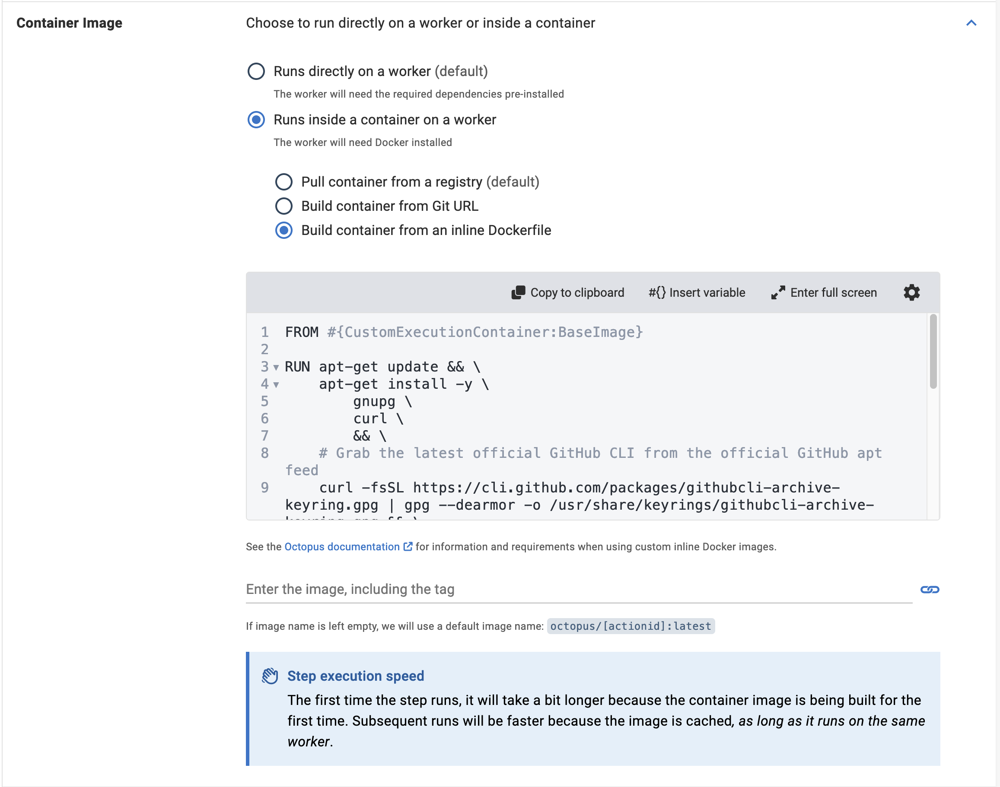
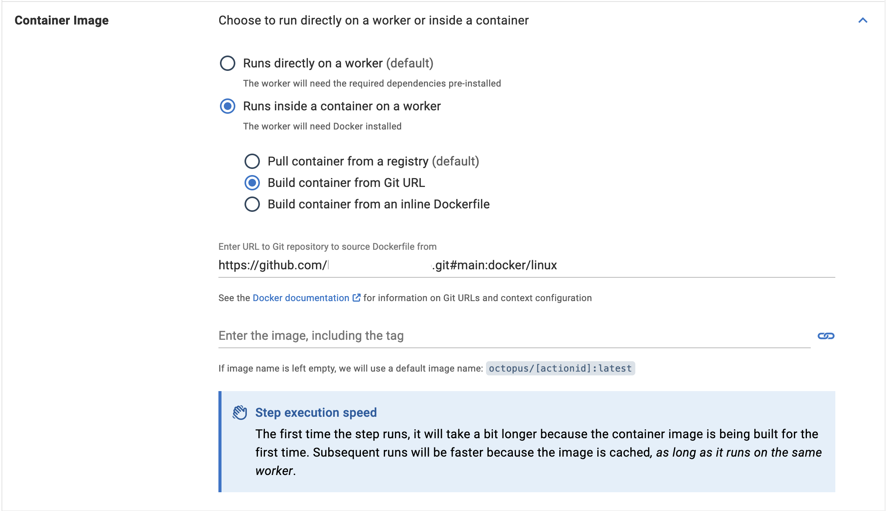

With the introduction of Execution Containers for steps we simplified how you deploy applications using Octopus, providing a lightweight and portable solution for bundling dependencies needed in your deployments into Docker containers.

But, if you can't or don't want to use the container images we provide, managing Dockerfiles and CI pipelines to publish the Docker containers and ensuring smooth deployment workflows can still present challenges. 

We're excited to announce that we've improved this feature with a couple of new options that aim to simplify this process by offering users the flexibility to choose to use either an inline Dockerfile or a URL to a Git repository to build the Docker container image used for a deployment.

## The Challenges of using Execution Containers

Before jumping into the new options, let's discuss the challenges faced in creating Docker container images for deploying applications with Execution Containers. 

Creating a Docker container image for use as an Execution Container involves writing a Dockerfile. This specifies the steps needed to build the container image with the necessary dependencies, and a CI/CD pipeline to publish the container image to a registry that Octopus can access (such as DockerHub or Azure Container Registry).

While Dockerfiles are powerful and customizable, managing them across different projects can become cumbersome, especially when dealing with many dependencies or complex deployment processes.

Any friction in this process can lead to delays in delivering updates and features to end-users.

##  Introducing Inline Execution Containers

To address these challenges, we've introduced new options to this feature that allows users to choose between two methods of creating Execution containers for deployment: 
- using an inline Dockerfile, or 
- providing a URL to a Git repository

### Inline Dockerfile

With the inline Dockerfile option, you can define the container's build instructions within the step. 

This approach offers simplicity and immediacy, as you can specify the required dependencies and configuration settings without switching between different container images or repositories. 

It's particularly useful for smaller projects or scenarios where the Dockerfile is simple.

### URL to Git Repository

This option allows you to provide a URL to a Git repository containing the Dockerfile and associated resources. 

This approach offers greater flexibility and scalability, allowing you to leverage existing Dockerfiles maintained within their version control system. 

By referencing a Git repository, teams can ensure consistency across projects, promote code reuse, and take advantage of versioning and collaboration features provided by Git platforms.

## Conclusion

In conclusion, the introduction of new options allowing users to choose between an inline Dockerfile or a URL to a Git repository represents a nice improvement in simplifying deployment workflows with Docker. 

By offering flexibility and versatility, users can streamline the container creation process, integrate with their deployment process quicker, and foster collaboration through centralized code repositories. 

As organizations continue to embrace containerization for deploying applications at scale, features like these play a role in accelerating development cycles and delivering value to end-users.

Happy Deployments!