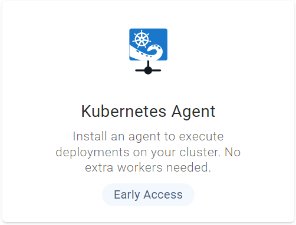
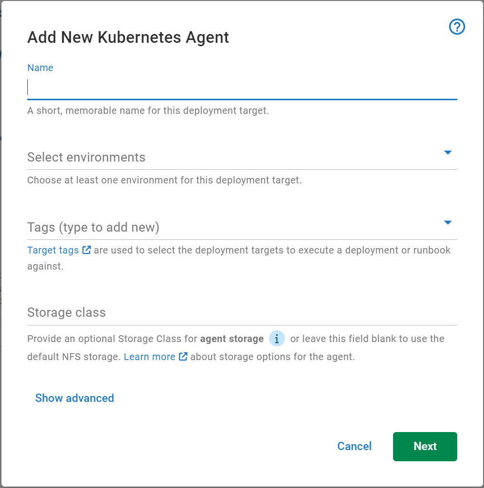
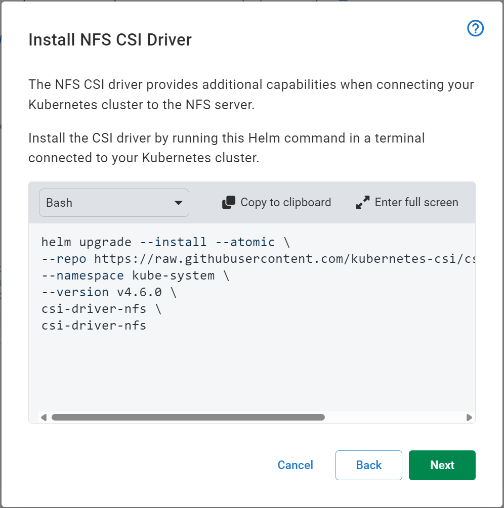
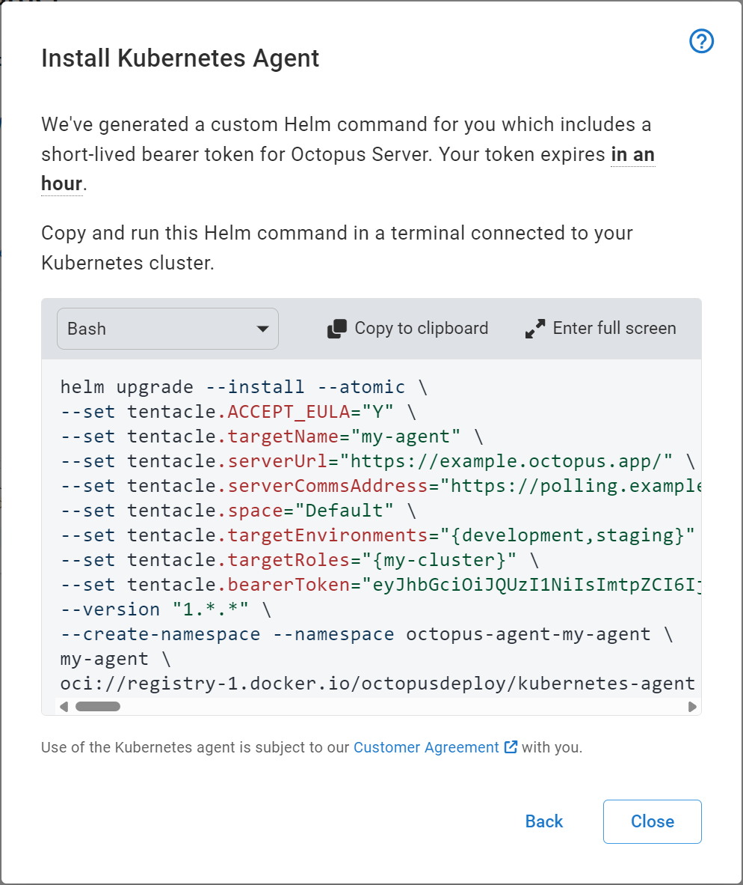
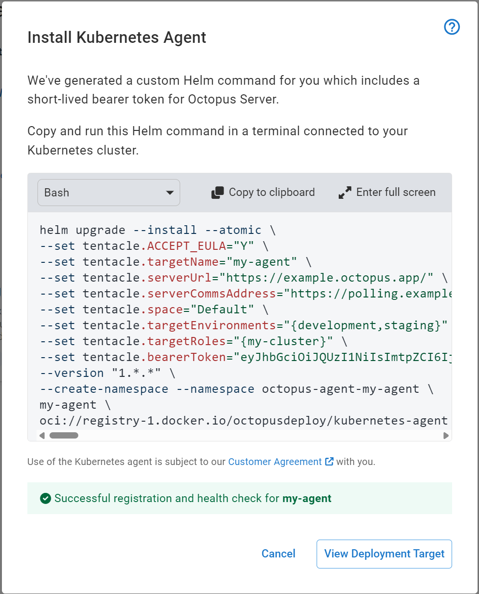

Kubernetes is rapidly becoming the dominant platform for hosting and running applications. At Octopus Deploy, we want to provide a best-in-class experience for deploying applications to Kubernetes.

To make deployments to Kubernetes simpler, faster and safer, we are introducing a new deployment target the Kubernetes agent.

The Kubernetes agent is a small, lightweight application that you install into your Kubernetes cluster. Once installed, it registers itself with Octopus Server as a new deployment target, allowing you to deploy your applications and manifests into that cluster, without the need for workers, external credentials or custom tooling.

The Kubernetes agent is available in Early Access preview in Octopus Cloud now.

## Why did we build the agent?

Octopus Deploy already has the ability to deploy to Kubernetes clusters via the Kubernetes API deployment target. This target connects to the target cluster, executing authenticated kubectl commands against the cluster.

We have heard from customers that there is some limitations with the Kubernetes API target. 

### Workers

To execute a deployment to a Kubernetes API target, it requires an Octopus Worker with all the correct tooling. 
In Octopus Cloud, we provide the Octopus Cloud Dynamic Workers, but when self-hosting Octopus Deploy, it requires either executing work on the Octopus Server machine or creating and managing an Octopus Worker.

### Tooling

As the Kubernetes API target uses kubectl to perform its deployments, it requires the correct tooling. This includes authentication plugins for cloud providers and other tools such as Helm. This becomes difficult to manage as versions change or when deploying to different clusters with different versions.

### Authentication

The Kubernetes API target requires authentication with the cluster to deploy. This authentication can be very complicated depending on the target cluster or hosting platform. These authentication credentials must be added to Octopus Deploy, making securing and automation difficult.

The Kubernetes agent solves all these limitations in three key ways:

### Polling communications

The Kubernetes agent leverages the same Polling communication protocol used by Octopus Tentacle to allow the agent to connect from the cluster to Octopus Server, solving network access issues.

### In-cluster application

As the agent is already running inside the target cluster, it no longer needs authentication credentials to the cluster to perform deployments. It can leverage the in-cluster authentication support of Kubernetes to execute deployments using Kubernetes Service Accounts and Kubernetes RBAC local to the cluster.

### Cluster-aware tooling

As the agent is running in the cluster, it can retrieve the cluster's version and correctly use tooling that is specific to that version. The tooling required is also drastically reduced as there are no longer any requirements for custom authentication plugins.

## How does the agent work?

The Kubernetes agent builds on top of Octopus Tentacle, allowing for deployment scripts to be executed from Octopus Server. Where Octopus Tentacle executes scripts in local shells (via powershell or bash), the Kubernetes agent can take advantage of the Kubernetes cluster to execute deployment scripts inside of short-lived Kubernetes pods. This gives the agent the ability to scale its workloads independently of the main agent pod.

### Installing a new agent

The Kubernetes agent is packaged and installed via a helm chart. This makes the installation and management of the agent very simple as well as making automated installation easy.

To install a Kubernetes agent, go to **Infrastructure** > **Deployment Targets** > **Add Deployment Target** > **Kubernetes**

*Adding a new Kubernetes agent*

This will launch the Kubernetes agent installation wizard. Here you can name the agent, select the environments that it can deploy to, as well as the target tags/roles.

*Kubernetes agent configuration options*

The Kubernetes agent requires a shared filesystem, so you have the option of either providing an existing storage class or using a default Network File System (NFS) storage pod. The NFS storage pod is an easy, low-configuration storage option that doesn’t need extra volumes or storage classes to be configured in the cluster first. To use NFS storage, you must install an extra helm chart.

*The NFS driver needs to be installed first*

At the end of the wizard, Octopus Deploy will generate a Helm command that you copy and paste into a terminal connected to the target cluster. Once executed, Helm will install all the required resources and start the agent.

*Executing this helm command will install the agent into your cluster*

Octopus Server will start waiting for the agent to establish a connection and perform a health check. Once successful, the Kubernetes agent target is ready for use!

*Successfully installed and ready for use*

### Swapping from Kubernetes API target to Kubernetes agent target

Swapping from an existing Kubernetes API target to the new Kubernetes agent is simple. No deployment process configuration needs to change. As long as the Kubernetes agent target has the same target tag and environment as the Kubernetes API target, you only need to disable the API target to use the agent on the next deployment.

You can read more detailed information in the [documentation](https://octopus.com/docs/infrastructure/deployment-targets/kubernetes/kubernetes-agent).

## When can I use it?
The Kubernetes agent is in Early Access preview in Octopus Cloud now and is ready for use.

We would love to hear any and all feedback from you on this new way to deploy to Kubernetes. You can leave feedback [here](https://oc.to/f6Vp3d).

Happy Deployments

