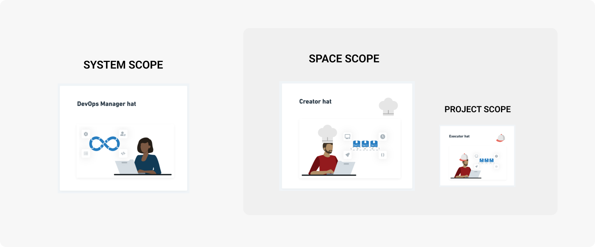
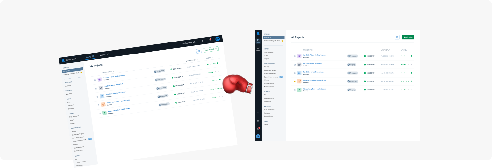
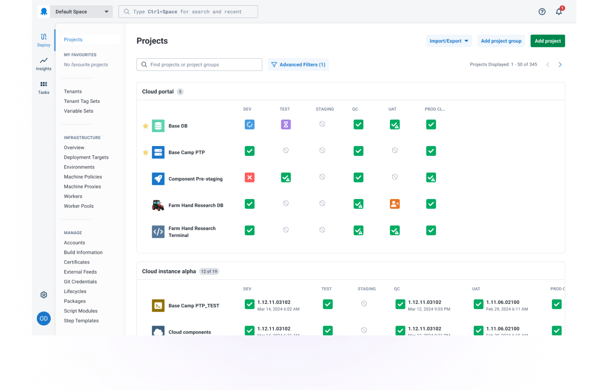

Findability in Octopus Deploy has been our biggest UX pain point.

Insights from our NPS surveys gave us hints about the findability problem. But many comments were non-specific, like, “I have trouble finding things” or, “I feel lost”. This was a signal that it wasn’t a surface-level problem or a quick fix. 

We came to learn many parts of the in-product experience connect to this problem. This includes information groupings, menu labels, too many pages, page layouts, and workflows. 

We had to decide how to tackle a broad and interconnected problem space. We decided that re-envisioning our navigation was the next best step. We organized a series of activities to help us understand our navigation "North Star".

Changes to the navigation will start rolling out to Cloud instances in July. 

## Gaining more understanding

### Card sorting

We gave existing customers a card sorting activity. This helps identify common information groups. We needed more clarity though. In particular, features for managing your deployments had produced conflicting results.

### Mapping out mental models

Next, we wanted to see how we could better surface the mental model of Octopus in our navigation. We listed all the features of Octopus, then looked through different lenses to group these features. This exercise brought more clarity. System scopes and personas, in particular, delivered the most useful insights.

*Defined system, space, and project scopes align with personas.*

### Behavioral analytics

Looking at our analytics we understood feature use. We saw that features like variable sets are heavily used. Yet, we'd unintentionally buried this feature in our navigation.

### Ideation workshops

We brought together the outcomes from mental model mapping, behavioral analytics, and competitor research to help guide our first ideation workshop. It was clear there were several ways to re-envision the navigation experience.

## Our North Star

*Horizontal versus vertical navigation.*

Arriving at these rough concepts, we could now start validating our thinking and assumptions.

- **Horizontal vs vertical**: Vertical tested slightly better than horizontal.

- **Menu group headings**: Too many made it messy and over-opinionated. Too few was overwhelming.

- **Existing customers versus new customers**: DevOps professionals who had never used Octopus before were able to find things with ease. Existing customers were very comfortable with our proposed UI change.

### Noteworthy learnings

- No matter how great your navigation is, a poorly labeled feature will still confuse users. Yes **Deployment Targets**, I'm looking at you.
- A navigation will only get you so far when you have thousands of things. Search and filters are the ideal tools, so we gave global and in-page search more importance in our designs.
- A point of comparison helped surface more understanding. Showing existing customers a new design helped them articulate what wasn’t working with the current design.

## Delivering the new navigation

Choosing our North Star early helped engineers plan activities to support the change. They identified foundational pieces of work that ensured this change was relatively easy to implement.

We haven’t resolved all the findability problems, and we had to make tradeoffs. We'll continue to refine our experience in a way that empowers customers to deploy on a Friday happily, quickly, and easily. 

*Our new navigation UI.*

## Share your feedback

We're always keen to hear your feedback. Feel free to jump into the blog comments to share your thoughts about the new navigation. 

Happy deployments!
