A challenge with short-lived feature branches is testing and getting feedback before merging into the main branch. Creating and deploying to short-lived infrastructure solves this problem. But, it can be challenging to build and eventually destroy that infrastructure. 

In this post, I explain how to create and destroy dynamic testing infrastructure for feature branch environments with Kubernetes and Octopus. 

## Defining the problem

A core principle of Continuous Delivery is that the main branch must always be ready to deploy to production. It should match production or represent an upcoming desired production state (about to be deployed).  

To accomplish that, you need to incorporate a branching strategy. Some common branching strategies include:

- [Feature branch workflow](https://www.atlassian.com/git/tutorials/comparing-workflows/feature-branch-workflow) 
- [Trunk-based development](https://trunkbaseddevelopment.com/)
- [GitHub flow](https://docs.github.com/en/get-started/using-github/github-flow)

All these strategies use short-lived feature branches.  

While working on a code change in a feature branch, many developers ask if it works as the business expects. The only way to know is to deploy it to a location where you can verify it.

A default behavior of Octopus that I'm not a fan of is putting all the environments (Dev, Test, Staging, and Production) in one channel. It helps remove a barrier to the first deployment from an onboarding perspective, which is a good thing. However, it leads to a deployment pipeline that looks similar to this:

The problem with this pipeline is that you must merge to the main branch before deploying to development to get feedback. This causes the following issues when you want to get feedback:

- Half-finished changes get merged into the main branch to get feedback.
- Very rarely does everything work as expected on the first merge, resulting in dozens of deployments.
- The main branch is likely undeployable, violating the core principle that it must always be ready to deploy to production.

A good first step to solving this problem is to create 2 channels or pipelines. I already had this process in place before working on this post:

- Default: Deploy to Development Only
- Release: Deploy to Test -> Staging -> Production

Feature branches get deployed to the default channel. The main branch gets deployed to the release channel.

This works when you have one feature branch at a time. However, many applications have multiple active feature or hotfix branches. What you need is the ability to create temporary environments.

In this post, we create temporary environments in Kubernetes and SQL Server.

The rules for this process are:

1. Feature branches:
   1. Deploy to temporary environments.
   1. The namespaces and database are temporary, and the Kubernetes cluster and SQL Server are static.
   1. Every code check-in on a feature branch triggers a new build. 
   1. The built artifact is only deployed to temporary environments. Tag each build artifact with a pre-release tag.
   1. Delete the temporary environment when a pull request gets closed.
2. Main branch:
   1. The main branch deploys to static environments, at least one test environment, and production.
   1. A new build occurs for every code check-in on the main branch.  
   1. The built artifact gets deployed to static testing environments and production.

## Build from main once, deploy everywhere

At first glance, this process violates the "build once, deploy anywhere" principle because I'm rebuilding after merging into the main branch. However, we need the build from the main branch.

Consider this scenario:

- A feature branch gets created from the main branch.
- Shortly after, a hotfix branch gets created from the main branch.
- The hotfix branch gets merged into the main branch.
- The feature branch and hotfix branch didn't touch the same code. 
- The feature branch gets merged into the main branch shortly after the hotfix branch.

We want the main branch to represent production. After all changes get merged, you must test them together.  

Rebuilding from the main branch after each check-in follows the "build once, deploy anywhere" principle. The build artifact from the main branch gets reused for each testing environment and production. The critical difference is that the built artifacts from the feature branches get thrown away after testing. Those are never meant to go to production.

## Configuration

I'm using Kubernetes hosted on Azure (AKS) to host my application and Azure SQL for my database. I reuse the same AKS Cluster and Azure SQL Server for the dynamic infrastructure. I'm using GitHub Actions as my build server.

This workflow should work with any application host you can re-use, like ECS clusters, Windows, or Linux. It's much more difficult when you can't reuse the same app hosts, like Azure Web Apps or other PaaS-hosted applications. 

### Versioning strategy

The versioning strategy of the build artifacts is critical to this workflow.  

- Feature branches: Have a pre-release tag, for example, [4.0.70-demo.2](https://hub.docker.com/layers/bobjwalker99/trident/4.0.70-demo.2/images/sha256-d9ac568c45cfea37a55039371c141f293b703e0cf59e98adf0e6add512b633eb?context=explore). The .2 at the end represents the build number.
- Main branch: Has no pre-release tag, for example, [4.0.69](https://hub.docker.com/layers/bobjwalker99/trident/4.0.69).

The build server is responsible for creating the version number for the build artifacts. I cover that later in the build server configuration.

### Octopus Deploy configuration

We need to update the following items in Octopus Deploy:

- Lifecycles
- Project
  - Configuration as Code
  - Channels
  - Runbooks
  - Variables
  - Deployment process

#### Lifecycles

We need to configure 2 lifecycles: 

- One with development only
- One with the remaining environments

I configure both lifecycles to auto deploy releases for the first environment. This is so I don't have to add a **Deploy release** step in my build servers. As an added bonus, I don't have to click **Deploy** after creating a release via the UI either.

My dynamic infrastructure exists in the Development environment, while the environments in the release lifecycle are static.

#### Configuration as Code

For my configuration, I'm using the Config as Code feature in Octopus. The Octopus configuration and GitHub Actions get stored in the same [Git repository](https://github.com/BobJWalker/Trident) as the application source code.

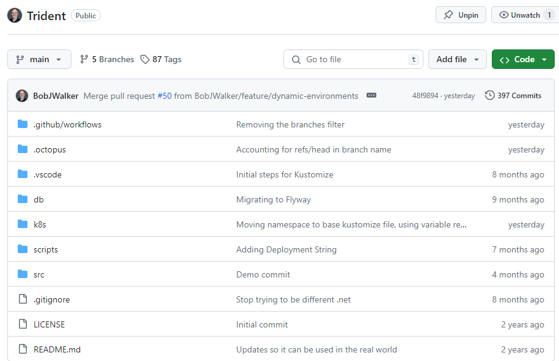

I do this because when I create the release for the feature branch, I have access to the branch name and other important information.

Also, if I need to make changes to _how I deploy_ with the feature branch, I can do all the work in the branch and include the code changes, database changes, and deployment process changes in the same pull request.  

#### Channels

My project has 2 channels, one for each of the above lifecycles. The channels have version rules to enforce the pre-release tag rule from the versioning strategy section.

- Default Lifecycle allows any pre-release tag: `^\[^\\+].\*`
- Release Lifecycle doesn't allow any pre-release tags: `^(|\\+.\*)$`

#### Runbooks

I created 2 runbooks: 

- One to create the infrastructure
- One to destroy the infrastructure 

My application has 2 components: 

- A web application
- A database backend 

The infrastructure creates a namespace for the web application in Kubernetes and the databases in Azure SQL.

You'll notice the **Check Database** and **Run Script** for the databases. Flyway requires the check database to perform the deployment. The **Run Script** step for the databases ensures I can run a basic "select 1" query on the database. The process of creating infrastructure will likely differ.

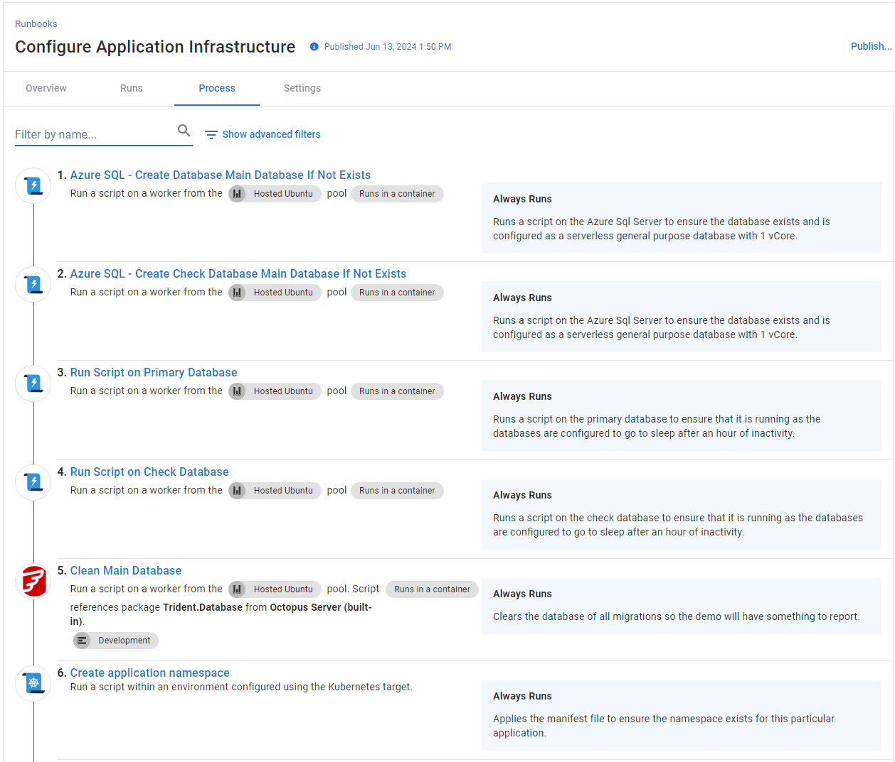 

The **Destroy Application Infrastructure** runbook does the opposite; it deletes the database and the namespace.

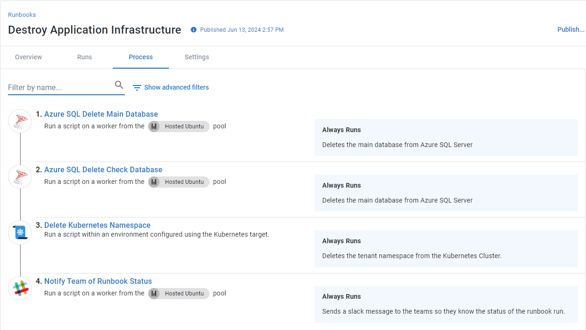

#### Variables

The variables are the key to this entire process in Octopus. You have to come up with a naming convention that uses the feature branch name for this to work. I'll include a formatted feature branch name for anything specific to the Development environment.

You must format the branch name, as SQL Server and Kubernetes might not like specific characters. 

I've highlighted the key variables in my process below.

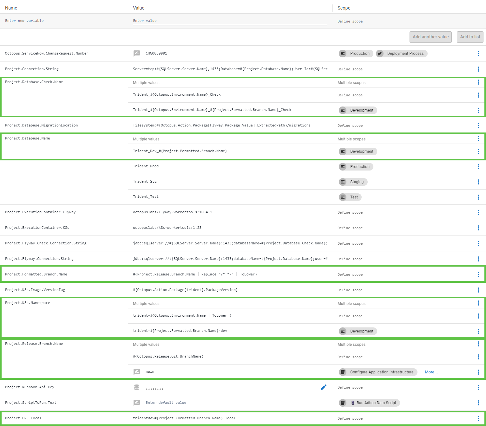

The variables are:

- **Project.Release.Branch.Name**: This pulls the branch name from Config as Code for the deployment process for Config as Code. The value is: `#{Octopus.Release.Git.BranchName}`.  
  - Because my version of Octopus doesn't have Config as Code for runbooks, I have to use a [prompted variable](https://octopus.com/docs/projects/variables/prompted-variables) for my 2 runbooks. The default value for the prompted variable is `main`.
- **Project.Formatted.Branch.Name**: This variable removes all invalid characters and formats it for use in other variables. The value is `#{Project.Release.Branch.Name | Replace "/" "-" | ToLower | Replace "refs-heads" ""}`.
- **Project.K8s.Namespace**: Used by the deploy steps and create namespace step. For the Development environment, I included `#{Project.Formatted.Branch.Name}`.
- **Project.Database.Name**: Used by the database deploy steps and connection strings to determine the application's database name. For the Development environment, I included `#{Project.Formatted.Branch.Name}`.
- **Project.Database.Check.Name**: Used by the Flyway steps for deployments as a temporary database. If you aren't using Flyway, you won't need this variable. For the Development environment, I included `#{Project.Formatted.Branch.Name}`.
- **Project.URL.Local**: Specifies the domain for Kubernetes Ingress. I had to modify my Kustomize overlay file in Dev and inject [Octostache](https://octopus.com/docs/projects/variables/variable-substitutions). While I prefer not to do that, ts was an appropriate compromise, as it was limited to the Dev overlay only.

#### Deployment process

The deployment process calls the **Create Infrastructure** runbook and waits for it to complete. I injected the branch name from Config as Code into the prompted variable.

I call this runbook for every environment because each night, I tear down all my infrastructure in Azure to save costs. In your deployment process, consider configuring this step to run for the Development environment only.

Any steps that interact with the Kubernetes cluster use the namespace variable.

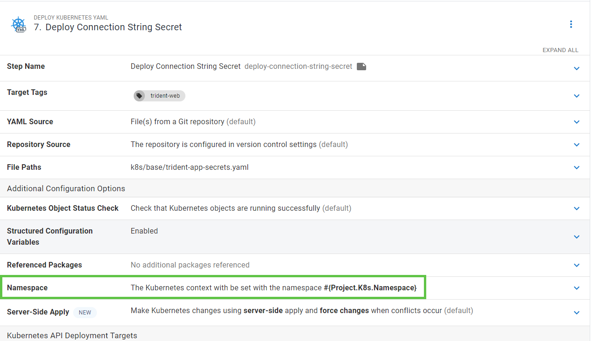

Any steps interacting with the database use the connection string variable, which uses the database name variable.

### GitHub Actions

I'm using GitHub Actions as my build server. I have 2 actions:

- Build - builds the artifacts, pushes them to Octopus / Docker Hub, and creates the release.
- PR Closed - Invokes the destroy runbook in Octopus Deploy when a PR gets closed.

#### Build action

For my build action, I want to build on meaningful code changes for specific branches and trigger the action manually. I also prefer to use environment variables to eliminate as many magic strings as possible.

This build calculates the version number. I'm using [GitTool's GitVersion action](https://github.com/GitTools/GitVersion) to handle that work. That action creates several output variables you can use in later steps. I primarily use the `env.GitVersion\_SemVer` output variable.

The next step shows the first use of that output variable. I like to tag the version number on the main branch using the [update tag GitHub action](https://github.com/marketplace/actions/update-tag). That particular step only runs because of the `if` condition.

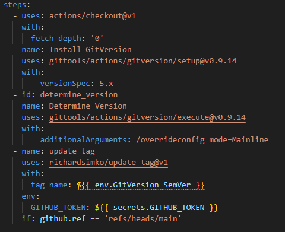

That output variable appears when I create the tag for my Docker image.

The final step in my action is to create a release in Octopus.

GitHub's syntax can be hard to decipher. Here's what each of those options mean:

- **name**: The name of the project in Octopus. Pull from the environment variables defined earlier in the action. `${{ env.OCTOPUS\_PROJECT\_NAME }}`
- **channel**: The name of the channel in that project. When on the main branch use the release channel, otherwise use the feature branch channel. `${{ github.ref == 'refs/heads/main' && env.OCTOPUS\_RELEASE\_CHANNEL || env.OCTOPUS\_FEATURE\_BRANCH\_CHANNEL }}`
- **release_number**: The release number in Octopus. Uses the same GitVersion output variable as before. `"${{ env.GitVersion\_SemVer }}"`
- **package_version**: The version of each of the packages for the release. Uses the same GitVersion output variable as before. `"${{ env.GitVersion\_SemVer }}"`
- **git_ref**: This is required for projects with Config as Code enabled. Specifies the branch. `${{ (github.ref\_type == 'tag' && github.event.repository.default\_branch ) || (github.head\_ref || github.ref) }}`
- **git_commit**: This is required for projects with Config as Code enabled. The Git commit that triggered this action.   `${{ github.event.after || github.event.pull\_request.head.sha }}`

#### Pull Request action

The Pull Request action has a single step: invoke the **Destroy Application Infrastructure** runbook in Octopus when the PR gets closed.

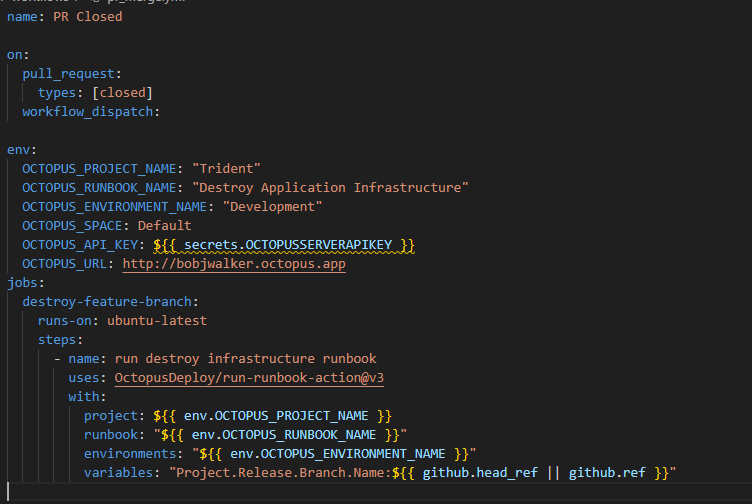

The variables parameter is critical as it tells the runbook which feature branch to destroy. I wanted to invoke this runbook manually for testing, which is why you see `${{ github.head\_ref || github.ref }}`. That tells the GitHub action to use the branch that created the PR. It uses the specified branch when manually invoking that action if it's not in a PR.

### Kustomize overlays

I had to make a minor change to the development overlay. I wanted a custom domain for each feature branch of my ingress in Kubernetes. The easiest way to do that was to inject the value using Octostache. As this overlay is only used for development, that was an appropriate compromise. Helm charts and raw manifest files have other options that don't require Octostache in the file. Kustomize has a limitation in that we can't inject structured variable replacement after the file has been transformed.

All the other overlays do not have Octostache, as those are static environments.

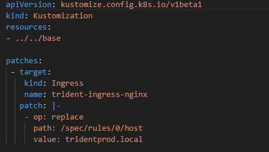

## See it in action

On my AKS Cluster, I have the following namespaces:

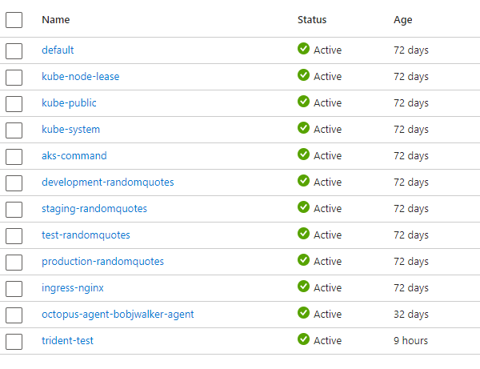

On my Azure SQL Server, I have the following databases: 

When I create a new branch called `feature/blog-post` and check in a change a build gets triggered.  

After the action is complete, I see version **4.0.71-blog-post.1** was created.

After that's done, I see 2 new databases.

And a new namespace.

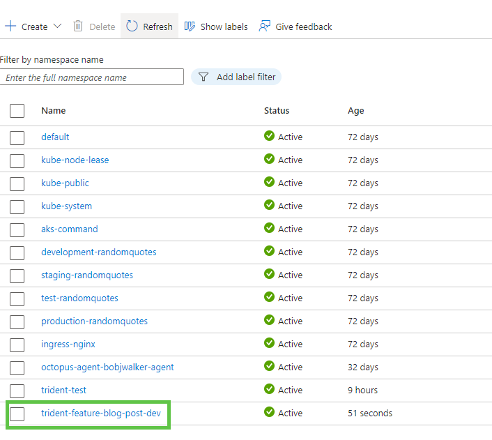

I create and merge my pull request.

After the PR gets approved and closed, the GitHub action triggers the runbook. 

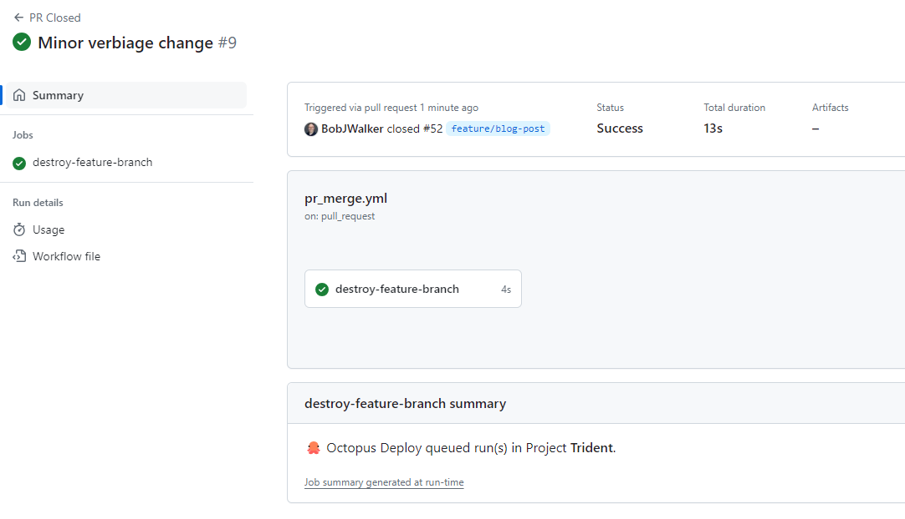

The namespace and databases get deleted and we can move on to the next feature branch.

## Limitations

There are known limitations and shortcuts when creating this process.  

- It reuses a pre-existing application host (AKS Kubernetes cluster) and database server (Azure SQL). Creating and destroying new infrastructure makes it harder, as you need a mechanism to tell Octopus to deploy only to new infrastructure. Use [Matthew Casperson's excellent blog post](https://octopus.com/blog/feature-branch-web-apps) as a reference.
- This process assumes you have a development / testing Kubernetes cluster where you can create and destroy namespaces with impunity.
- There are a few environmental configuration items. If you use a configuration or secret store, you need additional configuration.
- The application has no external dependencies. If your application has external dependencies, your options are:
   - Point to services running on a static testing environment.
   - Create all the external dependencies for each feature branch.
- The build server (in my case, GitHub Actions) is more tightly coupled with the deployment server. It's aware of different channels and runbooks.
- The deployment dashboard in the Octopus project only shows the last 3 successful deployments to an environment. If I had many feature branches in flight, I'd need to go to the project's releases page to see the latest deployment for my branch.

## Conclusion

Using the process in this post, you can create and destroy dynamic testing infrastructure for each feature branch. Depending on your use of Octopus, you might need only a few modifications to your existing configuration. Chances are you already have a lot of this configuration in place for different environments. That's what makes me so excited about it. Some minor changes to an existing process and you can get it working. 

Before working on this post, every feature branch got deployed to a static development environment. That means I already had the channels and runbooks configured. I just needed to add some new variables and tweak my Kustomize overlay file.

What's even more exciting is that you can apply this pattern to other application types if you can reuse other infrastructure, like ECS clusters, Windows servers, or Linux servers.

You can find the [Git repository on GitHub](https://github.com/BobJWalker/Trident). You can also view the process on [my personal Cloud instance](https://bobjwalker.octopus.app/) – just log in as a guest.

Please do note the limitations with what I proposed in this post. If you implement this process, use this guide as a baseline. Take what works for you and modify where appropriate. You'll likely need to iterate a few times before it works.

Happy deployments!