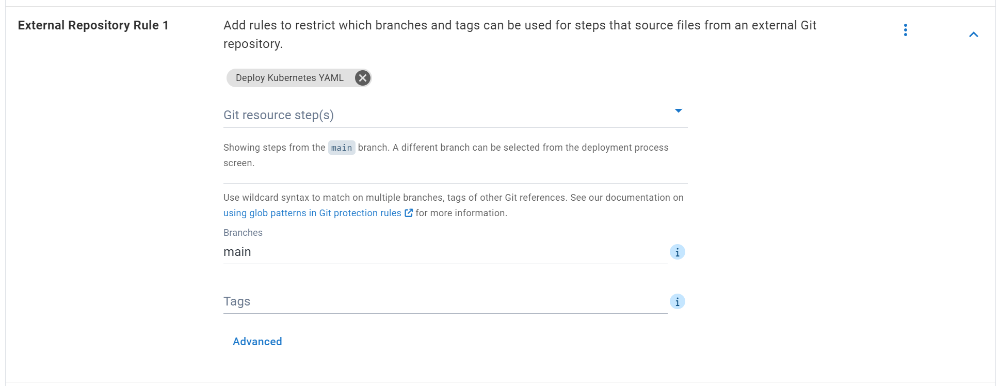
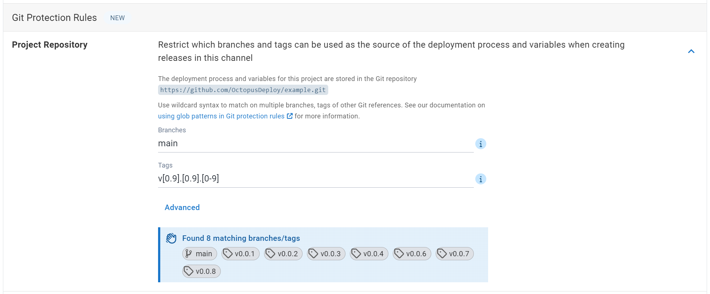

At Octopus, we're continuously enhancing our tools to better support your Git-based projects and workflows. We're happy to announce the introduction of Git protection rules, a pivotal addition to safeguard your deployments and ensure only the intended Git resources get deployed to the right environments. 

In this post, I walk you through our new Git protections.

## Why we're adding Git protections

In recent years, Octopus has introduced many features to streamline interaction with Git repositories (repos). This includes Config as Code, and the ability to source files from external Git repos and the project repository used in version-controlled projects. While these features have empowered users to integrate Git resources seamlessly into their deployment processes, they've also highlighted the need for better protections. 

You may wonder how this helps when you already have version rules in place for your packages. Git protection rules let you take your version rules a step further by defining your own restrictions on the Git resources used in deployments. This ensures that only intended resources get deployed to their intended environment. You can continue to leverage the full potential of Git while maintaining control over your deployment process.  

### Key features of Git protections

**Customizable rules**: Define rules tailored to your project's needs, specifying which branches or tags are permissible for deployment.

**Enhanced security**: Mitigate risks associated with unauthorized or outdated Git resources used in production or other sensitive environments.

#### External repository rules

Octopus supports sourcing files from an external Git repo configured on the step. This enables scenarios like storing scripts or Kubernetes manifests in a repository for use during a deployment.

External repository rules let you configure which branches and tags people can use for these steps when creating a release. This ensures that only approved Git resources get used during a deployment to protected environments such as production.

#### Project repository rules 

Octopus supports storing the deployment process and variables for a project in a Git repo. This enables you to use the power of Git branches and tags to manage and iterate on the steps within a deployment. 

Rules for the project repository for version-controlled projects let you configure which branches and tags people can use as the source of the deployment process and variables when creating a release. This helps ensure that only approved processes and variables get used during deployments to protected environments such as production.

## Conclusion

The additon of Git protections started rolling out to Cloud instances from late July 2024. Our self-hosted customers can expect this feature later in the year.

We're always happy to hear feedback. Feel free to jump in to the blog comments to share your thoughts.

## Learn more

- Read about [Git protections in our docs](https://octopus.com/docs/releases/channels#git-protection-rules)

Happy deployments!
